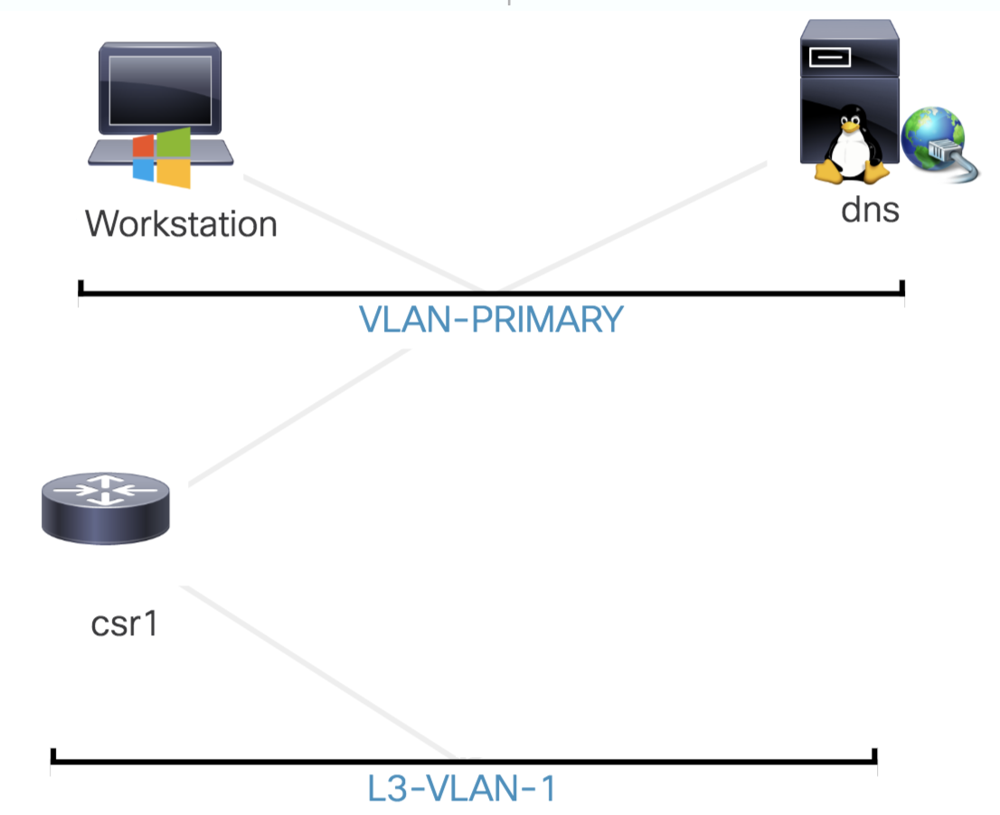

Navigation :: [Table of Contents](LTRDEV-1100-00-Intro.md#table-of-contents) :: [Next Page](LTRDEV-1100-01-Dojo.md)

---

# Introduction

The title of this lab is "So, You want to be a Network Programmability Ninja, Now What?"  In this lab, we will help 
you get started with network programmability and arm you with the concepts and tools and real-world use cases needed to 
make use of network programmability in your day-to-day work and play.

We will have fun with Ninja-themed metaphors: We will introduce you to the Network Programmability Dojo; teach you 
the Tools of the Ninja; allow you to Hone your Ninja Skills; and, finally, Test Your Ninja Skills with real-world use 
cases at the end of this lab.

We hope you have fun and learn valuable new skills!

# Learning Objectives

Upon completion of this lab, you will be able to:

* Understand what are the basic network programmability concepts
* Learn what tools are useful for getting started with network programmability
* Practice with the tools to develop and sharpen new network programmability skills
* Put the concepts and tools to practice with real-world use cases
* Put your new skills to the test

# Lab Topology

# Table of Contents

1. [The Network Programmability Dojo](LTRDEV-1100-01-Dojo.md)
    1. [Cisco DevNet](LTRDEV-1100-01a1-DevNet.md)
        1. [Joining Cisco DevNet](LTRDEV-1100-01a2-DevNet-Ex1.md)
        2. [Exploring Cisco DevNet](LTRDEV-1100-01a3-DevNet-Ex2.md)
2. [Tools of the Ninja](LTRDEV-1100-02-Tools.md)
    1. [Git and GitHub](LTRDEV-1100-02a1-Git.md)
        1. [Creating a GitHub Account](LTRDEV-1100-02a2-Git-Ex1.md)
        2. [Introducing Git Concepts and Commands](LTRDEV-1100-02a3-Git-Ex2.md)
    3. [Python for Network Programmability](LTRDEV-1100-02b1-Python.md)
        1. [Understanding How to Run Python](LTRDEV-1100-02b2-Python-Ex1.md)
        2. [Setting up Python Virtual Environments](LTRDEV-1100-02b3-Python-Ex2.md)
        3. [Deploying Useful Python Packages](LTRDEV-1100-02b4-Python-Ex3.md)
        4. [Working with the Python Interpreter](LTRDEV-1100-02b5-Python-Ex4.md)
    4. [Cisco Webex Teams](LTRDEV-1100-02c1-Teams.md)
        1. [Getting Started with Cisco Webex Teams](LTRDEV-1100-02c2-Teams-Ex1.md)
    5. [Postman](LTRDEV-1100-02d1-Postman.md)
        1. [Getting Started with Postman](LTRDEV-1100-02d2-Postman-Ex1.md)
3. [Hone Your Ninja Skills](LTRDEV-1100-03-Hone.md)
    1. [Application Programming Interface (API)](LTRDEV-1100-03a1-API.md)
        1. [Understanding and Using APIs](LTRDEV-1100-03a2-API-Ex1.md)
    2. [Model Driven Programmability](LTRDEV-1100-03b1-NETCONF.md)
        1. [Introducing YANG](LTRDEV-1100-03b2-NETCONF-Ex1.md)
        2. [Introducing NETCONF](LTRDEV-1100-03b3-NETCONF-Ex2.md)
        3. [Exploring IOS XE YANG Data Models with NETCONF](LTRDEV-1100-03b4-NETCONF-Ex3.md)
        4. [Exploring IOS XE NETCONF/YANG Example Use Cases](LTRDEV-1100-03b5-NETCONF-Ex4.md)
    6. [Guest Shell](LTRDEV-1100-03c1-GuestShell.md)
        1. [Introducing IOS XE Guest Shell](LTRDEV-1100-03c2-GuestShell-Ex1.md)
        2. [Unleashing Network Programmability at the Network Edge](LTRDEV-1100-03c3-GuestShell-Ex2.md)
4. [Test Your Ninja Skills](LTRDEV-1100-04-Test.md)
    1. [Script a Network Programmability Assistant for Cisco Webex Teams](LTRDEV-1100-04a1-NetAssist.md)
        1. [ChatOps like a Network Programmability Ninja](LTRDEV-1100-04a2-NetAssist-Ex1.md)
5. [Appendix 1](LTRDEV-1100-05-Appx1.md)
    1. [PyCharm](LTRDEV-1100-05a1-PyCharm.md)
        1. [Getting Started with PyCharm](LTRDEV-1100-05a2-PyCharm-Ex1.md)
        2. [Getting Advanced with PyCharm](LTRDEV-1100-05a3-PyCharm-Ex2.md)
    2. [Postman](LTRDEV-1100-05b1-Postman.md)
        1. [Getting Advanced with Postman](LTRDEV-1100-05b2-Postman-Ex1.md)
    3. [Vagrant Up for Network Engineers](LTRDEV-1100-05c1-Vagrant.md)
        1. [Introducing Vagrant](LTRDEV-1100-05c2-Vagrant-Ex1.md)
6. [Appendix 2](LTRDEV-1100-06-Appx2.md)

---

Navigation :: [Table of Contents](LTRDEV-1100-00-Intro.md#table-of-contents) :: [Next Page](LTRDEV-1100-01-Dojo.md)
