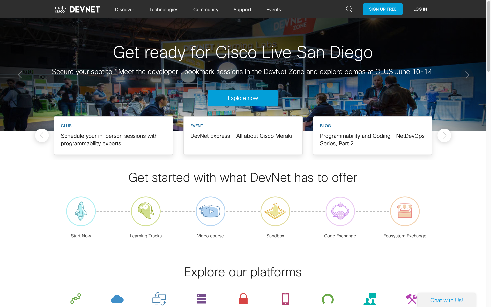
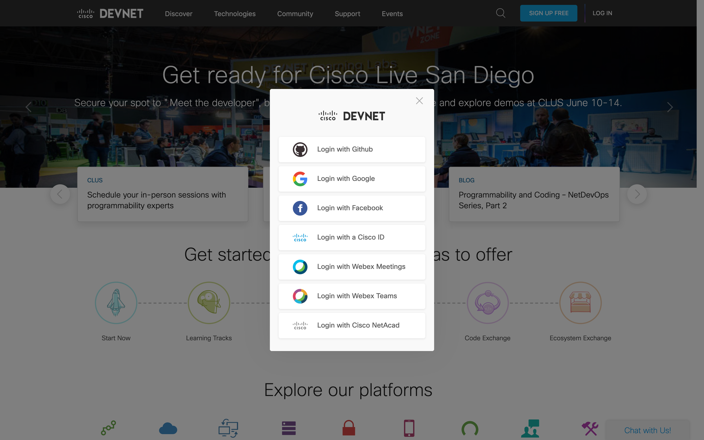
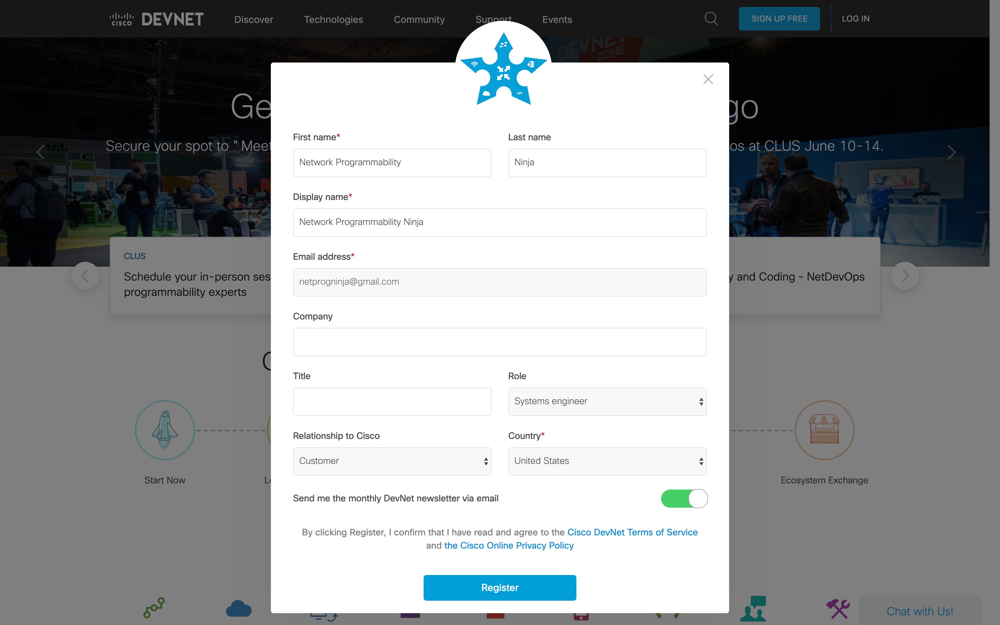
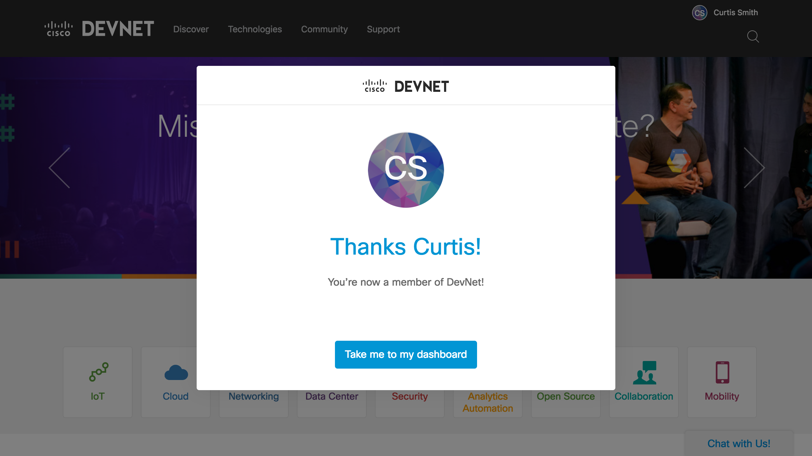

Navigation - [Previous Page](LTRDEV-1100-01a-DevNet.md)

---

### Exercise 1: Joining Cisco DevNet

#### Objectives

The objectives for this exercise are to:

* Create a DevNet account

#### Step 1: Creating a Cisco DevNet Account

The first step is your network programmability training is joining [Cisco DevNet](https://developer.cisco.com/).  Let's 
create your DevNet account, if you don't already have one.

1. Navigate to [DevNet](https://developer.cisco.com): `https://developer.cisco.com/`.
    
    

2. Click the `Login` link at the top right of the web page.
    
    
    
    You are given the choice of several single sign-on options.  We recommend using your Cisco ID, but you may 
    choose whichever you feel is appropriate.

3. Once you've logged in, complete your DevNet account profile if this is your first time logging in and click 
the `Complete setup` button.
    
    
    
4. Congratulations, you've successfully joined Cisco DevNet!  Click the `Take me to my dashboard` button and you 
are ready to explore DevNet.
        
    

---

Navigation - [Next Page](LTRDEV-1100-01c-DevNet-Ex2.md)
