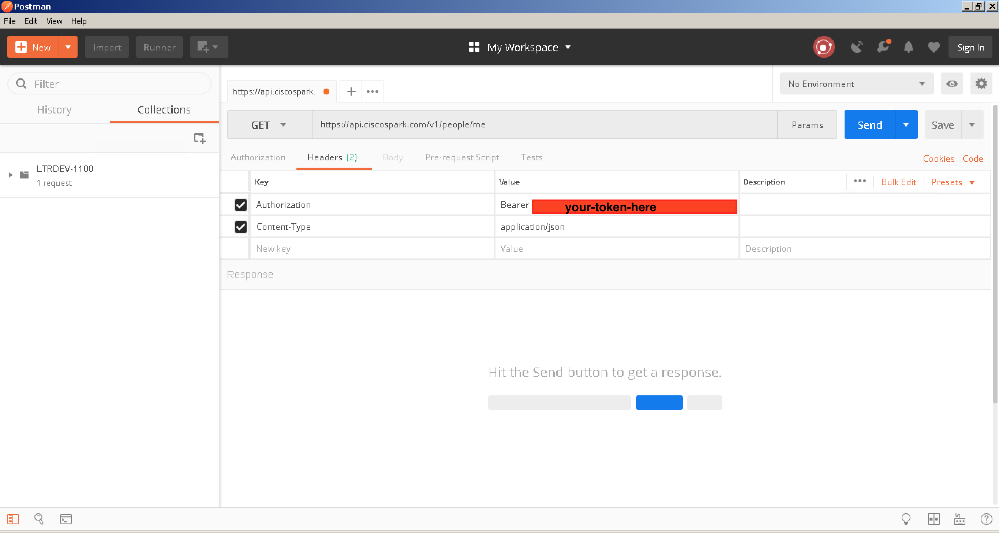
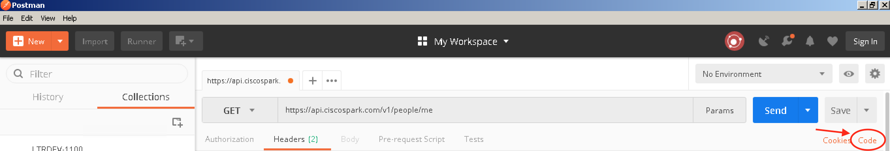
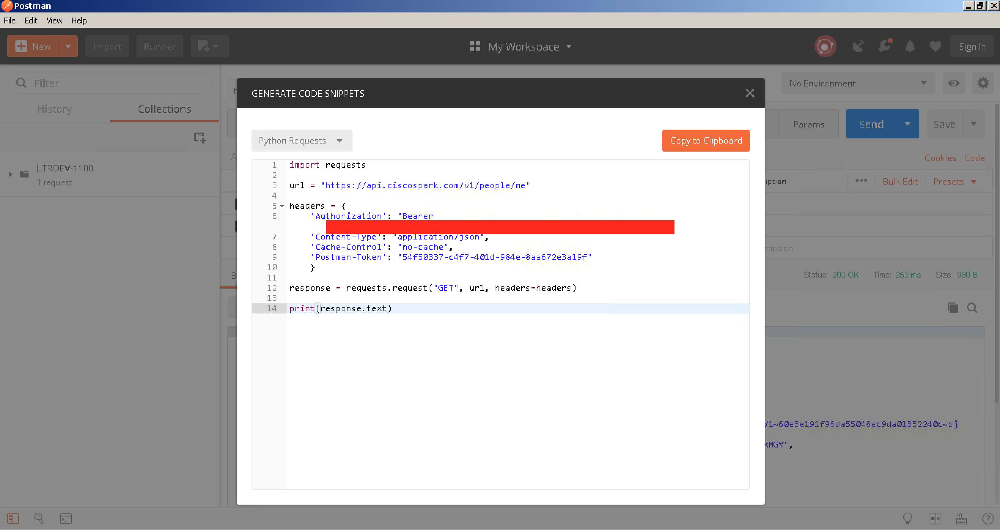

### Exercise 1: Understanding and Using APIs

#### Objectives

The objectives of this exercise are to:

* Learn how to find API info
* Use the docs to make an API call with Postman
* Automate an API call with a Python script

#### Step 1: Learning How to Find API Info

While there are standards that APIs typically follow, the particular calls, parameters, and expected results differ 
with every API. From a commonality standpoint, many APIs utilize the same architectural style called REST. REST, or 
Representational State Transfer, is based on core HTTP functions such as GET, POST, PUT, and DELETE. Beyond this, 
documentation is necessary to understand what functions are available via API. In this step, we will explore a number
of different API documentation, so you can start to formulate ideas around how each one could be utilized.

1. Let's quickly revisit the documentation for Webex Teams API. Its documentation is interactive and robust, so it is
a great example to peruse. Open up the [Webex Teams Developer Site](https://developer.webex.com/getting-started.html)
and spend a few minutes looking through the Teams API reference material.

    1. Which HTTP functions are available when working with the 'Rooms' area of the Teams API?
    2. What is the expected output for a well-formed request to list the rooms to which the user belongs?
    3. Which request should be used to pull information about people, specifically your own account?

#### Step 2: Making an API Call with Postman

Let's take a look at how we can make an API call based on what we've read in the Webex Teams API earlier in this 
lab. Reference the [People](https://developer.webex.com/resource-people.html) section of the Webex Teams API 
documentation.

1. Open Postman by double clicking the Postman icon on the desktop.

2. Start filling in the details for a new request as follows:
    
    Set the `Method` to `GET`.
    
    Insert the following URL for the request: `https://api.ciscospark.com/v1/people/me`
    
    Click on `Headers` to set the proper authorization for Webex Teams. The first header should have the key 
    `Authorization` and its value should be set to `Bearer XYZ` where `XYZ` is replaced with your access token.
    If you recall, the Webex Teams access token should be open in a Notepad window on your desktop. If not, you can 
    access it again by clicking [here](https://developer.webex.com/getting-started.html#authentication).
    
    Create a second header, with a key of `Content-Type` and a value of `application/json`, as shown in the 
    documentation.

     

    Click the `Send` button in Postman to observe the results! If all goes well, you should be greeted with a
    `200 OK` status and a body of JSON-formatted key-value pairs.

#### Step 3: Automate an API Call with a Python Script

When working with APIs in Postman, it is trivial to turn your API request into Python code. This can provide
the basis to wrap scripting logic around the request. For instance, maybe you want to repeat the "People" example as we
just did in the previous step, but with a longer list of users. This code snippet can become the basis to facilitate 
automation.

1. In your already-open tab for getting your own details in Webex Teams, click the `Code` button just below the 
`Save` button on the right side of the Postman screen.

    

2. Select `Python` and `Requests` from the upper left language dropdown box. This presents code that can be copied to 
the clipboard and pasted in a file to run with the python interpreter.

    
    
    You may not know how to write this Python code snippet from the API documentation alone, but you can use Postman 
    to experiment with APIs calls and generate Python code snippets for you to practice and learn.