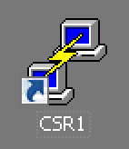
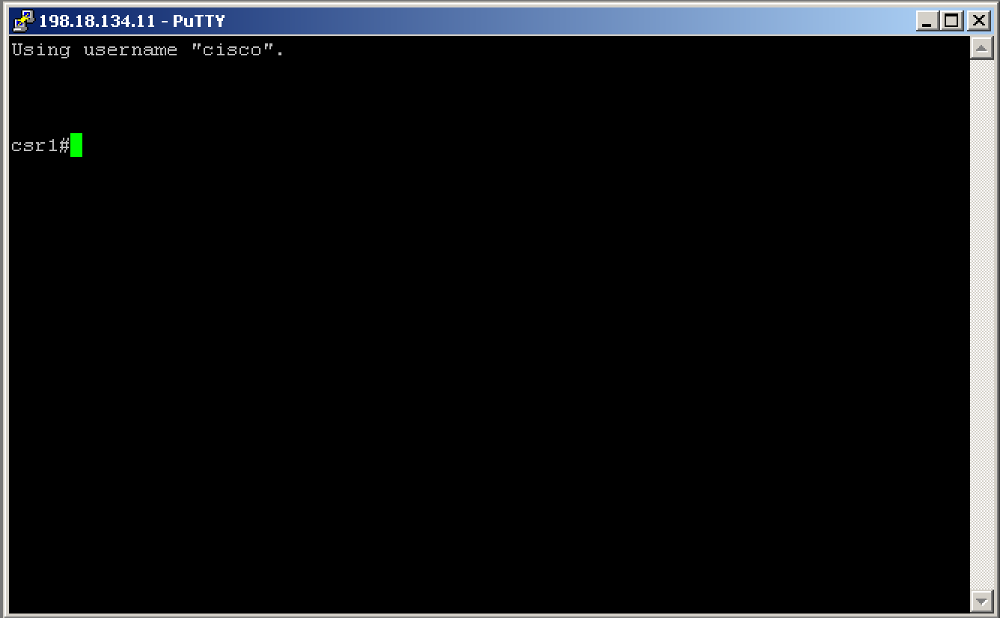

Navigation :: [Previous Page](LTRDEV-1100-03c1-GuestShell.md) :: [Table of Contents](LTRDEV-1100-00-Intro.md#table-of-contents) :: [Next Page](LTRDEV-1100-03c3-GuestShell-Ex2.md)


---

### Exercise 1: Introducing IOS XE Guest Shell

#### Objectives

The objectives for this exercise are to:

* Learn how to configure and access Guest Shell on IOS XE
* Learn how to run Guest Shell commands from IOS XE
* Explore the Guest Shell environment
* Learn how to run IOS XE commands from Guest Shell

#### Step 1: Enabling Guest Shell on IOS XE

1. Establish an SSH connection to the IOS XE device `csr1` by double clicking the CSR1 PuTTY icon on the desktop:
    
    

2. From the IOS XE device CLI, ensure you are in privileged EXEC mode as indicated by the `csr1#` prompt.  If you 
are in user EXEC mode as indicated by the `csr1>` prompt, then enter privileged EXEC mode with the `enable` command, 
for example:
   
    ```
    csr1>enable
    csr1#
    ```
    
    

3. Enter global configuration mode, which will be indicated by the `csr1(config)#` prompt, for example:
   
    ```
    csr1#configure terminal
    Enter configuration commands, one per line.  End with CNTL/Z.
    csr1(config)#
    ```

4. IOx is a Cisco-developed end-to-end application framework that provides application hosting capabilities for
different application types on Cisco network platforms.  Guest Shell is on such application distributed on Catalyst 
switches.  IOx is a prerequisite for Guest Shell, so you need to turn on IOx with the `iox` command, for example:
   
    ```
    csr1(config)#iox
    ```
    
    End the global configuration mode session with the `end` command or typing `CTRL-Z`, for example:
    
    ```
    csr1(config)#end
    csr1#
    ```

 5. It can take a few minutes for the IOx subsystem and processes to start.  Before continuing on, check to ensure 
 IOx is running with the `show iox-service` command, for example:
    
    ```
    csr1#show iox-service 
    Virtual Service Global State and Virtualization Limits:
    
    Infrastructure version : 1.7
    Total virtual services installed : 0
    Total virtual services activated : 0
    
    Machine types supported   : LXC
    Machine types disabled    : KVM
    
    Maximum VCPUs per virtual service : 0
    Resource virtualization limits:
    Name                         Quota     Committed     Available  
    --------------------------------------------------------------
    system CPU (%)                   7             0             7  
    memory (MB)                   1024             0          1024  
    bootflash (MB)               20000             0          6715  
    
    
    IOx Infrastructure Summary:
    ---------------------------
    IOx service (CAF)    : Running 
    IOx service (HA)     : Not Running 
    IOx service (IOxman) : Running 
    Libvirtd             : Running 
    
    csr1#

    ```
    
    Once you've verified the `IOx service (CAF)`, `IOx service (IOxman)`, and `Libvirtd` services are in the 
    `Running` state, continue to the next step.  The `IOx service (HA)` service will remain in the `Not Running` 
    state since there is only one IOS XE network device in this lab.

6. Before enabling Guest Shell, you have a bit of prerequisite configuration to complete first.  You must complete the 
following configuration:
    
    * Configure a Virtual Port Group - The Virtual Port Group is the interface the IOS XE network device uses to 
    communicate with guest shell.
    
    * Configure Network Address Translation - The IOS XE network device provides access to off-box resources through 
    NAT.
    
    A Virtual Port Group is only required on ISR and CSR IOS XE routing platforms.  On Catalyst IOS XE switching 
    platforms, Guest Shell connectivity is bridged from the `Mgmt0` <cjs - need to validate interfance name> management 
    interface.
    
    Since our lab uses the CSR 1000v, create and configure a Virtual Port Group interface, for example:
    
    ```
    csr1#configure terminal 
    Enter configuration commands, one per line.  End with CNTL/Z.
    csr1(config)#interface VirtualPortGroup 0
    csr1(config-if)#ip address 192.168.35.1 255.255.255.0
    csr1(config-if)#no shutdown 
    csr1(config-if)#exit
    csr1(config)#

    ```
    
    Configure Network Address Translation (required on all routing and switching platforms), for example:
    
    ```
    csr1(config)#interface VirtualPortGroup 0
    csr1(config-if)#ip nat inside
    csr1(config-if)#interface GigabitEthernet 1
    csr1(config-if)#ip nat outside
    csr1(config-if)#exit
    csr1(config)#ip access-list standard NAT_ACL
    csr1(config-std-nacl)#permit 192.168.0.0 0.0.255.255
    csr1(config-std-nacl)#exit
    csr1(config)#ip nat inside source list NAT_ACL interface GigabitEthernet1 overload
    csr1(config)#
    ```
    
7.  To enable Guest Shell itself, first run the following commands in config mode:
    
    ```
    csr1(config)#app-hosting appid guestshell
    csr1(config-app-hosting)#vnic gateway1 virtualportgroup 0 guest-interface 0 guest-ipaddress 192.168.35.2 netmask 
    255.255.255.0 gateway 192.168.35.1 name-server 208.67.222.222 default
    csr1(config-app-hosting)#resource profile custom cpu 1500 memory 512
    csr1(config-app-hosting)#exit
    csr1(config)#
    ```
    
    End the global configuration mode session with the `end` command or typing `CTRL-Z`, for example:
    
    ```
    csr1(config)#end
    csr1#
    ```
    
    Run the `guestshell enable` command in privileged EXEC mode (this command may take a few moments to complete, so 
    please be patient and wait for the `csr1#` prompt to return before continuing):
    
    ```
    csr1#guestshell enable
    Interface will be selected if configured in app-hosting
    Please wait for completion
    guestshell installed successfully
    Current state is: DEPLOYED
    guestshell activated successfully
    Current state is: ACTIVATED
    guestshell started successfully
    Current state is: RUNNING
    Guestshell enabled successfully
    
    csr1#
    ```
    
    You can confirm Guest Shell is enabled and active in the `Running` state with the `show app-hosting list` command, 
    for example:
    
    ```
    csr1#show app-hosting list
    App id                           State
    ------------------------------------------------------
    guestshell                       RUNNING
    
    csr1#
    ```
    
    Confirm the `VirtualPortGroup0` interface is present and configured in an `up` Status with the
    `show ip interface brief` command, for example:
    
    ``` 
    csr1#show ip interface brief
    Interface              IP-Address      OK? Method Status                Protocol
    GigabitEthernet1       198.18.134.11   YES NVRAM  up                    up
    VirtualPortGroup0      192.168.35.1    YES manual up                    up
    csr1#
    ```
    
    Test to confirm the Guest Shell vnic is active and reachable with the `ping` command, for example:
    
    ```
    csr1#ping 192.168.35.2
    Type escape sequence to abort.
    Sending 5, 100-byte ICMP Echos to 192.168.35.2, timeout is 2 seconds:
    !!!!!
    Success rate is 100 percent (5/5), round-trip min/avg/max = 1/1/1 ms
    csr1#
    ```
    
    Congratulations, you now have a working Guest Shell running.  Let's explore how to leverage Guest Shell 
    effectively in the next steps in this lab.

#### Step 2: Running Guest Shell Commands from IOS XE

1. You can run Guest Shell Linux commands from the IOS XE device CLI.  Simply precede the Linux command `foo` with the 
IOS XE command `guestshell run`: `guestshell run foo`.  For example, to see what version of Python is installed in 
Guest Shell, run the command `guestshell run python -V` from the IOS XE device CLI:
    
    ```
    csr1#guestshell run python -V
    Python 2.7.5
    
    csr1#
    ```
    
    This is valid for any Linux binary in the Guest Shell `/bin` and `/sbin` directories.  Try a few more examples, 
    `guestshell run pwd`, `guestshell run whoami`, `guestshell run uname -a`, and `guestshell run sudo ifconfig eth0`:
    
    ```
    csr1#guestshell run pwd
    /home/guestshell
    
    csr1#
    ```
    
    ```
    csr1#guestshell run whoami
    guestshell
    
    csr1#
    ```
    
    ```
    csr1#guestshell run uname -a
    Linux guestshell 4.4.111 #1 SMP Wed Feb 14 22:16:42 PST 2018 x86_64 x86_64 x86_64 GNU/Linux
    
    csr1#
    ```
    
    ```
    csr1#guestshell run sudo ifconfig eth0
    eth0: flags=4163<UP,BROADCAST,RUNNING,MULTICAST>  mtu 1500
        inet 192.168.35.2  netmask 255.255.255.0  broadcast 192.168.35.255
        inet6 fe80::5054:ddff:fe05:ad34  prefixlen 64  scopeid 0x20<link>
        ether 52:54:dd:05:ad:34  txqueuelen 1000  (Ethernet)
        RX packets 24  bytes 2364 (2.3 KiB)
        RX errors 0  dropped 0  overruns 0  frame 0
        TX packets 24  bytes 2328 (2.2 KiB)
        TX errors 0  dropped 0 overruns 0  carrier 0  collisions 0
    
    
    csr1#
    ```

2. To enter a Guest Shell interactive session, run the IOS XE command `guestshell run bash`, for example:
    
    ```
    csr1#guestshell run bash
    [guestshell@guestshell ~]$
    ```
    
    Now you are operating from within an interactive Bash shell CLI session within the Guest Shell virtual 
    environment as indicated by the `[guestshell@guestshell ~]$` prompt.  Everything you do from here is native Linux 
    commands.  Let's explore the the Guest Shell virtual environment.

#### Step 3: Exploring the Guest Shell Virtual Environment

1. At the Guest Shell `[guestshell@guestshell ~]$` prompt, you can execute standard Linux commands.  Access to the
Guest Shell is restricted to an IOS XE user with privilege 15 level access to the IOS XE device.  This user is granted 
access into Guest Shell as the `guestshell` Linux user, who is a sudoer and can perform all root operations. Commands
executed through the Guest Shell are executed with the same privilege that a user has when logged into the
IOS XE device CLI.
    
    To run a Guest Shell Linux command, simply type the command at the Guest Shell `[guestshell@guestshell ~]$` 
    prompt.  For example, to see what version of Python is installed in Guest Shell, run the command `python -V`
    from the Guest Shell CLI:
    
    ```
    [guestshell@guestshell ~]$ python -V
    Python 2.7.5
    [guestshell@guestshell ~]$
    ```
    
    Try a few more examples, `pwd`, `whoami`, `uname -a`, and `sudo ifconfig eth0`:
    
    ```
    [guestshell@guestshell ~]$ pwd
    /home/guestshell
    [guestshell@guestshell ~]$
    ```
    
    ```
    [guestshell@guestshell ~]$ whoami
    guestshell
    [guestshell@guestshell ~]$
    ```
    
    ```
    [guestshell@guestshell ~]$ uname -a
    Linux guestshell 4.4.111 #1 SMP Wed Feb 14 22:16:42 PST 2018 x86_64 x86_64 x86_64 GNU/Linux
    [guestshell@guestshell ~]$
    ```
    
    ```
    [guestshell@guestshell ~]$ sudo ifconfig eth0
    eth0: flags=4163<UP,BROADCAST,RUNNING,MULTICAST>  mtu 1500
        inet 192.168.35.2  netmask 255.255.255.0  broadcast 192.168.35.255
        inet6 fe80::5054:ddff:fe05:ad34  prefixlen 64  scopeid 0x20<link>
        ether 52:54:dd:05:ad:34  txqueuelen 1000  (Ethernet)
        RX packets 24  bytes 2364 (2.3 KiB)
        RX errors 0  dropped 0  overruns 0  frame 0
        TX packets 24  bytes 2328 (2.2 KiB)
        TX errors 0  dropped 0 overruns 0  carrier 0  collisions 0
    
    [guestshell@guestshell ~]$
    ```

2. Check out the directory structure of the Guest Shell Linux file system with the `ls` command, for example:
    
    ```
    [guestshell@guestshell ~]$ cd /
    [guestshell@guestshell /]$ ls -la
    total 50222
    drwxr-xr-x  23 root  root              1024 Jun  3 20:04 .
    drwxr-xr-x  23 root  root              1024 Jun  3 20:04 ..
    -rw-r--r--   1 root  root                 0 Jun  3 18:27 .autorelabel
    drwxr-xr-x   2 root  root              1024 Jun  3 18:27 .oldroot
    lrwxrwxrwx   1 root  root                 7 Feb 15 20:53 bin -> usr/bin
    dr-xr-xr-x   2 root  root              1024 Jun 10  2014 boot
    drwxrwxr-x  13 65534 network-admin     4096 May 24 05:01 bootflash
    drwxr-xr-x   6 root  root              1024 Jun  3 18:27 cisco
    drwxr-xr-x   5 root  root              1024 Jun  3 18:27 data
    drwxr-xr-x   4 root  root               540 Jun  3 20:04 dev
    drwxr-xr-x  57 root  root              3072 Jun  3 20:04 etc
    -rwxr-xr-x   1 65534         65534      457 Jun  3 20:04 fix_sshd.sh
    lrwxrwxrwx   1 root  root                10 Feb 15 20:57 flash -> /bootflash
    drwxr-xr-x   3 root  root              1024 Feb 15 20:53 home
    lrwxrwxrwx   1 root  root                 7 Feb 15 20:53 lib -> usr/lib
    lrwxrwxrwx   1 root  root                 9 Feb 15 20:53 lib64 -> usr/lib64
    drwxr-xr-x   3 root  root              1024 Jun  3 18:27 local
    drwx------   2 root  root          51200000 Feb 15 20:57 lost+found
    drwxr-xr-x   2 root  root              1024 Jun 10  2014 media
    drwxr-xr-x   2 root  root              1024 Jun 10  2014 mnt
    drwxr-xr-x   2 root  root              1024 Jun 10  2014 opt
    dr-xr-xr-x 378 65534         65534        0 Jun  3 20:04 proc
    dr-xr-x---   2 root  root              1024 Jun  3 20:35 root
    drwxr-xr-x   6 root  root               120 Jun  3 20:04 run
    lrwxrwxrwx   1 root  root                 8 Feb 15 20:53 sbin -> usr/sbin
    drwxr-xr-x   2 root  root              1024 Feb 15 20:53 selinux
    drwxr-xr-x   2 root  root              1024 Jun 10  2014 srv
    drwxr-xr-x  13 65534         65534        0 Jun  3 19:59 sys
    lrwxrwxrwx   1 root  root                17 Feb 15 20:53 tmp -> /var/volatile/tmp
    -rwxr-xr-x   1 65534         65534      238 Jun  3 20:04 unfix_sshd.sh
    drwxr-xr-x  13 root  root              1024 Feb 15 20:53 usr
    drwxr-xr-x  18 root  root              1024 Jun  3 18:27 var
    [guestshell@guestshell /]$
    ```
    
    There are a couple of directories of particular interest:
    
    * `/bin` - A symlink to `/usr/bin`, containing all user commands
    * `/sbin` - A symlink to `/usr/sbin`, containing all root commands
    * `/flash` - A symlink to `/bootflash`, which is equivalent to the `bootflash:` file system on the IOS XE device 
    Guest Shell is running on.  This is particular handy for sharing files and between IOS XE and Guest Shell.
    
    Confirm the contents of `/bootflash` in Guest Shell and `bootflash:` are identical with the `ls -la /bootflash` 
    and `dir bootflaash:` commands, from the Guest Shell `[guestshell@guestshell /]$` and IOS XE device privieleged 
    EXEC `csr1#` command prompt respectively, for example:
    
    ```
    [guestshell@guestshell /]$ ls -la /bootflash
    total 409929
    drwxrwxr-x 13 65534 network-admin      4096 May 24 05:01 .
    drwxr-xr-x 23 root  root               1024 Jun  3 20:04 ..
    -rw-r--r--  1 65534         65534        16 Mar 30 17:12 .cvac_skip_once
    drwxr-xr-x  3 65534         65534      4096 Mar 30 17:15 .dbpersist
    drwxr-xr-x  3 65534         65534      4096 Jun  3 19:59 .installer
    drwxrwxrwx  2 65534         65534      4096 Mar 30 17:10 .prst_sync
    drwxr-xr-x  2 65534         65534      4096 Mar 30 17:10 .rollback_timer
    drwxr-xr-x  3 65534         65534      4096 Mar 30 17:10 core
    -rw-r--r--  1 65534         65534 380933080 Mar 30 17:09 csr1000v-mono-universalk9.16.08.01.SPA.pkg
    -rw-r--r--  1 65534         65534  38304805 Mar 30 17:09 csr1000v-rpboot.16.08.01.SPA.pkg
    -rw-rw-r--  1 65534 network-admin      3870 Apr  6 18:28 csr1_initial_config.txt
    -rw-r--r--  1 65534         65534       157 Jun  3 20:02 csrlxc-cfg.log
    -rw-r--r--  1 65534         65534         0 Jun  3 20:02 cvac.log
    drwxr-xr-x 22 65534         65534      4096 Jun  3 20:04 iox
    drwx------  2 65534         65534     16384 Mar 30 17:08 lost+found
    drwxr-xr-x  3 65534         65534      4096 Mar 30 17:12 onep
    -rw-r--r--  1 65534         65534        16 Mar 30 17:12 ovf-env.xml.md5
    -rw-r--r--  1 65534         65534      1941 Mar 30 17:09 packages.conf
    -rw-r--r--  1 65534         65534        30 Jun  3 20:02 throughput_monitor_params
    drwxrwxrwx  2 65534         65534     20480 Jun  4 03:40 tracelogs
    drwxrwxrwx  2 65534         65534      4096 Mar 30 17:11 virtual-instance
    drwxrwx---  2 65534         65534      4096 Mar 30 17:11 vman_fdb
    ```
    
    ```
    csr1#dir bootflash:
    Directory of bootflash:/
    
       11  drwx            16384  Mar 30 2018 17:08:36 +00:00  lost+found
    284481  drwx             4096   Jun 3 2018 19:59:46 +00:00  .installer
       12  -rw-        380933080  Mar 30 2018 17:09:33 +00:00  csr1000v-mono-universalk9.16.08.01.SPA.pkg
    24385  -rw-         38304805  Mar 30 2018 17:09:33 +00:00  csr1000v-rpboot.16.08.01.SPA.pkg
    24386  -rw-             1941  Mar 30 2018 17:09:33 +00:00  packages.conf
    308865  drwx             4096  Mar 30 2018 17:10:41 +00:00  core
    113793  drwx             4096  Mar 30 2018 17:10:32 +00:00  .prst_sync
    32513  drwx             4096  Mar 30 2018 17:10:42 +00:00  .rollback_timer
    203201  drwx            20480   Jun 4 2018 03:40:50 +00:00  tracelogs
    382017  drwx             4096  Mar 30 2018 17:15:16 +00:00  .dbpersist
    195073  drwx             4096  Mar 30 2018 17:11:20 +00:00  virtual-instance
    24387  -rw-               30   Jun 3 2018 20:02:02 +00:00  throughput_monitor_params
    24388  -rw-                0   Jun 3 2018 20:02:01 +00:00  cvac.log
    24389  -rw-               16  Mar 30 2018 17:12:41 +00:00  ovf-env.xml.md5
    24390  -rw-               16  Mar 30 2018 17:12:41 +00:00  .cvac_skip_once
    24391  -rw-              157   Jun 3 2018 20:02:18 +00:00  csrlxc-cfg.log
    211329  drwx             4096  Mar 30 2018 17:12:44 +00:00  onep
    24392  -rw-             3870   Apr 6 2018 18:28:43 +00:00  csr1_initial_config.txt
    325121  drwx             4096   Jun 3 2018 20:04:04 +00:00  iox
    
    7897796608 bytes total (5937340416 bytes free)
    csr1#
    ```
    
    Once within a Guest Shell Bash CLI session, you can access the IOS XE device CLI.  Let's explore how in the next 
    step of this lab.

#### Step 4: Running IOS XE Commands from Guest Shell

1. You can run IOS XE commands from the Guest Shell CLI.  Simply precede the IOS XE command `foo` with the Guest Shell 
command `dohost`: `dohost 'foo'`.  For example, to display the IOS XE device interface summary, run the command 
`dohost 'show ip interface brief'` from the Guest Shell CLI:
    
    ```
    [guestshell@guestshell ~]$ dohost 'show ip interface brief'
    
    Interface              IP-Address      OK? Method Status                Protocol
    GigabitEthernet1       198.18.134.11   YES NVRAM  up                    up
    VirtualPortGroup0      192.168.35.1    YES manual up                    up
    
    [guestshell@guestshell ~]$
    ```
    
    This is limited to IOS XE privileged EXEC mode commands only; access to IOS XE global configuration mode commands
    is not possible.
    
    Try a few more examples, `dohost 'show log'`, `dohost 'show version'`, and `dohost 'show inventory'` (output 
    below may be truncated for brevity):
    
    ```
    [guestshell@guestshell ~]$ dohost 'show log'
    
    Syslog logging: enabled (0 messages dropped, 2 messages rate-limited, 0 flushes, 0 overruns, xml disabled, filtering disabled)
    No Active Message Discriminator.
    No Inactive Message Discriminator.
    Console logging: level debugging, 64 messages logged, xml disabled,
                     filtering disabled
    Monitor logging: level debugging, 0 messages logged, xml disabled,
                     filtering disabled
    Buffer logging:  level debugging, 64 messages logged, xml disabled,
                    filtering disabled
    Exception Logging: size (4096 bytes)
    Count and timestamp logging messages: disabled
    Persistent logging: disabled
    No active filter modules.
    Trap logging: level informational, 65 message lines logged
        Logging Source-Interface:       VRF Name:
    Log Buffer (4096 bytes):
    *Jun  3 10:22:34.505: %SYS-5-RESTART: System restarted --
    Cisco IOS Software [Fuji], Virtual XE Software (X86_64_LINUX_IOSD-UNIVERSALK9-M), Version 16.8.1, RELEASE SOFTWARE (fc3)
    Technical Support: http://www.cisco.com/techsupport
    Copyright (c) 1986-2018 by Cisco Systems, Inc.
    Compiled Tue 27-Mar-18 13:32 by mcpre
    [guestshell@guestshell ~]$
    ```
    
    ```
    [guestshell@guestshell ~]$ dohost 'show version'
    
    Cisco IOS XE Software, Version 16.08.01
    Cisco IOS Software [Fuji], Virtual XE Software (X86_64_LINUX_IOSD-UNIVERSALK9-M), Version 16.8.1, RELEASE SOFTWARE (fc3)
    Technical Support: http://www.cisco.com/techsupport
    Copyright (c) 1986-2018 by Cisco Systems, Inc.
    Compiled Tue 27-Mar-18 13:32 by mcpre
    Cisco IOS-XE software, Copyright (c) 2005-2018 by cisco Systems, Inc.
    All rights reserved.  Certain components of Cisco IOS-XE software are
    licensed under the GNU General Public License ("GPL") Version 2.0.  The
    software code licensed under GPL Version 2.0 is free software that comes
    with ABSOLUTELY NO WARRANTY.  You can redistribute and/or modify such
    GPL code under the terms of GPL Version 2.0.  For more details, see the
    documentation or "License Notice" file accompanying the IOS-XE software,
    or the applicable URL provided on the flyer accompanying the IOS-XE
    software.
    ROM: IOS-XE ROMMON
    csr1 uptime is 9 hours, 29 minutes
    Uptime for this control processor is 9 hours, 31 minutes
    System returned to ROM by reload
    System image file is "bootflash:packages.conf"
    Last reload reason: reload
    This product contains cryptographic features and is subject to United
    States and local country laws governing import, export, transfer and
    use. Delivery of Cisco cryptographic products does not imply
    third-party authority to import, export, distribute or use encryption.
    Importers, exporters, distributors and users are responsible for
    compliance with U.S. and local country laws. By using this product you
    agree to comply with applicable laws and regulations. If you are unable
    to comply with U.S. and local laws, return this product immediately.
    A summary of U.S. laws governing Cisco cryptographic products may be found at:
    http://www.cisco.com/wwl/export/crypto/tool/stqrg.html
    If you require further assistance please contact us by sending email to
    export@cisco.com.
    License Level: ax
    License Type: Default. No valid license found.
    Next reload license Level: ax
    cisco CSR1000V (VXE) processor (revision VXE) with 2186344K/3075K bytes of memory.
    Processor board ID 9M93T8LVKM4
    1 Gigabit Ethernet interface
    32768K bytes of non-volatile configuration memory.
    3985000K bytes of physical memory.
    7774207K bytes of virtual hard disk at bootflash:.
    0K bytes of WebUI ODM Files at webui:.
    Configuration register is 0x2102
    
    [guestshell@guestshell ~]$
    ```
    
    ```
    [guestshell@guestshell ~]$ dohost 'show inventory'
    
    NAME: "Chassis", DESCR: "Cisco CSR1000V Chassis"
    PID: CSR1000V          , VID: V00  , SN: 9M93T8LVKM4
    NAME: "module R0", DESCR: "Cisco CSR1000V Route Processor"
    PID: CSR1000V          , VID: V00  , SN: JAB1303001C
    NAME: "module F0", DESCR: "Cisco CSR1000V Embedded Services Processor"
    PID: CSR1000V          , VID:      , SN:
    
    [guestshell@guestshell ~]$
    ```

---


Navigation :: [Previous Page](LTRDEV-1100-03c1-GuestShell.md) :: [Table of Contents](LTRDEV-1100-00-Intro.md#table-of-contents) :: [Next Page](LTRDEV-1100-03c3-GuestShell-Ex2.md)
