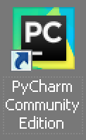
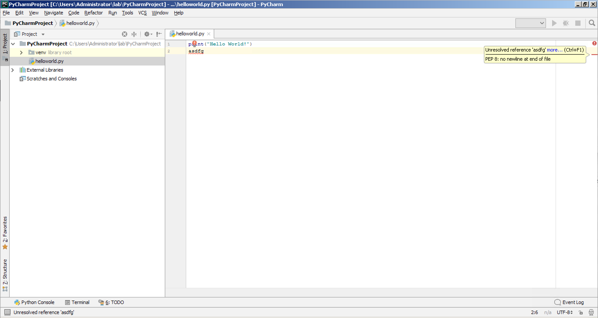

Navigation :: [Previous Page](LTRDEV-1100-05a1-PyCharm.md) :: [Table of Contents](LTRDEV-1100-00-Intro.md#table-of-contents) :: [Next Page](LTRDEV-1100-05a3-PyCharm-Ex2.md)

### Exercise 1: Getting Started with PyCharm

#### Objectives

The objectives for this exercise are to:

* How to create a project in PyCharm
* Learn to navigate the PyCharm application GUI
* Write Python code with PyCharm
* Run and debug Python code with PyCharm

#### Step 1: Creating a New Project with PyCharm

When you run PyCharm for the first time, you are presented with the welcome screen and prompted to create a new 
project, open an existing project, or check out a project from version control.  First, let's create a new project.

1. Double click the `PyCharm Community Edition` icon on the Desktop.
    
    

2. Click `Create New Project`.
    
    
    
2. Choose a location for your new project, for example `C:\Users\Adminstrator\lab\PyCharmProject`.
    
    Click to expand `Project Interpreter: New Virtualenv environment`.
    
    Click the radio button labeled `New environment using` and click the drop down menu to select `Virtualenv`.
    
    Accept the default `Location:`, for example `C:\Users\Adminstrator\lab\PyCharmProject\venv`.
    
    Click the drop down box labeled `Base interpreter:` to select the Python version 3 interpreter, for example 
    `C:\Users\Administrator\AppData\Local\Programs\Python\Python36-32\python.exe`.
    
    Accept the remaining default options and click the `Create` button.
    
    

    
Congratulations, you now have a new PyCharm project complete with a Python version 3 virtual environment ready to
write some code.  So far, we haven't touched the command line or had to manually create any directories for 
the Python virtual environment by hand.  PyCharm performed the heavy lifting for us.  Next, let's take a look at the 
PyCharm GUI.

#### Step 2: Navigating PyCharm

When a project is opened, you see the PyCharm window divided into different tool bars, window areas, a status bar, 
and Tip of the Day window.


Click the `Close` button on the `Tips of the Day` window to close tips window.

1. The project view is on the left side of the main window.  This lists your project files.  Double click to expand 
`PyCharmProject` and you will see the Python virtual environment PyCharm created for this project in the `venv` 
directory.
    
    

2. The editor is on the right side of the main window.  This is where you write your code and edit files.  Let's create
a new file so that we can explore the editor in more detail.
    
    Navigate to the `File` menu and click `New...` menu item.
    
    Click `Python File` in the pop up window.
    
    
    
    In the box labeled `Name:`, type `helloworld.py`.  Click the drop down box labeled `Kind:` and select `Python 
    file`.
    
    
    
    Click the `OK` button.
    
    The editor has tabs so that you can open and navigate between multiple files at one time.
    
    The editor has a left and right column surrounding it.  In the left column, you will see line numbers as you 
    type in the file you are editing, allowing you to navigate code more easily.  In the right column, you will see the
    result of PyCharm code inspection, which we will explore later in this lab.
    
    
    
3. The navigation bar is above the project view and editor.  Within the navigation bar, there are buttons for quick 
access to run and debug your code and version control actions.
    
    

4. At the bottom left corner of the main application window is a button to toggle showing/hiding the tool window bars.  
These windows can be toggled to be displayed or not.  This is where your code will run if invoked from within PyCharm,
you can manage project TODOs, access the Python interpreter console, and access a command line terminal.  These tool 
windows are designed to give you access tasks and tools you might need to manage your project without having to leave 
PyCharm and open multiple windows or applications.
    
    Click the icon to show the tool window bars.  We will explore the tool window bars later in this lab.
    
    

5. The status bar is at the bottom of the main application window and displays project and application status and 
informational messages.

#### Step 3: Writing Code with PyCharm

Let's write some Python code with PyCharm.
    
1. You created a new Python file named `helloworld.py` in the root of your PyCharm `PyCharmProject` project 
directory.  Go ahead and start writing a bit of Python code in the PyCharm editor:
    
    ```
    print
    ```
    
    Did you notice that when you typed the word `print`, PyCharm popped up a tool tip with suggested Python syntax 
    and its usage?
    
    
    
    Continue by typing more:
    
    ```
    print("")
    ```
    
    PyCharm automatically closed the `()` and `""` when you typed the opening `(` and `"`.  Additional tool tips 
    showed you more contextual Python syntax help.
    
    
    
    Continue by typing more (type the `Enter`/`Return` key at the end of the first line to create an empty second line):
    
    ```
    print("Hello World!")
    
    ```
    
    Now you have your first line of Python code written in PyCharm.  In the right column of the editor there 
    is a green check mark.
    
    
    
    Hover over the check mark and PyCharm will pop up a tool tip indicating that its code analysis is complete and no
    errors were found.
    
    
    
    Let's add a mistake intentionally to illustrate how this helps you write error-free code.  Type some gibberish on
    line 2:
    
    ```
    print("Hello World!")
    
    asdfg
    
    ```

    PyCharm will display a warning symbol.  Hover over the warning symbol:
    
    
    
    PyCharm will include an indicator with the analysis of the error at the exact point in the code the error occurs.
    Hover over the red line indicator on line 2 to see the result of the code analysis:
    
    
    
    This is part of the wonder and charm (no pun intended) of PyCharm!
    
    Go ahead and remove the error, which should leave you with the following code:
    
    ```
    print("Hello World!")
    
    ```
    
    Save your changes by navigating to the `File` menu and clicking `Save All` menu item.

#### Step 4: Running Python Code with PyCharm

So far, you've seen how you can create a project, add a Python file, write Python code, and correct Python syntax 
errors with ease with without leaving PyCharm.  Now you will learn how to run Python code with PyCharm.

1.  With your `PyCharmProject` project open and the Python file `helloworld.py` open in the editor, you can run the 
Python code from within PyCharm using the Python interpreter and virtual environment setup with the PyCharm project.
    
    Navigate to the `Run` menu and click the `Run...` menu item.
    
    
    
    Click on `2. helloworld`.
    
    When you run Python code in PyCharm, the main window will split and open the tool window bar on the bottom of the
    application window.  This will invoke the Python interpreter and run the Python code in the interpreter for you.  
    This is the same as opening a terminal, creating and initializing the Python virtual environment, and 
    running the Python interpreter by hand as we did earlier in this lab.  Here is an example:
    
    
    
    You can leave the tools window open or close the window by clicking the `Run Dashboard` tab at the bottom of the 
    tool window bar.  You can bring the tools window back by clicking the `Run Dashboard` tab again.
    
    You might have noticed there are other tabs in the tools window.  Let's explore those as well and see how they 
    are useful.
    
2.  Click the `Python Console` tab at the bottom of the tool window bar.  If you get a Windows Security Alert message 
window, click the `Allow Access` button.
    
    
    
    This should look familiar as it is the Python interpreter we used earlier in this lab.  This gives you place to 
    test code snippets or interact with the Python interpreter directly while writing your Python code.
    
    For example, type the simple "Hello World!" code in the Python Console:
    
    
    
3.  Click the `Terminal` tab at the bottom of the tool window bar.  This will open a command line interface terminal 
invoked from within the Python virtual environment created with this PyCharm project.  This would be the same thing 
as opening a terminal, changing to the project directory, and running the Python virtual environment manually.
    
    
    
    From here, you can run Python code directly, manipulate the file system directory and files, and run utilities 
    from the command line.
    
    For example, perform a directory listing with the `dir` command:
    
    

Navigation :: [Previous Page](LTRDEV-1100-05a1-PyCharm.md) :: [Table of Contents](LTRDEV-1100-00-Intro.md#table-of-contents) :: [Next Page](LTRDEV-1100-05a3-PyCharm-Ex2.md)
