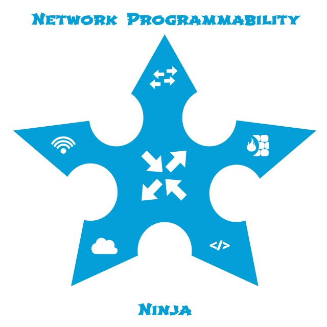

TODOs

- [x] @mgalazka Update Python content with new virtual environment instructions; Add content to upgrade pip==10.0.1;
Add content to pip install netmiko; Add content to upgrade setuptools==39.2.0;  Add content pip install -r
requirements.txt
- [ ] @curtissmith Update all content to include how to open Git Bash and PuTTY
- [ ] @curtissmith Re-structure/organize content
- [ ] @mgalazka Update TOC/navigation
- [ ] Create guide/README.md to include TOC

# Introduction

The title of this lab is "So, You want to be a Network Programmability Ninja, Now What?"  In this lab, we will help 
you get started with network programmability and arm you with the concepts and tools and real-world use cases needed to 
make use of network programmability in your day-to-day work and play.

We will have fun with Ninja-themed metaphors: We will introduce you to the Network Programmability Dojo; teach you 
the Tools of the Ninja; allow you to Hone your Ninja Skills; and, finally, Test Your Ninja Skills with real-world use 
cases at the end of this lab.

We hope you have fun and learn valuable new skills!

# Learning Objectives

Upon completion of this lab, you will be able to:

* Understand what are the basic network programmability concepts
* Learn what tools are useful for getting started with network programmability
* Practice with the tools to develop and sharpen new network programmability skills
* Put the concepts and tools to practice with real-world use cases
* Put your new skills to the test

# Lab Topology

# Table of Contents

1. [The Network Programmability Dojo](LTRDEV-1100-Guide-01-Dojo.md)
    1. [Cisco DevNet](LTRDEV-1100-Guide-01a-DevNet.md)
    2. [Cisco DevNet (Continued)](LTRDEV-1100-Guide-01b-DevNet-Ex1.md)
    2. [Cisco DevNet (Continued)](LTRDEV-1100-Guide-01c-DevNet-Ex2.md)
2. [Tools of the Ninja](LTRDEV-1100-Guide-02-Tools.md)
    1. [Git and GitHub](LTRDEV-1100-Guide-02a-Git.md)
    2. [Vagrant Up for Network Engineers](LTRDEV-1100-Guide-02b.md)
    3. [Python for Network Programmability](LTRDEV-1100-Guide-02d-Python.md)
    4. [Python for Network Programmability (Continued)](LTRDEV-1100-Guide-02e-Python-Ex1.md)
    5. [Python for Network Programmability (Continued)](LTRDEV-1100-Guide-02f-Python-Ex2.md)
    6. [Other Desktop Network Programmability Tools](LTRDEV-1100-Guide-02f.md)
        1. [Introducing PyCharm](LTRDEV-1100-Guide-02g.md)
        2. [Introducing Postman](LTRDEV-1100-Guide-02h.md)
        3. [Introducing Cisco Webex Teams](LTRDEV-1100-Guide-02g-Teams.md)
3. [Hone Your Ninja Skills](LTRDEV-1100-Guide-03-Hone.md)
    1. [Using APIs](LTRDEV-1100-Guide-03a-API.md)
    2. [Using NETCONF/YANG](LTRDEV-1100-Guide-03c-NETCONF.md)
    3. [Using NETCONF/YANG (Continued)](LTRDEV-1100-Guide-03d-NETCONF-Ex1.md)
    4. [Using NETCONF/YANG (Continued)](LTRDEV-1100-Guide-03e-NETCONF-Ex2.md)
    5. [Using NETCONF/YANG (Continued)](LTRDEV-1100-Guide-03f-NETCONF-Ex3.md)
    6. [Guest Shell](LTRDEV-1100-Guide-03g-GuestShell.md)
    7. [Guest Shell (Continued)](LTRDEV-1100-Guide-03h-GuestShell-Ex1.md)
    8. [Guest Shell (Continued)](LTRDEV-1100-Guide-03i-GuestShell-Ex2.md)
4. [Test Your Ninja Skills](LTRDEV-1100-Guide-04-Test.md)

---

Navigation - [Next Page](LTRDEV-1100-Guide-01-Dojo.md)
