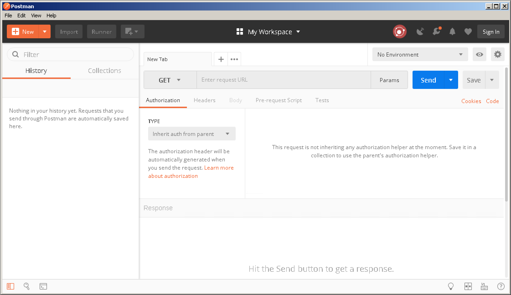
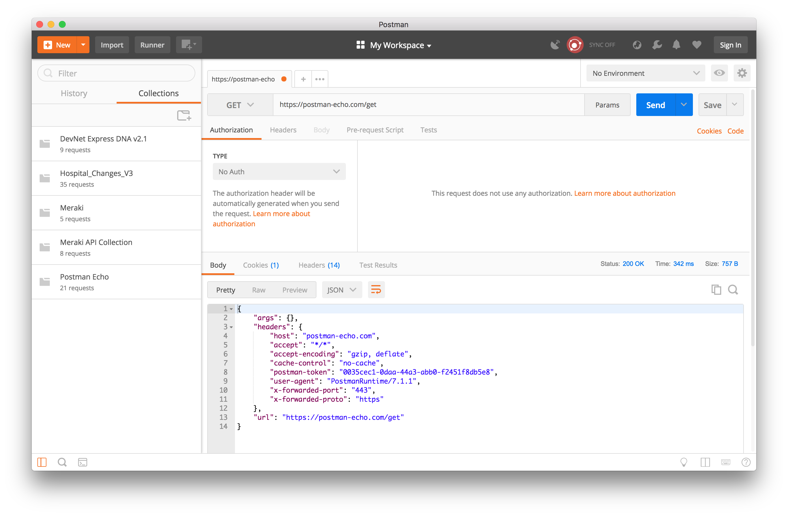
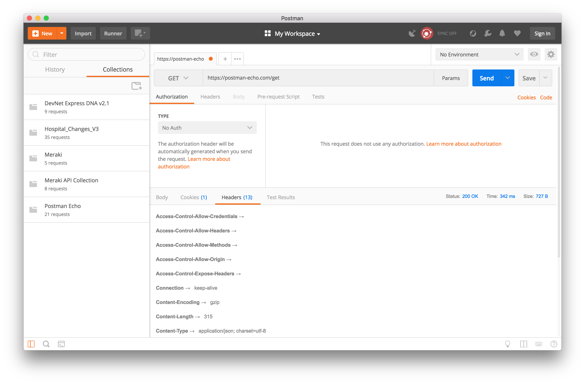

# Tools of the Ninja

## Git and GitHub

TODO:

- [x] @curtissmith Draft "Tools of the Ninja - Git and GitHub"
- [ ] Proofread
- [ ] Add example output and screenshots

### Introducing Git and GitHub

[Git](https://git-scm.com/) is a free and open source distributed version control system.  It was designed to be 
lightweight, easy to learn, and capable to handle projects large and small alike.  Git has a small footprint and is 
very fast.

A version control system records and manages changes to files over time.  A version control system will have 
mechnisms that allow you to see the differences between versions and revert back to earlier versions of files being 
managed.  Generally speaking, most people's idea of version control is to create copies of files and archive them in 
a series of directories on their file system.  This is very error prone as one file copy mistake and you could 
overwrite a file by mistake.  Also, this method rarely works when multiple people are modifying the same files at the
 same time.
 
A Git repository, or repo for short, is a group of files that are tracked as a project.  A Git repo can reside on your 
computer, but the repository must be hosted on a server if two or more people are going to access the repository.  
[GitHub](https://github.com/) is the largest online host of Git repositories on the Internet.  GitHub also serves as 
a community for developers.  GitHub is free, but any repositories you create and host on GitHub must be public.  
Private repositories are supported with a [paid subscription account upgrade](https://github.com/account/upgrade).

### Exercise 1: Creating a GitHub Account

#### Objectives

The objectives for this exercise are to:

* Create a GitHub account
* Explore GitHub

#### Step 1: Creating a GitHub Account

Although creating a GitHub account is not required to clone Git repositories hosted on GitHub, why not join and 
participate in one of the largest developer communities on the Internet?  Doing so gives you the opportunity to see 
what other people are working on or are interested in, learn how software is built by following projects, and share 
your work - no matter how small - with the community.

1. Open a web browser and navigate to [GitHub](https://github.com/): `https://github.com/`.
2. On the GitHub homepage, fill out the form to [Sign up](https://github.com/join?source=header-home), choosing a 
unique username, entering your email adress, and creating a password.  Click the `Sign up for GitHub` button.
3. Choose the personal plan `Unlimited public repositories for free.`  Optionally click to select `Send me updates on
GitHub news, offers, and events`.  Click the `Continue` button.
4. Tailor your GitHub experience by answering the questions.  Click the `Submit` button.

Congratulations, you have joined the GitHub community!

#### Step 2: Exploring GitHub

1. Take a few minutes to [explore GitHub](https://github.com/explore).
2. Take a few minutes to follow new and interesting people:
    1. Search for and follow your Cisco Live lab proctors: [Curtis Smith](https://github.com/curtissmith) 
(`curtissmith`) and [Matthew Galazka](https://github.com/mgalazka) (`mgalazka`).
    2. Search for and follow your fellow Cisco Live lab participants.
3. Take a few minutes to discover new repositories:
    1. Search for and star the Cisco Live [LTRDEV-1100 session](https://github.com/curtissmith/LTRDEV-1100) repository.
    2. Search for the [Cisco DevNet](https://github.com/CiscoDevNet) repositories.

### Exercise 2: Introducing Git Concepts

#### Objectives

The objectives for this exercise are to:

* Understand key Git version control system concepts
* Introduce the basic Git commands

#### Step 1: Understanding Git Version Control Concepts

There is a simple flow to using Git for version control:

```
+----------------+      +---------+       +----------+
| Initialize or  |      |  Stage  |       |  Commit  |
|     Clone      +----->| Changes +------>|  Changes |
| Git Repository |      |         |       |          |
+----------------+      +---------+       +----------+
```

You start by either creating a new Git repository or cloning an existing Git repository hosted on a remote server.  In 
doing so, you create the Git directory (also called the repository), a working directory, and a staging area (also 
called the index).  The Git directory contains the metadata and object database and is copied from the server when 
a repository is cloned.  The working directory contains one version of the project and are copied to the file system 
from the compressed object database in the Git directory.  The staging area is a file inside the Git directory 
contains an index of changes that are waiting to be committed.

Files that are changed but not staged are considered modified.  Files that are changed and added to the staging 
area are considered staged.  Files in the Git directory are considered committed.  In the next step, we will learn 
how to initialize and clone repositories, and modify, stage, and commit changes, and push those changes to GitHub.

#### Step 2: Learning Git Commands

Git has command line commands for managing Git repositories.  Here are the key commands and their usage you will need
 to get started to participate in projects or manage your own projects.

1. For a complete list of Git commands, type `git help` (output truncated for brevity):
    
    ```
    $ git help
    
    foo
    
    $
    ```
    
    For more help with a specific Git command, type `git <command> -h`, for example:
    
    ```
    $ git clone -h
     
    foo
     
    $
    ```
    
2. For first time setup, you should set your name and email address with the `git config` command.  Every commit you 
make includes this information, so it is important to set this after installing Git.  This should match the name and 
email address you used to register on GitHub, for example:
    
    ```
    $ git config --global user.name "Curtis Smith"
    
    foo
    
    $ git config --global user.email <curtissm@cisco.com>
    
    foo
    
    $
    ```
    
3. To create your very first Git repository, create a Git working directory and initialize the repository with the 
command `git init`, for example:
    ```
    $ mkdir -p ~/coding/ciscolive/helloworld
    $ cd ~/coding/ciscolive/hellowworld
    $ git init
    
    foo
    
    $
    ```
    
    Now take a look at the contents of the directory.  You find a hidden directory named `.git`:
    
    ```
    $ ls -al
    .		..		.git
    $
    ```
    
    The directory `~/coding/ciscolive/helloworld` is your new Git working directory and 
    `~/coding/ciscolive/helloworld/.git` is your Git directory.  Your working directory (and consequently your Git 
    directory) are empty as you've not staged or committed anything to the repository yet.
    
4. Let's confirm this is the case with the command `git status`:
    
    ```
    $ git status
    On branch master
    
    No commits yet
    
    nothing to commit (create/copy files and use "git add" to track)
    ```
    
    At any time you can invoke the `git status` command from inside your Git repository working directory to see 
    whether there are any staged changes or whether your copy of the repository is in sync with the remote server if 
    it is hosted online.
    
5. Let's create a new file to track:
    ```
    $ echo "# Hello World!" >> README.md
    $
    ```
    
    and check the status:
    
    ```
    $ git status
    On branch master
    
    No commits yet
    
    Untracked files:
        (use "git add <file>..." to include in what will be committed)
    
	        README.md
    
    nothing added to commit but untracked files present (use "git add" to track)
    ```
    
    You can see that there is an unstaged file in your working directory.  Let's stage the file with the `git add` 
    command:
    
    ```
    $ git add README.md
    $
    ```
    
    and the check the status again:
    
    ```
    $ git status
    On branch master
    
    No commits yet
    
    Changes to be committed:
        (use "git rm --cached <file>..." to unstage)
    
	        new file:   README.md
    
    $
    ```
    
    You can see there is a staged file in your working directory that is uncommitted.
    
6. Let's make your first commit to your first Git repository!  Use the `git commit` to commit your staged changes:
    
    ```
    $ git commit -m "My first Git commit"
    [master (root-commit) a2c0a25] My first Git commit
     1 file changed, 0 insertions(+), 0 deletions(-)
     create mode 100644 README.md
    $
    ```
    
    and check the status:
    
    ```
    $ git status
    On branch master
    nothing to commit, working tree clean
    $
    ```
    
    Congratulations, you've created your first Git repository and made your first commit to that repository!
    
7. Let's create a remote repository on GitHub and push our repository locally to the server.
    
    1. First, navigate to [Github](https://github.com/) `https://github.com/` and ensure you've logged in with the 
    account you created earlier.
    
    2. At the top right of the page, click the `+` and click `New Repository`.
    
    3. In the box labeled `Repository name` type `helloworld`.
    
    4. You may add an optional `Description`, for example `My first Git repository`.
    
    5. Click the `Create repository` button.
    
    6. Now let's push your existing local repository to the new remote repository you've created on GitHub.  First, 
    use the `git remote add` command to add the local repository to the remote repository (replace the URL in the 
    example below with the URL of your new remote repository):
    
    ```
    $ git remote add origin https://github.com/curtissmith/helloworld.git
    $
    ```
    
    Second, push your local changes to the remote repository with the `git push` command:
    
    ```
    $ git push -u origin master
    Counting objects: 6, done.
    Delta compression using up to 4 threads.
    Compressing objects: 100% (2/2), done.
    Writing objects: 100% (6/6), 455 bytes | 455.00 KiB/s, done.
    Total 6 (delta 0), reused 0 (delta 0)
    To https://github.com/curtissmith/helloworld.git
     * [new branch]      master -> master
    Branch 'master' set up to track remote branch 'master' from 'origin'.
    $
    ```
    
    and check the status:
    
    ```$ git status
    On branch master
    Your branch is up to date with 'origin/master'.
    
    nothing to commit, working tree clean
    $
    ```
    
    You can further confirm that your local repository is in sync with your remote repository and chdeck for changes 
    with the `git pull` command:
    
    ```
    $ git pull
    Already up to date.
    $
    ```
    
    If there had been any remote changes that were not in your local Git directory, then those changes would have 
    been synchronized in your Git directory and copied to your working directory.
    
    Navigate to your remote repository on GitHub and you should see the results of your labor!

8. The `git pull` will only work from inside a working directory that contains a Git repository in the first place.
    1. Try this by moving to a directory that doesn't contain a `.git` Git directory, for example:
        
        ```
        $ cd ~/coding/ciscolive
        $ ls -a
        .		..		helloworld
        $ git pull
        fatal: Not a git repository (or any of the parent directories): .git
        $
        ```
        
    2. To download a fresh copy of a remote repository to your local workstation, use the `git clone` command.  For 
    example, you can access this lab guide and all of the code and content for this session from [GitHub]
    (https://github.com/curtissmith/LTRDEV-1100) at `https://github.com/curtissmith/LTRDEV-1100`:
        
        ```
        $ git clone https://github.com/curtissmith/LTRDEV-1100
        Cloning into 'LTRDEV-1100'...
        remote: Counting objects: 117, done.
        remote: Compressing objects: 100% (84/84), done.
        remote: Total 117 (delta 51), reused 80 (delta 24), pack-reused 0
        Receiving objects: 100% (117/117), 86.75 KiB | 488.00 KiB/s, done.
        Resolving deltas: 100% (51/51), done.
        $ ls
        LTRDEV-1100	helloworld
        $ cd LTRDEV-1100/
        $ ls -a
        .		.git		AGENDA.md	README.md
        ..		ABSTRACT.md	BIO.md
        $ git status
        On branch master
        Your branch is up to date with 'origin/master'.
        
        nothing to commit, working tree clean
        $
        ```

## Ansible for Network Programmability

TODO:

- [ ] @curtissmith Draft "Tools of the Ninja - Git and GitHub"
- [ ] Proofread
- [ ] Add example output and screenshots

### Introducing Ansible

Easy button for network programmability...configuration management...

"Configuration management tools help manage infrastructure at scale. Consider the challenges of managing large data 
centers:

* Updating packages on thousands of virtual machines.
* Changing configuration files on hundreds of servers.
* Orchestrating a workflow such as the deployment of a new application to production across different data centers.
* Running multiple CLI commands on dozens of servers to retrieve operational data.

All of this is prone to various human error. As such, configuration management tools provide features that are useful
to solve problems such as these."

ad hoc across multiple hosts...simple task flow automation...workflow automation...

### Exercise 1: Foo

#### Objectives

The objectives for this exercise are to:

* Foo
* Bar

#### Step 1: Foo

loreum ipsum

#### Step 2: Bar

lorem ipsum

## Vagrant Up for Network Engineers

TODO:

- [x] @curtissmith Draft "Tools of the Ninja - Vagrant Up for Network Engineers"
- [ ] Proofread
- [ ] Add example output

### Introducing Vagrant Up for Network Engineers

[Vagrant](https://www.vagrantup.com/) is an Open Source tool for creating workflows to build and manage virtual 
machine environments.  Vagrant is developed and maintained by the San Francisco-based company [HashiCorp](https://www
.hashicorp.com/).  Vagrant is not just for software developers.  Developers, designers, DevOps engineers, and network
 engineers alike can use Vagrant to automatically provision consistent and disposable virtual environments that can be  
leveraged for application or scripting design, development, and testing.

You can use Vagrant to learn and test APIs, write and test scripts, and validate network device platform commands 
and configuration if the system you are interested can be virtualized.  Fortunately, many Cisco devices 
have been virtualized: IOS XE using the CSR 1000v image, NX-OS using the Nexus 9000v image, and IOS XR using the 
XRv image, to name a few.  Earn some developer street cred by learning how to "Vagrant Up"!

### Exercise 1: Introducing Vagrant

#### Objectives

The objectives for this exercise are to:

* Explain what problem Vagrant solves
* Introduce the basic Vagrant commands
* Explore a Vagrantfile

#### Step 1: Describing Vagrant

How many times have you said "It worked fine in the lab, I don't know why it won't work in production."?  Or how many 
times when troubleshooting an appication problem you've heard someone say "It worked fine in dev, I don't know whjy 
it won't work in prod."?  Network engineers oftentimes test configuration on their own test switch or router.  
Developers oftentimes develop and test code on their workstations.  But if your switch or or their workstation don't 
match production systems or environments, testing and development won't reflect reality and unfornsee issues may 
arise.  You need a lab environment that closely reflects your production network.  Developers need a dev environment 
that closely matches their production systems.  This is where Vagrant comes into play. 

Vagrant can be used to create virtual environments that closely, if not identically, match real-life, production 
environments.  Traditionally, building test dev environments was time consuming and could not be easily reproduced 
or replicated. With Vagrant, you can build a network programmability environment once that can create a virtual 
machine from basic templates called [boxes](https://www.vagrantup.com/intro/getting-started/boxes.html), customize 
the operating system, install required software, and more.  Vagrant manages virtualization platforms refered to as 
[providers](https://www.vagrantup.com/intro/getting-started/providers.html).

Instead of building or recreating a virtual machine from scratch every time you need a network programmability 
environment, Vagrant boxes provide a base image from which virtual machines can be cloned.  HashiCorp maintains and 
hosts third-party boxes online, but you may also use install a box from a local `.box` file you create yourself or 
obtain a trusted source or from a custom URL.

Vagrant by itself is not a virtualization platform and cannot start a virtual machine.  Instead, Vagrant provides a 
common and consistent command line interface to control and manage virtual machines running inside VirtualBox, 
VMware, Amazon Web Services, and more using the virtualization platforms' APIs.

This is not limited to commonly virtualized operating systems like Microsoft  Windows or Linux  distributions.  
Vagrant supports many guest and host operating systems.  Anything that can be run as a virtual machine in a supported  
Vagrant provider can be supported, including Cisco IOS XE, NX-OS, and IOS XR!

Take a brief moment to discover the publicly available [catalog of Vagrant boxes](https://app.vagrantup
.com/boxes/search).

#### Step 2: Learning Vagrant Commands

Regardless of the Vagrant provider used as the virtualization platform, Vagrant has common commands for initializing an 
environment, installing and uninstalling boxes, booting an environment, connecting to the virtual machine, powering 
down an environment, cleaning up an environment, and more.

1. For a complete list of Vagrant commands, type `vagrant -h` (output truncated for brevity):
    
    ```
    $ vagrant -h
    
    foo
    
    $
    ```

2. For more help with a specific Vagrant command, type `vagrant <command> -h`, for example:
    
    ```
    $ vagrant box -h
     
    foo
     
    $
    ```
    
3. Vagrant boxes are globally stored for the current user logged into the host system running Vagrant.  Boxes are 
never modified; boxes are cloned from the base image provided by the box.  If you manage multiple 
Vagrant projects that use the same Vagrant box, modifying a guest virtual machine in one environment will not affect 
a guest virtual machine in other environments.
    
    1. To list the locally stored boxes on your system, type `vagrant box list`, for example:
        
        ```
        $ vagrant box list
        
        foo
        
        $
        ```
    
    2. To download and install a Vagrant box from [HashiCorp's Vagrant Cloud box catalog](https://app.vagrantup
    .com/boxes/search), type `vagrant box add <box descriptor>`.  For example, to install the box named 
    `hashicorp/precise64`:
        
        ```
        $ vagrant box add hashicorp/precise64
        
        foo
        
        $
        ```
    3. To remove a Vagrant box altogether from your system, type `vagrant box remove <box descriptor>`.  For example,
     to uninstall the box downloaded in the previous example:
        
        ```
        $vagrant box remove hashicorp/precise64
        
        foo
        
        $
        ```
    
4. Every Vagrant environment needs initialized.  To initialize a new Vagrant environment, type `vagrant init`.  This 
will establish the current working directory as the environment root directory and create a Vagrantfile (more on 
Vagrantfiles in Step 3.).  For example, to create a directory `my_first_vagrant_env` and initialize a new Vagrant 
environment:
    
    ```
    $ mkdir my_first_vagrant_env
    $ vagrant init
    
    foo
    
    $
    ```
    
5. To start up the new Vagrant environment, type `vagrant up`, for example:
    
    ```
    $ vagrant up
    
    foo
    
    $
    ```
    
6. To connect to the virtual machine in your new environment, you have two options, depending on what is supported 
by the virtual machine cloned from the Vagrant box:
    
    1. To connect using SSH, type `vagrant ssh`, for example:
        
        ```
        $ vagrant ssh
        
        foo
        
        $
        ```
    
    2. To connect using RDP, type `vagrant rdp`.
    
7. To see the status of the Vagrant environment, type the command `vagrant status`, for example:
    
    ```
    $ vagrant status
    
    foo
    
    $
    ```
    
    This will show you the current, default machine status.  If there are multiple Vagrant environments running, then
     type the command `vagrant global-status` to see all virtual machine environments, for example:
     
     ```
     $ vagrant global-status
     
     foo
     
     $
     ```
     
8. There are several Vagrant commands to manage the state of a Vagrant environment:
    
    1. To suspend the Vagrant environment, type `vagrant suspend`.
    2. To resume the Vagrant environment, type `vagrant resume`.
    3. To shutdown the Vagrant environment, type `vagrant halt`.
    4. To restart the Vagrant environment and force Vagrant to re-load the Vagrantfile, type `vagrant reload`.
    5. When you are done with the Vagrant environment, you can delete everything and clean up the working directory 
    (leaving the Vagrantfile).  Be aware that you will lose changes to the virtual machine and environment.  To 
    delete the Vagrant environment, type `vagrant destroy`, for example:
        
        ```
        $ vagrant destroy
        
        foo
        
        $
        ```
    
    Each of these commands can take the virtual machine ID or name as listed in the output of the command `vagrant 
    global-status` as an argument to specify a specific virtual machine if you have multiple machines running on your 
    system.  For example, if you want to destroy a specific virtual machine with machine ID `1a2b3c4d`, then type the
     command `vagrant destroy 1a2b3c4d`.

#### Step 3: Exploring a Vagrantfile

Every Vagrant environment or project requires a [Vagrantfile](https://www.vagrantup.com/docs/vagrantfile/).  The 
most basic reason for requiring a Vagrantfile is to describe the type of virtual machine and how to configure and  
provision the virtual machine.  The Vagrantfile is called a Vagrantfile because that is also the filename 
`Vagrantfile`.  Only one Vagrantfile is needed per Vagrant project environment.  The Vagrantfile should be managed 
in a version control system (such as Git and Github, which you will learn about later in this lab) so that your 
peers can check out the Vagrantfile for an environment and simply `vagrant up` to get the environment up and running.
 
The syntax of a Vagrantfile is the [Ruby](http://www.ruby-lang.org/en/) programming language, but it is not necessary 
have an understanding of Ruby to edit a Vagrantfile.  Let's take a look at the default Vagrantfile that is created 
for you when you run the command `vagrant init hashicorp/precise64`:

    # -*- mode: ruby -*-
    # vi: set ft=ruby :
    
    # All Vagrant configuration is done below. The "2" in Vagrant.configure
    # configures the configuration version (we support older styles for
    # backwards compatibility). Please don't change it unless you know what
    # you're doing.
    Vagrant.configure("2") do |config|
      # The most common configuration options are documented and commented below.
      # For a complete reference, please see the online documentation at
      # https://docs.vagrantup.com.
    
      # Every Vagrant development environment requires a box. You can search for
      # boxes at https://vagrantcloud.com/search.
      config.vm.box = "hashicorp/precise64"
    
      # Disable automatic box update checking. If you disable this, then
      # boxes will only be checked for updates when the user runs
      # `vagrant box outdated`. This is not recommended.
      # config.vm.box_check_update = false
    
      # Create a forwarded port mapping which allows access to a specific port
      # within the machine from a port on the host machine. In the example below,
      # accessing "localhost:8080" will access port 80 on the guest machine.
      # NOTE: This will enable public access to the opened port
      # config.vm.network "forwarded_port", guest: 80, host: 8080
    
      # Create a forwarded port mapping which allows access to a specific port
      # within the machine from a port on the host machine and only allow access
      # via 127.0.0.1 to disable public access
      # config.vm.network "forwarded_port", guest: 80, host: 8080, host_ip: "127.0.0.1"
    
      # Create a private network, which allows host-only access to the machine
      # using a specific IP.
      # config.vm.network "private_network", ip: "192.168.33.10"
    
      # Create a public network, which generally matched to bridged network.
      # Bridged networks make the machine appear as another physical device on
      # your network.
      # config.vm.network "public_network"
    
      # Share an additional folder to the guest VM. The first argument is
      # the path on the host to the actual folder. The second argument is
      # the path on the guest to mount the folder. And the optional third
      # argument is a set of non-required options.
      # config.vm.synced_folder "../data", "/vagrant_data"
    
      # Provider-specific configuration so you can fine-tune various
      # backing providers for Vagrant. These expose provider-specific options.
      # Example for VirtualBox:
      #
      # config.vm.provider "virtualbox" do |vb|
      #   # Display the VirtualBox GUI when booting the machine
      #   vb.gui = true
      #
      #   # Customize the amount of memory on the VM:
      #   vb.memory = "1024"
      # end
      #
      # View the documentation for the provider you are using for more
      # information on available options.
    
      # Enable provisioning with a shell script. Additional provisioners such as
      # Puppet, Chef, Ansible, Salt, and Docker are also available. Please see the
      # documentation for more information about their specific syntax and use.
      # config.vm.provision "shell", inline: <<-SHELL
      #   apt-get update
      #   apt-get install -y apache2
      # SHELL
    end

Let's break this down; it is acutally much simpler than it might appear.

1. The line `# -*- mode: ruby -*-` simply indicates that the Vagrantfile is written in the Ruby language syntax.  
This line is required and should always be the first line of the Vagrantfile.
    
2. Throughout the Vagrantfile, you will find lines that begin with a `#`.  These are comments and are ignored by 
Vagrant but provide you with guidance and allow you to document your Vagrantfile for clarity.  Nearly the entire 
Vagrantfile is comments.

3. If we remove the comments, we are just left with three lines of actual Vagrantfile configuration:
    
    ```
    Vagrant.configure("2") do |config|
      config.vm.box = "hashicorp/precise64"
    end
    ```
    
    In fact, these three lines are all that are really required to bring up a virtual machine environment.
    
     1. `Vagrant.configure("2") do |config|` is the syntax to indicate that this is a configuration for Vagrant 
        version 2.  
     2. `config.vm.box = "hashicorp/precise64"` is the syntax to specify the Vagrant box used to clone and boot 
        the virtual machine.  The box descriptor would be changed based on the box you choose.
     3. `end` indicates the end of the configuration.
        
    All other configuration of the environment uses the defaults from Vagrant and VirtualBox.

## Python for Network Programmability

TODO:

- [x] @mgalazka Draft "Tools of the Ninja - Python for Network Programmability"
- [ ] Proofread
- [ ] Other stuff?

### Introducing Python

[Python](https://www.python.org/) is a popular programming language and a great first language to learn. Python is 
highly readable, object oriented, and it can be run interactively through the Python interpreter. One reason that 
Python has become quite popular is due to its plethora of available modules, or reusable code, to tackle many different 
projects or tasks. Additionally, Python is available for many different operating systems, some of which even include 
it by default. This allows the same Python scripts to be written, modified, and executed by users on Windows, Mac, 
Linux, and more.

Learning a language like Python is really important on a journey towards network programmability. Python gives the 
flexibility to create reusable code to solve a particular problem, or perhaps automate a series of steps. Through its 
modules, Python can be used to communicate with networking devices in many ways, including SSH, NETCONF, 
and REST API's. With so many uses, it is one of the most powerful tools a Network Programmability Ninja can have.

### Understanding Python Versions

When it comes to programming in Python, it's critical to understand which Python interpreter is installed in the 
environment. The reason for this is that Python 3.0 re-wrote certain aspects of the language, which broke backward 
compatibility with Python 2. While it is still common to find Python files (scripts) written for use with Python 2, 
most projects are now written for use with Python 3. In this lab, Python 3 is the interpreter to use.

While the two versions are different, it is entirely possible to have both Python 2 and Python 3 on the same computer. 
It's also possible to have several different versions of each installed at the same time (i.e. Python 3.4, 3.5, 3.6). 
For these reasons, it is important to understand which version of Python you are running.

### Setting up Virtual Environments

Different projects using Python may have different environment requirements. For instance, one project may need Python 
2.x interpreter, whereas others may need Python 3.x. Some projects may require many Python packages and modules to be 
installed, and others may only use built-in modules.

Traditionally, installing a package for Python is a global change on a particular host. This means that if one project 
needs access to one version of a package, and another project needs to upgrade to a different version of the same 
package, it could break the first project. Thankfully, there is a tool that can help tackle this problem: virtualenv.

Virtualenv allows isolating python environments to specific directories, as opposed to globally. This means each 
virtualenv can run its own Python executable in the correct version, and install its own packages and modules. 
By creating separate virtual environments per project, a developer can manage these dependencies of each project 
without inadvertently causing harm to other projects.

### Exercise 1: Setting Up a Python Environment

#### Objectives

The objectives for this exercise are to:

* Check the version of Python
* Set up a virtual environment to work in

#### Step 1: Checking the version of Python

In order to work with Python, we need to make sure that it is properly installed, able to run, and is of the 
correct version.

1.  Open a terminal, and at the command prompt, enter the command `python -V` (case-sensitive) and check the output. 
    The output should look similar to below:
    
    ```
    $ python -V
    Python 3.6.3
    ```

    In some scenarios when both Python 2.x and Python 3.x are installed on the same host, you may need to run 
    `python3 -V` to get these results. If this is the case, please use `python3` to run python in the following step.

#### Step 2: Setting up a Virtual Environment

Now that we know that Python 3 is available for use, it is time to set up a virtual environment to continue working in.

1.  First, create and enter a directory called `LTRDEV-1100` as a home for your project.
    ```
    $ mkdir LTRDEV-1100
    ```

2.  Next, create a virtual environment in this directory. By using the `-p python3` parameter, virtualenv will use the 
    current Python 3.x version installed on the host as its version. 

    ```
    $ virtualenv -p python3 LTRDEV-1100
    Running virtualenv with interpreter /Library/Frameworks/Python.framework/Versions/3.6/bin/python3
    Using base prefix '/Library/Frameworks/Python.framework/Versions/3.6'
    New python executable in ~/LTRDEV-1100/bin/python3
    Also creating executable in ~/LTRDEV-1100/bin/python
    Installing setuptools, pip, wheel...done.
    ```

3.  Now that the virtual environment is created, go ahead and activate it so that any packages installed for our 
    project will stay within this specific environment. This is done by typing `source bin/activate` from within the 
    project's working directory.

    ```
    $ cd LTRDEV-1100
    $ source bin/activate
    (LTRDEV-1100) $
    ```

    Now that the environment has been activated, notice that the prompt is now prepended with the project name. This 
    means that any packages that you install or remove in this terminal window will be specific to this project unless 
    you `deactivate` or close the terminal.

### Exercise 2: Deploying Useful Packages

#### Objectives

The objectives for this exercise are to:

* Understand which packages are already installed
* Install useful packages for a Network Programmabity Ninja

#### Step 1: Understanding which Packages are Installed
Once a virtual environment is created, a few specific packages are automatically installed. However, sometimes when 
going back into a project after not working on it for a while, it is useful to view which packages are already 
installed. 

1.  First make sure that your terminal still shows the prepended project name `(LTRDEV-1100)`. If it does not, 
    then `cd` back into that directory and issue `source bin/activate` first.

2.  The `pip` tool is a software management system to install and maintain packages in Python. List installed packages 
    with `pip list` at the terminal.
    
    ```
    (LTRDEV-1100) $ pip list
    Package    Version
    ---------- -------
    pip        10.0.1
    setuptools 39.1.0
    wheel      0.31.0
    (LTRDEV-1100) $
    ```

    As seen here, this virtual environment is still 'vanilla' with no additional packages installed.

#### Step 2: Installing Useful Packages
There are plenty of useful packages when working with network programmability. 

* requests: This installs a library useful for making HTTP operations, which is necessary for working with REST API's.
* ncclient: The ncclient library provides a client library for working with NETCONF.
* paramiko: Paramiko provides an implementation of SSHv2 into Python, enabling a python script to interact with a 
    network device over SSH.
* netmiko: Netmiko is a library that simplifies Paramiko for use with network devices such as those running 
    Cisco IOS-XE.
* ipaddress: This library allows Python to handle IP addresses with functions to effectively work with IP's and subnets.

1. We can use `pip` to install these packages into our virtual environment. Issue: 
    `pip install requests ncclient paramiko netmiko ipaddress` to install all of these packages and their prerequisites.

    ```
    (LTRDEV-1100) $ pip install requests ncclient paramiko netmiko ipaddress
    Collecting requests
    ... [output truncated] ...
    ```

    Alright! Now that the virtual environment is active and is ready for any future packages, it is a great time to 
    start trying out python.

### Execise 3: Working with Python 

#### Objectives

The objectives for this exercise are to:

* Work with the Python interpreter
* Run a Python Script

#### Step 1: Working with the Python Interpreter

Recall that Python is an interpreted language, meaning that every command is evaluated as it is run. The Python 
interpreter can be run interactively, allowing for real-time testing of code. This can be a great way to learn how a 
particular function acts, or as a quick way to execute a couple of one-time use Python code.

1.  Run the interactive interpreter by issuing `python` at the terminal.

    ```
    (LTRDEV-1100) $ python
    Python 3.6.0 (v3.6.0:41df79263a11, Dec 22 2016, 17:23:13)
    [GCC 4.2.1 (Apple Inc. build 5666) (dot 3)] on darwin
    Type "help", "copyright", "credits" or "license" for more information.
    >>> 
    ```

2.  Notice that once the Python interpreter is running, the prompt changes to `>>>`. This is where you can input Python 
    code. Start with printing `Hello World!` to the screen, as shown below.

    ```
    >>> print("Hello World!")
    Hello World
    >>>
    ```

3.  The interactive interpreter is mainly used for practicing, learning, debugging, or quick-use. As Python has many 
    built-in math and numeric functions, it can be an easy way to do quick arithmetic. Need to know how much cash to 
    bring for a $50 dinner, including 15% tip and 6% sales tax?

    ```
    >>> 50*(1.15+.06)
    60.5
    >>>
    ```
    
    Sometimes our on-the-fly mathematics needs are directly related to our network ninja skills. For instance, you may 
    need to convert DSCP values to ToS values. Converting DSCP to ToS for quality of service is done by bit-shifting by 
    2 bits to the left (padding a binary number with two 0's). Doing this on paper, one would typically write out the 
    binary representation of the DSCP integer, then pad two 0's on the right side of this binary string, and then 
    mentally convert that new binary string back into an integer. Tough? Then use Python.
    
    ```
    >>> 46 << 2
    184
    >>>
    ```
    
    The `<<` operator executes a left bit-shift operation on the number to the left of the operator by the number of 
    bits indicated to the right of the operator. In this example, we bit-shifted two bits to the left on DSCP 46, 
    leaving us with a ToS value of 184. 

4.  To exit the interpreter, type `quit()` or use the key-sequence `CTRL-D` and it will return you to the 
    terminal prompt.

#### Step 2: Running a Python Script

While the interactive Python interpreter is useful here and there, the majority of work with Python will be done by 
creating and running scripts. A Python script is a set of instructions written in a language that the Python 
interpreter understands. The script is written in a text editor or developement environment, and then run against the 
Python interpreter.

1.  Return to your terminal window, and ensure that your are in your virtual environment. If the prompt is not 
    prepended with `(LTRDEV-1100)` please `cd` to your project directory and issue `source bin/activate`.

2.  Create your first python script by editing the file `helloworld.py` in nano by issuing the command:
    `nano -w helloworld.py`

    This will open the nano text editor program.

3.  Let's create our first script! Type the following into nano:

    ```
    print("Hello world!")
    myNumber = 5
    print("My favorite number is", myNumber)
    ```

4.  Once you have inputted this into nano, type the command sequence `CTRL-X`, followed by `y` to save changes, and 
    hit enter to accept the filename.

5.  Run the script by issuing `python helloworld.py`
    
    ```
    (LTRDEV-1100) $ python helloworld.py
    Hello world!
    My favorite number is 5
    (LTRDEV-1100) $
    ```

    By putting your Python instructions into a file, it can be called at any time by the Python interpreter. This is 
    key to reusing code.

### Execise 4: Python Ninjutsu 

#### Objectives

The objectives for this exercise are to:

* Know your target: Identify data types
* Learn discipline: Proper use of operators
* Adapt quickly: Conditional statements
* Select your equipment: Working with functions
* Forging metal: Writing your own functions
* Surround your enemy: Executing loops

## Other Desktop Network Programmability Tools

TODO:

- [ ] @mgalazka Draft "Tools of the Ninja - Other...Postman"
- [ ] @mgalazka Draft "Tools of the Ninja - Other...Webex Teams"

There are a number of other desktop applications you will find useful.  We've chosen to highlight apps that are 
cross-platform, supporting Microsoft Windows, Apple macOS, and Linux alike, have full-featured free versions, and 
are generally popular in the community.  We've included applications for testing and exploring APIs, collaborating 
with peers and teams, and devleoping in an integrated environment.  These are GUI applications that 
help simplify development and collaboration and keep you productive.

### Introducing PyCharm

TODO:

- [x] @curtissmith Draft "Tools of the Ninja - Other...PyCharm"
- [ ] Proofread
- [x] Add screenshots

[PyCharm](https://www.jetbrains.com/pycharm/) is a Python integrated development environment (IDE) developed by 
[JetBrains](https://www.jetbrains.com/).  There is a [free community version](https://www.jetbrains
.com/pycharm/download) available for download, but you can support the application and obtain addtional features with
 the purchase of the [professional version](https://www.jetbrains.com/pycharm/buy/).  JetBrains describes PyCharm as 
 an "intelligent coding assistant".
 
 Key features of PyCharm include, but are not limited to:
 
 * A smart code editor with syntax formatting, highlighting, completion and error detection
 * Built-in terminal and integrated debugger
 * Integrated support for version control systems, including Git
 * Integrated support for Vagrant
 
An IDE like PyCharm is much more than a text editor, although it is that, too.  Let's take a look at what is key to 
getting started with PyCharm. 

### Exercise 1: Getting Started with PyCharm

#### Objectives

The objectives for this exercise are to:

* How to create a project in PyCharm
* Learn to navigate the PyCharm application GUI
* Write Python code with PyCharm
* Run and debug Python code with PyCharm

#### Step 1: Creating a New Project with PyCharm

When you run PyCharm for the first time, you are presented with the welcome screen and prompted to create a new 
project, open an existing project, or check out a project from version control.  First, let's create a new project.

1. Click `Create New Project`.
    
    
    
2. Choose a location for your new project, for example `PyCharmProjects/helloworld`.
    
    
    
    1. Click to expand `Project Interpreter: New Virtualenv environment`.
    2. Click the radio button to select `New environment using` and click the drop down menu to select `Virtualenv`.
    3. Accept the default `Location`, for example `PyCharmProjects/helloworld/venv`.
    4. Click the drop down box to select a Python version 3 interpreter.
    6. Accept the remaining default optoins and click the `Create` button.
    
Congratulations, you now have a new PyCharm project complete with a Python version 3 virtual environment ready to
write some code.  So far, we haven't touched the command line or had to manually create any directories for 
Python virtual environment by hand.  PyCharm performed the heavy lifting for us.  Next, let's take a look at the 
PyCharm GUI.

#### Step 2: Navigating PyCharm

When a project is opened, you see the PyCharm window divided into different tool bars, window areas, and a 
status bar.


1. The project view is on the left side of the main window.  This lists your project files.
2. The editor is on the right side of the main window.  This is where you write your code.  The editor has tabs so 
that you can open and navigate between multiple files at one time.
    1. The editor has a left and right column surrounding it.  In the left column, you will see line numbers which 
    lets you navigate the code more easily.  In the right column, you will see the result of PyCharm code inspection.
3. The navigation bar is above the project view and editor.  Within the navigation bar, there are buttons for quick 
access to run and debug your code and version control actions.
4. At the bottom of the main window is the tool windows.  These windows can be toggled to be displayed or not.  This 
is where your code will run if invoked from within PyCharm, you can manage project TODOs, access the Python 
interpreter console, and access a command line terminal.  These tool windows are designed to give you access to most 
everything you might need without having to leave PyCharm and open multiple windows or applications.
5. The status bar is at the bottom of the main window and displays project and application status and informational 
messages.

#### Step 3: Writing Code with PyCharm

In PyCharm, with your `helloworld` project open, double click the project in the project view to expand the tree.  
You will the Python virtual environment we discussed earlier in this lab.  This was automatically created for you by 
PyCharm when you created this project.  Let's create a new file and write some Python code.

1. Right click on `helloworld` and select `New` and click `Python File`.
    
    
    
2. Type `helloworld.py` in the `Name:` box and select `Python file` from the `Kind:` drop down box.  Click the `OK` 
button.
    
    
    
3. Now you have a new file names `helloworld.py` in your the root of your PyCharm `helloworld` project directory.  Go
ahead and start writing a bit of Python code in the PyCharm editor:
    
    ```
    print
    ```
    
    Did you notice that when you typed the word `print`, PyCharm popped up a tool tip with suggested Python syntax 
    and its usage?
    
    
    
    Continue by typing more:
    
    ```
    print("")
    ```
    
    PyCharm automatically closed the `()` and `""""` when you typed the opening `(` and '"'.  Additional tool tips 
    showed you more contextual Python syntax help.
    
    
    
    Continue by typing more:
    
    ```
    print("Hello World!")
    
    ```
    
    Now you have you first line of Python code written in PyCharm.  In the right column of the editor there 
    is a green checkmark.  Hover over the checkmark and PyCharm will pop up a tool tip indicating that its code 
    analysis is complete and no errors were found.
    
    
    
    Let's add a mistake intentionally to illustrate how this helps you write error-free code.  Type the following:
    
    ```
    print("Hello World!")
    
    asdfg
    
    ```

    PyCharm will display a warning symbol.  Hover over the warning symbol:
    
    
    
    PyCharm will include an indicator with the analysis of the error at the exact point in the code the error occurs.
      Hover over the red line:
    
    
    
    This is part of the wonder and charm (no pun intended) of PyCharm!
    
    Go ahead and remove the error, which should leave you with the following code:
    
    ```
    print("Hello World!")
    
    ```
    
    Save your changes by clicking the `File` menu and clicking `Save All`.

#### Step 4: Running Python Code with PyCharm

So far, you've seen how you can create a project, add a Python file, write Python code, and correct Python syntax 
errors with ease with PyCharm.  All without leaving PyCharm.  Now you will learn how to run and debug a Python 
application with PyCharm.

1.  With a project active and a Python file open in the editor, you can run the Python code from within 
PyCharm using the Python interpreter and virtual environment setup with the PyCharm project.  To run your `helloworld
.py` Python code, click on the green play button in the navigation bar on the top right side of the PyCharm 
application window:
    
    
    
    When you run a Python code in PyCharm, the main window will split and open the tool window on the bottom. 
    This will invoke the Python interpreter and run the Python code in the interpreter for you.  This is the 
    same as opening a terminal, creating and initializing the Python virtual environment with `virtualenv`, and 
    running the Python interpreter by hand as we did earlier in this lab.  Here is an example:
    
    
    
    You can leave the tools window open or close the window by clicking the `Run` tab at the bottom of the window.  
    You can bring the tools window back by clicking the `Run` tab again.
    
    You might have noticed there are other tabs in the tools window.  Let's explore those as well and see how they 
    are useful.
    
2.  Click the `Python Console` tab.   This should look familiar as it is the Python interpreter we used earlier in 
this lab.  This gives you place to test code snippets or interact with the Python interpretor directly why writing 
your Python code.  For example, type the simple "Hello World!" code in the Python Console:
    
    
    
3.  Click the `Terminal` tab.  This will open a command line interface terminal invoked from within the Python 
virtual environment created with this PyCharm project.  This would be the same thing as opening a terminal, changing 
to the project directory, and running `virtualenv` manually.  From here, you can run Python code directly, 
manipulate the file system directory and files, and run utilities from the command line.  Give it a try, perform a 
directory listing with the `dir` or `ls` command, based on whether you are on a Windows or macOS/Linux workstation:
    
    

### Exercise 2: Getting Advanced with PyCharm

#### Objectives

The objectives for this exercise are to:

* Learn how to keep your project under version control in Git with PyCharm
* Learn how to integrate Vagrant with PyCharm

#### Step 1: Managing a Project's Git Repository in PyCharm

Earlier in this lab, we created a new PyCharm project from scratch.  Now, let's explore creating a PyCharm project by
cloning from a Git repository and how to keep our project under revision control.

1.  First, close the current PyCharm project by clicking on the `File` menu and clicking `Close Project`.

2.  You need to move the original PyCharm project since the name of the project matches the name of the Git 
repository we created earlier in this lab.  From the terminal:
    
    ```
    $ cd ~/PyCharmProjects
    $ mv helloworld helloworld.old
    $
    ```

3. Next, click `Check out from Version Control` from the `Welcome to PyCharm` window and click `Git`.
    
    

4. In the `URL:` box, type the URL for your Git repository you created earlier in this lab.  For example, 
`https://github.com/curtissmith/helloworld`, replacing `curtissmith` with your Git username.    
    1. Click the `Test` button to test the Git repository URL you've typed.
        
        
        
    2. If the test was successful, click the `Clone` button.
    3. Click the `Yes` button when prompted to open the directory.
        
    
5. Now you have a new PyCharm project cloned from your Git repository.  Double click to expand the `helloworld` 
project directory in the PyCharm project view.  You will find the `README.md` file we created earlier in the lab.

    When you double click to open the `README.md` file, you'll notice the editor will open and you have many of the 
    same editing features with a Markdown file as you do with a Python file.  There is an additional feature where 
    PyCharm will preview the Markdown file live for you.  Click the buttons in editor window to toggle to show the 
    editor only, show the editor and a preview, or show a preview only.
    
    
    
6.  You will notice there is no `venv` directory in your project.  That is because PyCharm did not create one when it
cloned the Git repository.  However, we can configure and create one easily.
    
    1. Click the `File` menu and click `Settings`.
    2. Double click `Project: helloworld` to expand the tree and click `Project Interpreter`.  You will notice that 
        this is empty or has an error.
    3. Click the gear button next to the drop downbox labeled `Project Interpreter` and click `Add...`.
        1. Click to select `Virtual Environment`.
        2. Click the radio button to select `New environment`
        3. Accept the default `Location`, for example `PyCharmProjects/helloworld/venv`.
        4. Click the drop down box to select a Python version 3 interpreter.
        5. Accept the remaining default options and click the `OK` button.
        
        
        
        A new Python virtual environment will be created for you.  Click the `OK` button.
    
7. Let's re-create our "Hello World!" Python code.  Right click on `helloworld` and select `New` and click `Python
File`.
    
    
    
    1. Type `helloworld.py` in the `Name:` box and select `Python file` from the `Kind:` drop down box.  Click the 
        `OK` button.
    
        
    
    2. This time, PyCharm knows that this project is under revision control with Git and prompts you to add the new 
        file to Git:
        
        For now, ignore the PyCharm project `.idea` directory and all its file contents.  Click the checkbox next to 
        `.idea` to unselect the directory and all files under that directory.  Ensure that `helloworld.py` is checked.
        
        
    
    3. Now you have a new file names `helloworld.py` in your the root of your PyCharm `helloworld` project directory.
        Go ahead and re-write Python code in the PyCharm editor:
        
        ```
        print("Hello World!")
        
        ```
        
        and save your changes by clicking the `File` menu and clicking `Save All`.

8. You will also notice new buttons in the naviation bar at the top of the PyCharm window and a new tool window in the 
tool window tab at the bottom of the PyCharm window: `Version Control`.  Click the `Version Control` tab.
    
    
    
    1. First, you will get a status of all local changes.  Double click `Default` and you see your Python file 
    `helloworld.py`.
    2. Second, you will see `Unversioned Files` - too numerous to list, so click the `browse` button.
        
        
        
        1. Double click to expand the tree and you notice you have two directories each with files that are 
        unversioned.  These include the PyCharm project `.idea` directory and Python virtual environment `venv` 
        directory.
        2. Click to select the `.idea` directory.
            1. Click the fourth button from the left `Ignore`.
            2. Click the radio buton labeled `Ignore all files under`.
                
                
            
            3. Click the `OK` button.
        3. Repeat the previous step to ignore the `venv` directory.
        4. Click the `Close` button.
    3. Now it is time to commit your changes.  Click the `VCS` menu and click `Commit...`
        1. Add an entry such as `Initial commit` in the `Commit Message` box.
        3. Click the `Commit` button.
            
            
            
        4. If PyCharm doesn't know your Git username, then it will prompt your for it.
            1. Fill out your name in the boxed labeled `Name` and email address in the boxed labeled `E-mail`.  
            2. Ensure that the checkbox labeled `Set properties globally` is checked.
                
                
            
            3. Click the `Set and Commit` button.
    4. Once all your changes are committed, don't forget to push your committed changed to the remote repository.
        1. Click the `VCS` menu, click `Git`, and click `Push`.
            
            
            
        2. Click the `Push` button.
        
    7. PyCharm will show you the status of your Git push and tell you when the action has been completed successfully.
        
        
        
        Check your handiwork by opening a web browser and navigating to your Git repository in GitHub, for 
        example `https://github.com/curtissmith/helloworld`, replacing `curtissmith` with your own GitHub username.
        
Congratulations, you've cloned a remote Git repository, staged a new Python file, committed those changes, and pushed
your changes into the remote Git repository - All without leaving the PyCharm application or having to go back and 
forth between PyCharm and the command line.  PyCharm makes managing the whole project easy, including with version 
control.

#### Step 2: Vagrant Up with PyCharm

lorem ipsum

### Introducing Postman

[Postman](https://www.getpostman.com/) is a development environment focused specifically on working with application programming interfaces (API's). An API is a well-defined structure that allows communication between different pieces of software. Many network engineers are aware that a Cisco Nexus switch has a command line interface where users can type well-defined commands and receive expected output. Some may be surprised to learn that the same Nexus switch also has an API interface where users can send specific queries and receive structured responses ideal for programmatic consumption.

The benefits to utilizing API's are in the way that the information can be consumed and processed, as well as the rate and control with which changes can be made. As an example on the information processing side, imagine that you have a critical router and you want to be alerted if a certain route or set of routes change or disappear from the routing table. Monitoring for this situation with traditional network management tools may prove difficult. Using an API to query the router about these routes, the specific information being sought can be retreived, parsed, and used to generate an alert.

As products continue to implement API's, possibilities of cross-product or cross-system integration become ever more popular. One example of this within Cisco is with pxGrid. This open API allows contextual information about security to be shared between cross-vendor security products to contain threats faster than the products could have accomplished on their own.

Many modern API's are RESTful API's, meaning that they follow HTTP methods and framework to exchange data. While Postman is a full-featured and powerful toolset, it still provides a remarkably user-friendly experience as an API client. This functionality is helpful when working with products or services that offer a REST API. Postman can be a great first step to prototype the API call, and then subsequently understand how the resposne looks. Using this information, it becomes much easier to interact with the API programmatically. 

### Exercise 1: Learn Postman Basics

#### Objectives

The objectives for this exercise are to:

* Become familiar with the layout of Postman
* Understand how to make an API call
* Analyze the results of an API call

#### Step 1: Becoming Familiar with Postman Layout

Postman is organized in three main sections: the header bar, the side bar, and the build area. The header bar is located at the top and provides access to common administrative tasks: creating new requests, importing data, changing settings, and so forth. The side bar is on the left side and it contains a history of requests made, as well as a section titled, "Collections," which we will look at in a later exercise. The build area is the majority of the screen real estate in the Postman app, and it is where you can build and send API requests.



1. Locate the method dropdown at the top of the build area. This allows you to select the type of API request to make, such as an HTTP GET, PUT, POST, and so on. For our introductory lesson, please select `GET` as the method.

2. Next to the method dropdown, notice the field to input a URL. This is the web location for the API with which you want to interact. Immediately to the right of this URL is a button to add parameters to the URL. These are akin to appending the URL with key/value pairs via `?myvariable=1&another=2` syntax often noted at the end of web URLs.

3. Just below the URL field, there are a few more options to define the request. For instance, you can define headers with the request. This is common with web requests in general. For instance, this is the method by which your mobile phone's web browser can indicate that it is a mobile device, and hence you get the mobile version of a web page automatically. With API's it is important as well; often times authentication keys, data formats, and more can be defined in headers.

4. The bottom half of the build area is where the response from the API requests is displayed. This will show the response code, the time to receive a response, and details of the response including any body and headers.

#### Step 2: Making an API call

1. In order to make an API call, we first have to select the HTTP method. 

Three of the most common methods used in API calls are `GET`, `POST`, and `PUT`. `GET` is used when getting information from an API. A `GET` request specifies the information in which it is interested via the URL, parameters, and headers. A `POST` request is one that is sending information to the API. This is often in the form of creating a new data entry of some sort through the API. Lastly, the `PUT` is often used to update existing information through the API.

In our example, we will be making a `GET` request, so please make sure this is the method selected.

2. Now that we know we will be making a request for information, we need a location to find the API we are querying. Please specify the URL as `https://postman-echo.com/get` in the URL field. We do not require any parameters for this API.

3. Click `Send` and watch for the response. If successful, the `Status` should return `200 OK` which means that the request was accepted by the API.

#### Step 3: Analyzing the Results



1. After verifying the important response code is `200 OK` we can start to dig into the other components of the response. Notice the body of the response that is shown below. The response is a set of data displayed in the JSON format of key/value pairs. 

2. Aside from the body of the response, there are also headers that give information about the response. For instance, the header `Content-Type` specifies `application/json` as its value. This data is important if working with API's programmatically, as JSON formatted data would be parsed differently than, say, XML formatted data.



### Exercise 2: Working in Postman

#### Objectives

The objectives for this exercise are to:

* Learn how and why to create a Collection
* Save variables in an Environment
* Use Postman to generate a Python script


