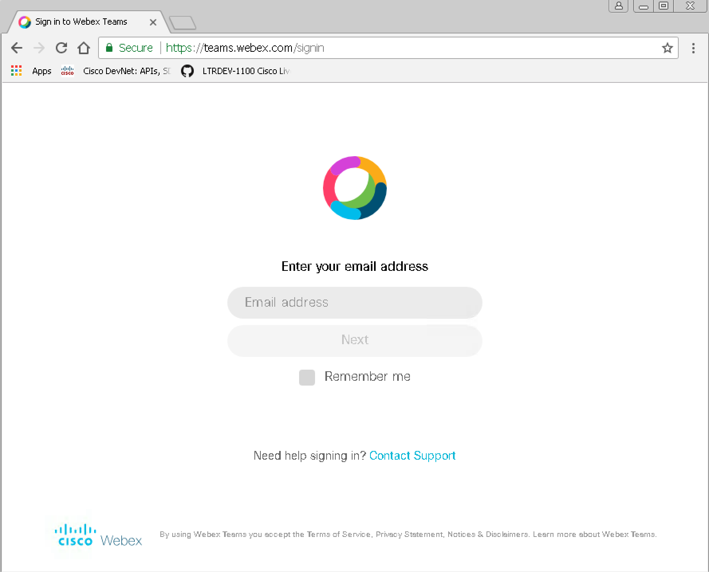
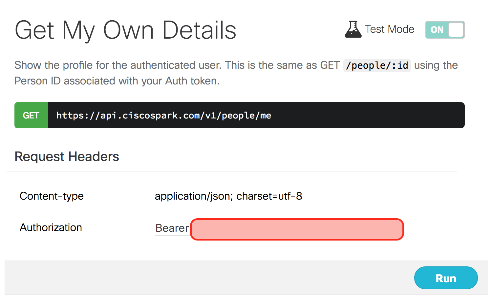
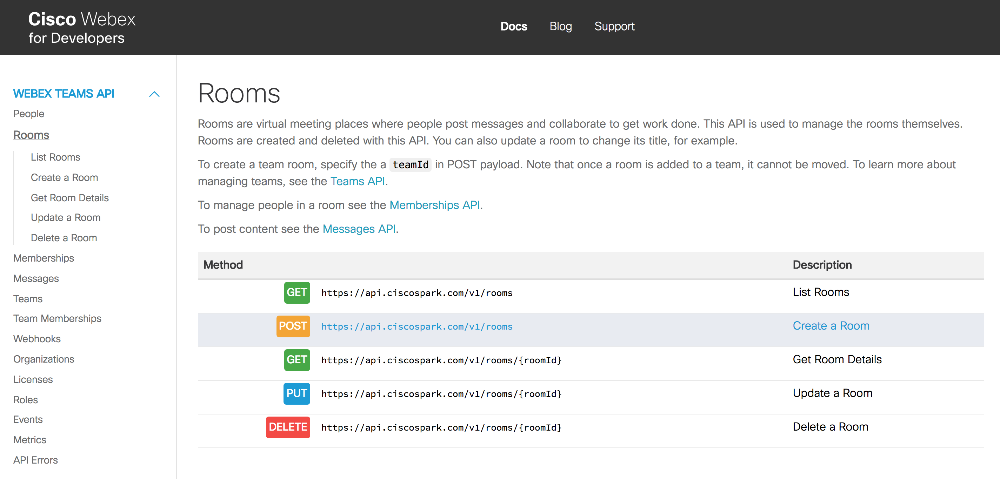
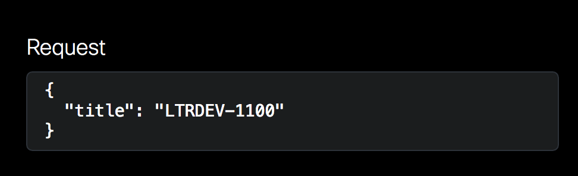

### Exercise 1: Getting to Know Webex Teams

#### Objectives

The objectives for this exercise are to:

* Sign up for a Webex Teams account
* Learn how to obtain an API token
* Discover Webex Teams Integrations
* Understand Webex Teams API Calls

#### Step 1: Sign up for a Webex Teams account

If you don't already have a Webex Teams (formerly Cisco Spark) account - then the first thing to do is sign up for 
one. If you already have an account and are confident in your ability to log in to it, please skip to Step 2.

1. Head on over to [Webex Teams Web Login](https://teams.webex.com/) to create your account.

2. Go ahead and type in your email address. If you have yet to activate an account, it will send an email to this 
address with a link to activate the account. Go ahead and input your email and hit `Next`.
    
    
    
3. If you do not yet have an account, it will tell you to check your email. Please do so, and click on the activation
link that is there waiting for you.

4. Follow the instructions to complete your signup.

#### Step 2: Obtain an API token

Once you have an account with Webex Teams, you can use it to access the platform API's. Webex Teams has a really 
well-documented set of API's, so it's important to spend some time learning about them.

1. Head over to [Cisco Webex for Developers](https://developer.webex.com/getting-started.html#authentication) to grab
your access token to use with the API. Save this token in a notepad window for future use.

2. Check out the rest of this "Getting Started" web page for some more info on Webex Teams API. Read through the 
use-cases and such. How can you see this useful for you as you embark on network programmability?

#### Step 3: Understand Webex Teams API's

Later in this lab, we will spend more time deep-diving into the logic and details of API's. For now, it is important 
to understand what kinds of API's are available and how they can help. Let's run through an overview of some important uses of the API.

1. Navigate to the [Cisco Webex Teams API Quick Reference](https://developer.webex.com/quick-reference.html) page for
a high-level overview of what interactions you can take using the API. Scroll through the page and look at the different functions that are available for the different categories.

2. Let's understand what type of info can be gathered through the API. For instance, in the `People` section of the 
quick reference, click on the `Get My Own Details` request.

3. This site allows for interactive use of the API's directly from the web interface, which is really helpful to 
understand how the API's work. To utilize this, flip the switch next to `Test Mode` to `ON`.
    
    
    
4. Go ahead and click `Run` to see the response on the right-side column. Without worrying too much about the details
of the structure, notice the information that comes back. With the API call, we are able to pull the user details.

5. Let's use this site to create a room that we can use during this lab. Click on `Rooms` on the left-hand column 
under the `Webex Teams API` section (alternatively, you can click
[here](https://developer.webex.com/resource-rooms.html) to get there). Select the `Create a room` method.
    
    
    
6. Ensure that the `Test Mode` is turned on, and then it is time to create a room. A room in Webex Teams (referred to
as a Space in the app) is a gathering place where team messaging, sharing, and collaboration can take place. Name 
your room something interesting like `LTRDEV-1100`. We can leave the `teamId` blank. The right-hand column should 
update in real-time with the request structure, shown below. When you are ready, click `Run` and monitor the 
right-hand column for results. If you see a `200 / Success` then the room was created!
    
    
    
#### Step 4: Discover Webex Teams Integrations

Everything that we've looked at so far allow you to interact as yourself with Webex Teams via the API. While this can
be effective and helpful depending on the task, Webex Teams also allows for integrations and bots, which expand the 
functionality and use even further. An integration is software that can act on your behalf to interact with other 
systems. Bots are separate 'users' that can send messages into spaces or read messages directed to them.

1. Check out the available integrations already developed and publicly available. Go to the
[Cisco Webex App Hub](https://apphub.webex.com/categories) to see a list of different integrations available for use.
For instance, you can add an integration with Github to receive notifications in Webex Teams for when updates are 
made to a repository. Spend a few minutes looking through the available bots and integrations.

2. If all of these available integrations and bots is inspirational, it is important to know that you can create 
these as well! Check out the documentation for [integrations](https://developer.webex.com/authentication.html) and 
[bots](https://developer.webex.com/bots.html) to learn more, but here is a quick reminder of the differences between 
integrations and bots.
    
    * Integrations utilize the Webex Teams API on behalf of other users, via OAuth.
    * Bots are effectively their own users and can post their own content.
