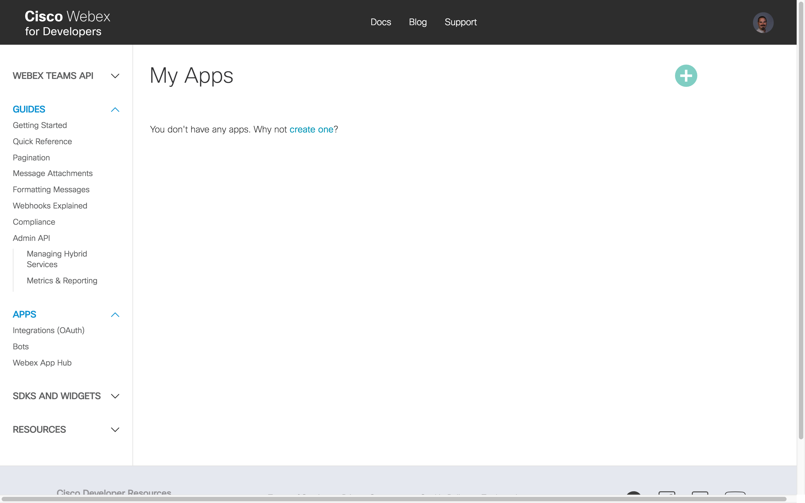
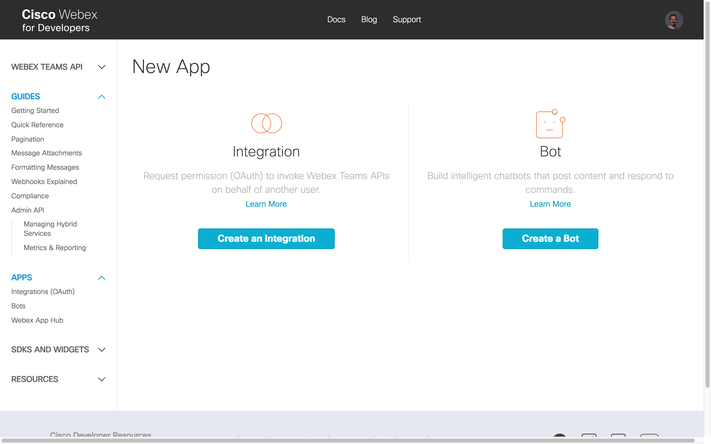
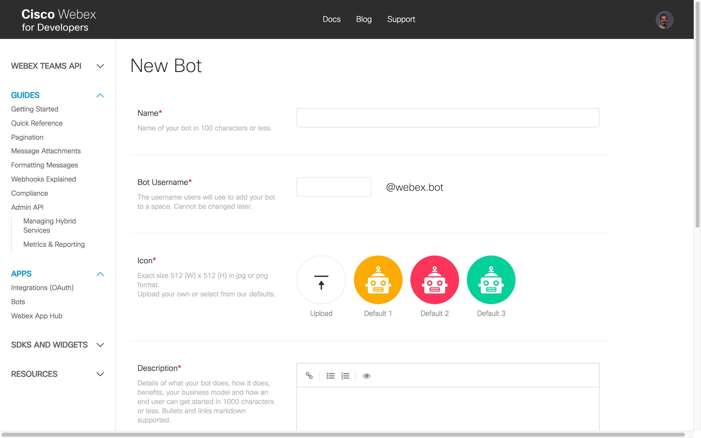
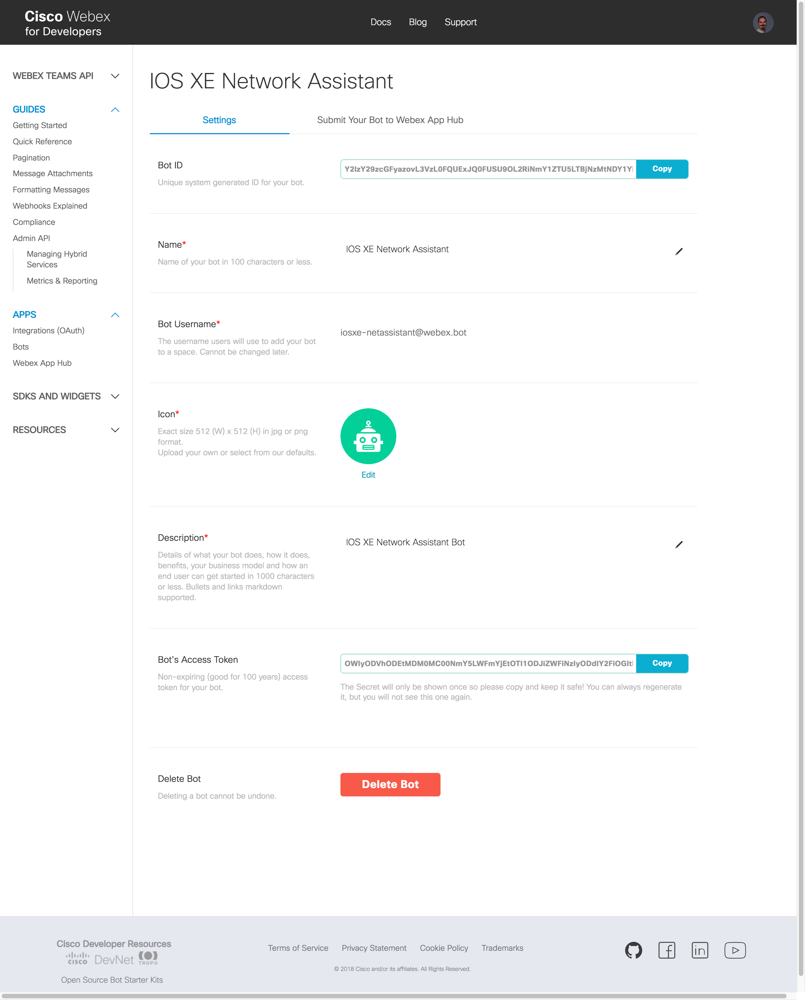
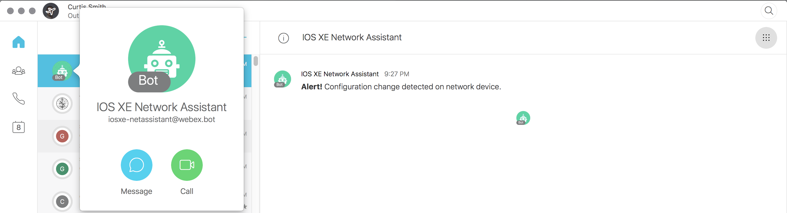

### Example 1: ChatOps like a Network Programmability Ninja

#### Objectives

The objectives for this exercise are to:

* Learn how to create a Webex Teams Bot
* Create a Python script on-box in Guest Shell to be triggered under some condition
* Create an IOS XE EEM applet to trigger the Python script given come condition

#### Step 1: Creating a Webex Teams Bot

In order to give your network device a voice to communicate ChatOps style in Webex Teams, you need an account to use 
to send a message.  You neither want to create a Webex Teams account for every network device, nor use your account 
on every network device.  The solution is to create a Bot through which all of your network devices can communicate 
and collaborate.  Think of this Bot as your Network Assistant, a virtual member of your team.  In this lab, we will 
create a basic Notifier Bot, which typically only responds to events in an external service or system and send a 
message in Webex Teams.  It is left as an exercise to you to use this a framework for creating a Controller or 
full-fledged Assistant ChatBot that can interact with you.

Creating a Webex Teams Bot is very easy.

1. In a web browser, navigate to [Cisco Webex for Developers](https://developer.webex.com/):
`https://developer.webex.com` and login with your Webex Teams account credentials you created earlier in this lab.
    
    

2. Click on your profile photo at the top right corner of the webpage.
    
    
    
    Click on `My Webex Teams Apps`.
    
    

3.  Click the icon with the plus sign inside a green circle to create a new Webex Teams app.
    
    

4.  Click `Create a Bot`.
    
    

5. Fill out the form in its entirety.
    
    Name your Bot, for example `IOS XE Network Assistant`.
    
    Choose a Bot Username, for example `iosxe-netassist`.  This must be unique and cannot be shared, so I suggest 
    you precede the Bot Username with something like the initials for first, middle, and last name.
    
    Choose a Icon.  You can select one default icons to choose to upload an icon of your own creation.
    
    Enter a Description, for example `IOS XE Network Assistant Bot`.
    
    Click `Create Bot`.
    
    

6. Take extra care to note the `Bot's Access Token`.  Click `Copy` and then paste this into a text file for reference
later in this lab.  The access token is what will be used to authenticate the Webex Teams API calls from your 
Python script.  Once you leave this screen, you will not be able to retrieve this access token.  This token should be
treated like a password and kept private.

Congratulations, you have created a Webex Teams Bot to serve as your ChatOps IOS XE Network Assistant.  Continue with
this lab to create a Python script to be triggered with EEM. 

#### Step 2: Triggering On-Box Python Scripts with IOS XE Embedded Event Manager

In this step, we will configure Embedded Event Manager to run a Python script residing on-box in Guest Shell in 
response to an event.

1. Establish an SSH connection to the IOS XE device `csr1` by double clicking the CSR1 PuTTY icon on the desktop:
    
    
    
2. From the IOS XE device CLI, ensure you are in privileged EXEC mode as indicated by the `csr1#` prompt.  If you are
in user EXEC mode as indicated by the `csr1>` prompt, then enter privileged EXEC mode with the `enable` command, for
example:
   
    ```
    csr1>enable
    csr1#
    ```
    
    

3. Enter a Guest Shell interactive session with the IOS XE command `guestshell run bash`, for example:
    
    ```
    csr1#guestshell run bash
    [guestshell@guestshell ~]$

4. Change to the `/bootflash/scripts` directory created ealier in the lab with the `cd` command from the Guest Shell 
`[guestshell@guestshell ~]$` prompt:
    
    ```
    [guestshell@guestshell ~]$ cd /bootflash/scripts
    [guestshell@guestshell scripts]$
    ```

4. Transfer the Bot script with the `wget` command from `https://raw.githubusercontent.com/curtissmith/LTRDEV-1100/labguide/code/iosxe-netassist-bot.py`
    
    ```
    [guestshell@guestshell scripts]$ wget https://raw.githubusercontent.com/curtissmith/LTRDEV-1100/labguide/code/iosxe-netassist-bot.py
    --2018-06-09 00:45:12--  https://raw.githubusercontent.com/curtissmith/LTRDEV-1100/labguide/code/iosxe-netassist-bot.py
    Resolving raw.githubusercontent.com (raw.githubusercontent.com)... 151.101.0.133, 151.101.64.133, 151.101.128.133, ...
    Connecting to raw.githubusercontent.com (raw.githubusercontent.com)|151.101.0.133|:443... connected.
    HTTP request sent, awaiting response... 200 OK
    Length: 1128 (1.1K) [text/plain]
    Saving to: 'iosxe-netassist-bot.py'
    
    100%[======================================>] 1,128       --.-K/s   in 0s
    
    2018-06-09 00:45:17 (9.75 MB/s) - 'iosxe-netassist-bot.py' saved [1128/1128]
    
    [guestshell@guestshell scripts]$
    ```

We need to complete a few tasks to update Python and install the necessary Python packages in Guest Shell needed for 
our Bot script.

5. The Webex Teams API uses the [Server Name Indication (SNI)](https://en.wikipedia.org/wiki/Server_Name_Indication)
extension to TLS.  An SSL client will fail to connect to the API if it does not support SNI with an error similar to:
    
    ```
    hostname 'api.ciscospark.com' doesn't match either of '*.wbx2.com', 'wbx2.com'
    ```
    
    IOS XE 16.8 Guest Shell ships with Python version 2.7.5, which contains an SSL client that will in fact fail to 
    connect due to lack of support for SNI.  SNI support was added to these versions of the following common 
    libraries and tools:
    
    * Java 1.7
    * PHP 5.3
    * Python 2.7.9, Python 3
    * Ruby (net/http) 2.0
    * cURL 7.18.1
    * wget 1.14
    
    Not to worry; it is trivial to upgrade Python in Guest Shell.  To do so, we recommend you upgrade using the 
    CentOS RPM package available for upgrade with the Yellowdog Updater, Modified (yum for short) RPM package manager.
    To upgrade Python, use the `sudo` command to run `yum` with elevated root user privileges:
    
    ```
    [guestshell@guestshell scripts]$ sudo -E yum upgrade python2
    Loaded plugins: fastestmirror
    base                                                     | 3.6 kB     00:00
    extras                                                   | 3.4 kB     00:00
    updates                                                  | 3.4 kB     00:00
    (1/4): extras/7/x86_64/primary_db                          | 147 kB   00:00
    (2/4): base/7/x86_64/group_gz                              | 166 kB   00:00
    (3/4): updates/7/x86_64/primary_db                         | 2.0 MB   00:00
    (4/4): base/7/x86_64/primary_db                            | 5.9 MB   00:01
    Determining fastest mirrors
     * base: linux.cc.lehigh.edu
     * extras: mirrors.advancedhosters.com
     * updates: ftp.linux.ncsu.edu
    Resolving Dependencies
    --> Running transaction check
    ---> Package python.x86_64 0:2.7.5-16.el7 will be updated
    ---> Package python.x86_64 0:2.7.5-68.el7 will be an update
    --> Processing Dependency: python-libs(x86-64) = 2.7.5-68.el7 for package: python-2.7.5-68.el7.x86_64
    --> Running transaction check
    ---> Package python-libs.x86_64 0:2.7.5-16.el7 will be updated
    ---> Package python-libs.x86_64 0:2.7.5-68.el7 will be an update
    --> Processing Dependency: libcrypto.so.10(OPENSSL_1.0.2)(64bit) for package: python-libs-2.7.5-68.el7.x86_64
    --> Running transaction check
    ---> Package openssl-libs.x86_64 1:1.0.1e-60.el7_3.1 will be updated
    --> Processing Dependency: openssl-libs(x86-64) = 1:1.0.1e-60.el7_3.1 for package: 1:openssl-1.0.1e-60.el7_3.1.x86_64
    ---> Package openssl-libs.x86_64 1:1.0.2k-12.el7 will be an update
    --> Running transaction check
    ---> Package openssl.x86_64 1:1.0.1e-60.el7_3.1 will be updated
    ---> Package openssl.x86_64 1:1.0.2k-12.el7 will be an update
    --> Finished Dependency Resolution
    
    Dependencies Resolved
    
    ================================================================================
     Package              Arch           Version                 Repository    Size
    ================================================================================
    Updating:
     python               x86_64         2.7.5-68.el7            base          93 k
    Updating for dependencies:
     openssl              x86_64         1:1.0.2k-12.el7         base         492 k
     openssl-libs         x86_64         1:1.0.2k-12.el7         base         1.2 M
     python-libs          x86_64         2.7.5-68.el7            base         5.6 M
    
    Transaction Summary
    ================================================================================
    Upgrade  1 Package (+3 Dependent packages)
    
    Total download size: 7.4 M
    Is this ok [y/d/N]:
    ```
    
    Notice that yum calculated the RPM dependencies for us and summarized the list of other RPMs that will also 
    need to be upgraded to upgrade Python.  When prompted with `Is this ok [y/d/N]:` answer 
    `y` and press the `Enter/Return` key:
    
    ```
    Is this ok [y/d/N]: y
    Downloading packages:
    Delta RPMs disabled because /usr/bin/applydeltarpm not installed.
    warning: /var/cache/yum/x86_64/7/base/packages/openssl-1.0.2k-12.el7.x86_64.rpm: Header V3 RSA/SHA256 Signature, key ID f4a80eb5: NOKEY
    Public key for openssl-1.0.2k-12.el7.x86_64.rpm is not installed
    (1/4): openssl-1.0.2k-12.el7.x86_64.rpm                    | 492 kB   00:00
    (2/4): openssl-libs-1.0.2k-12.el7.x86_64.rpm               | 1.2 MB   00:00
    (3/4): python-2.7.5-68.el7.x86_64.rpm                      |  93 kB   00:00
    (4/4): python-libs-2.7.5-68.el7.x86_64.rpm                 | 5.6 MB   00:00
    --------------------------------------------------------------------------------
    Total                                              4.9 MB/s | 7.4 MB  00:01
    Retrieving key from file:///etc/pki/rpm-gpg/RPM-GPG-KEY-CentOS-7
    Importing GPG key 0xF4A80EB5:
     Userid     : "CentOS-7 Key (CentOS 7 Official Signing Key) <security@centos.org>"
     Fingerprint: 6341 ab27 53d7 8a78 a7c2 7bb1 24c6 a8a7 f4a8 0eb5
     Package    : centos-release-7-1.1503.el7.centos.2.8.x86_64 (@base/$releasever)
     From       : /etc/pki/rpm-gpg/RPM-GPG-KEY-CentOS-7
    Is this ok [y/N]:
    ```
    
    If prompted to import a new GPG key with the prompt `Is this OK [y/n]` answer `y` and press the `Enter/Return` key:
    
    ```
    Is this ok [y/N]: y
    Running transaction check
    Running transaction test
    Transaction test succeeded
    Running transaction
      Updating   : 1:openssl-libs-1.0.2k-12.el7.x86_64                          1/8
      Updating   : python-libs-2.7.5-68.el7.x86_64                              2/8
      Updating   : python-2.7.5-68.el7.x86_64                                   3/8
      Updating   : 1:openssl-1.0.2k-12.el7.x86_64                               4/8
      Cleanup    : 1:openssl-1.0.1e-60.el7_3.1.x86_64                           5/8
    warning: file /usr/share/man/man1/tsget.1ssl.gz: remove failed: No such file or directory
    warning: file /usr/share/doc/openssl-1.0.1e/ssleay.txt: remove failed: No such file or directory
    warning: file /usr/share/doc/openssl-1.0.1e/openssl_button.html: remove failed: No such file or directory
    warning: file /usr/share/doc/openssl-1.0.1e/openssl_button.gif: remove failed: No such file or directory
    warning: file /usr/share/doc/openssl-1.0.1e/openssl.txt: remove failed: No such file or directory
    warning: file /usr/share/doc/openssl-1.0.1e/c-indentation.el: remove failed: No such file or directory
    warning: file /usr/share/doc/openssl-1.0.1e/README.FIPS: remove failed: No such file or directory
    warning: file /usr/share/doc/openssl-1.0.1e/README: remove failed: No such file or directory
    warning: file /usr/share/doc/openssl-1.0.1e/NEWS: remove failed: No such file or directory
    warning: file /usr/share/doc/openssl-1.0.1e/LICENSE: remove failed: No such file or directory
    warning: file /usr/share/doc/openssl-1.0.1e/INSTALL: remove failed: No such file or directory
    warning: file /usr/share/doc/openssl-1.0.1e/FAQ: remove failed: No such file or directory
    warning: file /usr/share/doc/openssl-1.0.1e/CHANGES: remove failed: No such file or directory
    warning: file /usr/share/doc/openssl-1.0.1e: remove failed: No such file or directory
      Cleanup    : python-2.7.5-16.el7.x86_64                                   6/8
      Cleanup    : python-libs-2.7.5-16.el7.x86_64                              7/8
      Cleanup    : 1:openssl-libs-1.0.1e-60.el7_3.1.x86_64                      8/8
    warning: file /usr/share/doc/openssl-libs-1.0.1e/LICENSE: remove failed: No such file or directory
    warning: file /usr/share/doc/openssl-libs-1.0.1e: remove failed: No such file or directory
      Verifying  : python-libs-2.7.5-68.el7.x86_64                              1/8
      Verifying  : python-2.7.5-68.el7.x86_64                                   2/8
      Verifying  : 1:openssl-1.0.2k-12.el7.x86_64                               3/8
      Verifying  : 1:openssl-libs-1.0.2k-12.el7.x86_64                          4/8
      Verifying  : 1:openssl-1.0.1e-60.el7_3.1.x86_64                           5/8
      Verifying  : python-2.7.5-16.el7.x86_64                                   6/8
      Verifying  : python-libs-2.7.5-16.el7.x86_64                              7/8
      Verifying  : 1:openssl-libs-1.0.1e-60.el7_3.1.x86_64                      8/8
    
    Updated:
      python.x86_64 0:2.7.5-68.el7
    
    Dependency Updated:
      openssl.x86_64 1:1.0.2k-12.el7        openssl-libs.x86_64 1:1.0.2k-12.el7
      python-libs.x86_64 0:2.7.5-68.el7
    
    Complete!
    [guestshell@guestshell scripts]$
    ```
    
    It is safe to ignore the warnings at this time.  Ensure that the RPM package upgrades are successful with the 
    output `Complete!` before continuing with this lab.

6. Next, we need to install the perquisite Python requests package needed to make the Webex Teams API calls.  You 
could install the Python package with pip like we have on our lab workstation, however with a system under 
package management like the CentOS Linux Guest Shell, we recommend you install the appropriate RPM instead, if 
available.  Use the `sudo` command to run `yum` with elevated root user privileges to install the `python-requests`
RPM:
    
    ```
    [guestshell@guestshell scripts]$ sudo -E yum install python-requests
    Loaded plugins: fastestmirror
    Loading mirror speeds from cached hostfile
     * base: linux.cc.lehigh.edu
     * extras: mirrors.advancedhosters.com
     * updates: ftp.linux.ncsu.edu
    Resolving Dependencies
    --> Running transaction check
    ---> Package python-requests.noarch 0:2.6.0-1.el7_1 will be installed
    --> Processing Dependency: python-urllib3 >= 1.10.2-1 for package: python-requests-2.6.0-1.el7_1.noarch
    --> Processing Dependency: python-chardet >= 2.2.1-1 for package: python-requests-2.6.0-1.el7_1.noarch
    --> Running transaction check
    ---> Package python-chardet.noarch 0:2.2.1-1.el7_1 will be installed
    ---> Package python-urllib3.noarch 0:1.10.2-5.el7 will be installed
    --> Processing Dependency: python-six for package: python-urllib3-1.10.2-5.el7.noarch
    --> Processing Dependency: python-ipaddress for package: python-urllib3-1.10.2-5.el7.noarch
    --> Processing Dependency: python-backports-ssl_match_hostname for package: python-urllib3-1.10.2-5.el7.noarch
    --> Running transaction check
    ---> Package python-backports-ssl_match_hostname.noarch 0:3.5.0.1-1.el7 will be installed
    --> Processing Dependency: python-backports for package: python-backports-ssl_match_hostname-3.5.0.1-1.el7.noarch
    ---> Package python-ipaddress.noarch 0:1.0.16-2.el7 will be installed
    ---> Package python-six.noarch 0:1.9.0-2.el7 will be installed
    --> Running transaction check
    ---> Package python-backports.x86_64 0:1.0-8.el7 will be installed
    --> Finished Dependency Resolution
    
    Dependencies Resolved
    
    ================================================================================
     Package                               Arch     Version            Repository
                                                                               Size
    ================================================================================
    Installing:
     python-requests                       noarch   2.6.0-1.el7_1      base    94 k
    Installing for dependencies:
     python-backports                      x86_64   1.0-8.el7          base   5.8 k
     python-backports-ssl_match_hostname   noarch   3.5.0.1-1.el7      base    13 k
     python-chardet                        noarch   2.2.1-1.el7_1      base   227 k
     python-ipaddress                      noarch   1.0.16-2.el7       base    34 k
     python-six                            noarch   1.9.0-2.el7        base    29 k
     python-urllib3                        noarch   1.10.2-5.el7       base   102 k
    
    Transaction Summary
    ================================================================================
    Install  1 Package (+6 Dependent packages)
    
    Total download size: 503 k
    Installed size: 2.1 M
    Is this ok [y/d/N]:
    ```
    
    Again, notice that yum calculated the RPM dependencies for us and summarized the list of other RPMs that will also 
    need to be upgraded to install the Python requests package.  When prompted with `Is this ok [y/d/N]:` answer 
    `y` and press the `Enter/Return` key:
    
    ```
    Is this ok [y/d/N]: y
    Downloading packages:
    (1/7): python-backports-ssl_match_hostname-3.5.0.1-1.el7.n |  13 kB   00:00
    (2/7): python-backports-1.0-8.el7.x86_64.rpm               | 5.8 kB   00:00
    (3/7): python-ipaddress-1.0.16-2.el7.noarch.rpm            |  34 kB   00:00
    (4/7): python-chardet-2.2.1-1.el7_1.noarch.rpm             | 227 kB   00:00
    (5/7): python-requests-2.6.0-1.el7_1.noarch.rpm            |  94 kB   00:00
    (6/7): python-six-1.9.0-2.el7.noarch.rpm                   |  29 kB   00:00
    (7/7): python-urllib3-1.10.2-5.el7.noarch.rpm              | 102 kB   00:00
    --------------------------------------------------------------------------------
    Total                                              641 kB/s | 503 kB  00:00
    Running transaction check
    Running transaction test
    Transaction test succeeded
    Running transaction
      Installing : python-ipaddress-1.0.16-2.el7.noarch                         1/7
      Installing : python-six-1.9.0-2.el7.noarch                                2/7
      Installing : python-chardet-2.2.1-1.el7_1.noarch                          3/7
      Installing : python-backports-1.0-8.el7.x86_64                            4/7
      Installing : python-backports-ssl_match_hostname-3.5.0.1-1.el7.noarch     5/7
      Installing : python-urllib3-1.10.2-5.el7.noarch                           6/7
      Installing : python-requests-2.6.0-1.el7_1.noarch                         7/7
      Verifying  : python-backports-ssl_match_hostname-3.5.0.1-1.el7.noarch     1/7
      Verifying  : python-requests-2.6.0-1.el7_1.noarch                         2/7
      Verifying  : python-backports-1.0-8.el7.x86_64                            3/7
      Verifying  : python-ipaddress-1.0.16-2.el7.noarch                         4/7
      Verifying  : python-chardet-2.2.1-1.el7_1.noarch                          5/7
      Verifying  : python-six-1.9.0-2.el7.noarch                                6/7
      Verifying  : python-urllib3-1.10.2-5.el7.noarch                           7/7
    
    Installed:
      python-requests.noarch 0:2.6.0-1.el7_1
    
    Dependency Installed:
      python-backports.x86_64 0:1.0-8.el7
      python-backports-ssl_match_hostname.noarch 0:3.5.0.1-1.el7
      python-chardet.noarch 0:2.2.1-1.el7_1
      python-ipaddress.noarch 0:1.0.16-2.el7
      python-six.noarch 0:1.9.0-2.el7
      python-urllib3.noarch 0:1.10.2-5.el7
    
    Complete!
    [guestshell@guestshell scripts]$
    ```
    
    Ensure that the RPM package upgrades are successful with the output `Complete!` before continuing with this lab.

    Now we can test our Bot Python script.

7. The `iosxe-netassist-bot.py` Python script requires two command line arguments.  Run the script without 
arguments for a summary:
    
    ```
    [guestshell@guestshell scripts]$ python iosxe-netassist-bot.py
    usage: IOS XE Network Assistant Webex Teams Bot Script [-h] -t TOKEN -e EMAIL
    IOS XE Network Assistant Webex Teams Bot Script: error: argument -t/--token is required
    [guestshell@guestshell scripts]$
    ```
    
    Pass your Webex Teams IOS XE Network Assistant Bot's Access Token with the `-t` argument and the email address 
    associated with your Webex Teams account, for example:
    
    ```
    [guestshell@guestshell scripts]$ python iosxe-netassist-bot.py -t OWIyODVhODEtMDM0MC00NmY5LWFmYjEtOTI1ODJiZWFiNzIyODdlY2FiOGItMTQ3 -e email@example.com
    [guestshell@guestshell scripts]$
    ```
    
    If there are no errors, then you should receive a 1:1 message from your Bot similar to the following:
    
    

8. Finally, we need to configure an EEM applet that looks for a condition and triggers our new Python Bot script on-box
in Guest Shell.  The trigger we are going to use in this lab is any configuration change made on our network device. 
Normally, we might install an EEM applet via the IOS XE CLI, for example with the following IOS XE configuration 
snippet:
    
    ```
    !
    event manager applet GUESTSHELL-CONFIG-CHANGE-NETASSIST-BOT
     event syslog pattern "%SYS-5-CONFIG_I: Configured from"
     action 0.0 cli command "en"
     action 1.0 cli command "guestshell run python /bootflash/scripts/iosxe-netassist-bot.py -t OWIyODVhODEtMDM0MC00NmY5LWFmYjEtOTI1ODJiZWFiNzIyODdlY2FiOGItMTQ3 -e example.com"
    !
    ```
    
    However, we are Network Programmability Ninjas and will use model driven programmability to configure the EEM 
    applet on our network device.
    
    Open the Git Bash terminal application.  Activate the lab Python virtual environment:
    
    ```
    $ cd ~/lab
    $ source pythonenv/Scripts/activate
    (pythonenv) $
    ```
    
    FOO BAR
    
    Change to the 
    `~/lab/LTRDEV-1100/code` directory inside the Git 
    repository for this lab.
    
    
    
"Now each time I make a configuration change, I receive the notification in Cisco Spark.  This is a very basic 
implementation of the “Chat Ops” idea, but highlights how quick and easy this type of thing can be leveraged with 
very little time, or programming skill needed."

"With the power of Python, I could use ncclient and NETCONF to leverage the model drive programmability options under
the hood as an alternative to the CLI options we looked at earlier this post."