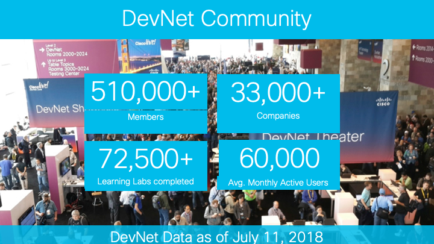
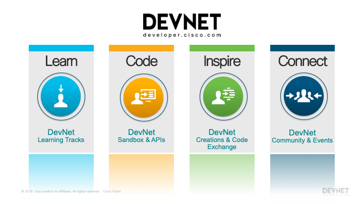

Navigation :: [Previous Page](LTRPRG-1100-01-Dojo.md) :: [Table of Contents](LTRPRG-1100-00-Intro.md#table-of-contents) :: [Next Page](LTRPRG-1100-01a2-DevNet-Ex1.md)

---

## Cisco DevNet

### Introducing Cisco DevNet

DevNet is your Network Programmability Dojo.  DevNet is where you can Learn, Code, Inspire, and Connect.  It is the 
place to create and find inspiring applications, learn about Cisco APIs, and connect with other developers in Cisco 
communities.  DevNet is the single largest resource for everything "developer" at Cisco.

DevNet answers these questions:

* What is it and do I want to use it?
* How do I get started?
* How do I get access?
* How do I use it?
* How do I get help?
* How do I share inspiration?

#### Learn

Access pre-release content; carry out coding tutorials and learning labs; and get paid case-based support and free 
online forum support.

#### Code

Download API client libraries, reference guides, sample apps and sample code; access cloud-based development 
platforms; warm up on API use with pre-configured demos; and test your code in the Sandbox Labs.

#### Inspire

Share what you're building; submit your creations and be recognized for your efforts; and meet one-on-one at DevNet 
events.

#### Connect

Join communities of interest and participate in on-going discussions around technologies; participate in trending 
forums on various Cisco technologies; get your questions answered; meet and greet at events around the world.

---

Navigation :: [Previous Page](LTRPRG-1100-01-Dojo.md) :: [Table of Contents](LTRPRG-1100-00-Intro.md#table-of-contents) :: [Next Page](LTRPRG-1100-01a2-DevNet-Ex1.md)
