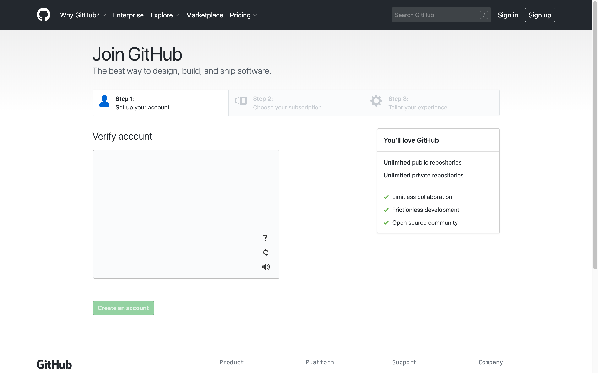
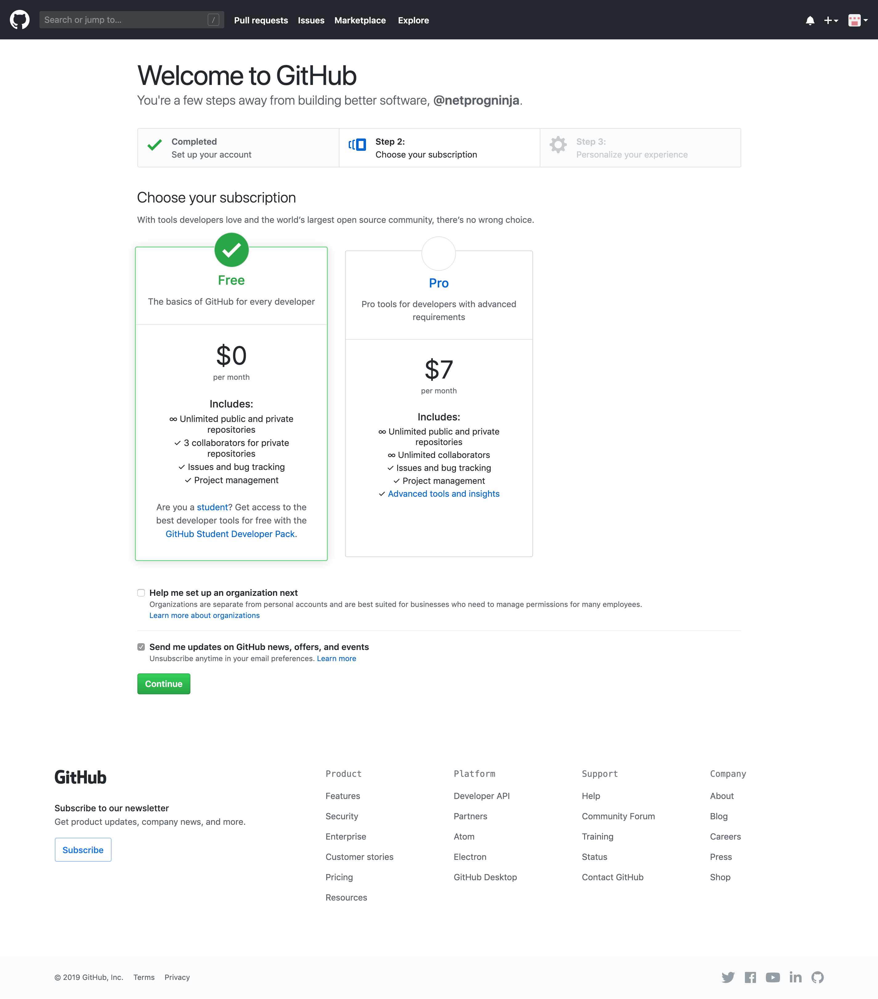
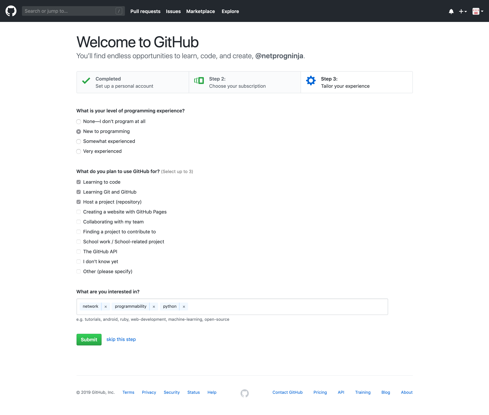

Navigation :: [Previous Page](LTRPRG-1100-02a1-Git.md) :: [Table of Contents](LTRPRG-1100-00-Intro.md#table-of-contents) :: [Next Page](LTRPRG-1100-02a3-Git-Ex2.md)

---

### Exercise 1: Creating a GitHub Account

#### Objectives

The objectives for this exercise are to:

* Create a GitHub account
* Explore GitHub

#### Step 1: Creating a GitHub Account

Although creating a GitHub account is not required to clone Git repositories hosted on GitHub, why not join and 
participate in one of the largest developer communities on the Internet?  Doing so gives you the opportunity to see 
what other people are working on or are interested in, learn how software is built by following projects, and share 
your work - no matter how small - with the community.  Cisco product teams, Cisco DevNet, and Cisco Systems Engineers 
all share and collaborate through GitHub.

If you do not want to create a GitHub account, then skip to Step 2.  If you already have a GitHub account, then login
and continue to Step 2.

To create a free GitHub account, complete these steps:

1. Open a web browser and navigate to [GitHub](https://github.com/) at `https://github.com/`:
    
    

2. On the GitHub homepage, fill out the form to choose a unique username, enter your email address, and create a 
password.
    
    
    
    Click the `Sign up for GitHub` button.

3. Complete `Step 1: Set up your account` and complete the puzzle in the `Verify account` box:
    
    
    
    Click the `Create an account` button.

4. Choose the `Free` subscription and optionally click to select `Send me updates on GitHub news, offers, and events`.
    
    

    Click the `Continue` button.

5. Tailor your GitHub experience by answering the questions.
    
    

    Click the `Submit` button or click the link `skip this step`.

6. You will need to verify your email address before you can contribute on GitHub.  Follow the verification instructions
sent to your email account.  Once you've completed email verification and login to [GitHub](https://github.com/) again, 
you will see your GitHub Dashboard:
 

Congratulations, you have joined the GitHub community!

#### Step 2: Exploring GitHub

Projects are stored in a repository, or repo for short.  This is where all of the project materials are hosted, 
including documentation and source code.

1. If you created a GitHub account and are currently logged in to [GitHub](https://github.com/), you can star a 
repository so that you can keep track of projects that are of interest or importance to you.  Starring a repository 
is also a way to show your support for, or appreciation of, the project and project maintainers.  Take a few minutes 
to discover new repositories.  Click the `Star` button to the right of a repository title on the project's site.
    
    Search for and star this Cisco Live session project repository:
    
    * [LTRPRG-1100: Cisco Live US 2019 Instructor Led Lab](https://github.com/curtissmith/LTRPRG-1100)
    
    Search for and star common Python modules commonly used for network programmability:
    
    * [ncclient: A Python module for NETCONF clients](https://github.com/ncclient/ncclient)
    * [textfsm: A Python module for parsing semi-structured text into python tables](https://github.com/google/textfsm)
    * [requests: A Python module for HTTP requests](https://github.com/kennethreitz/requests)
    * [netmiko: A Python module to simplify SSH connections to multi-vendor network devices](https://github.com/ktbyers/netmiko)

2. You can follow people of like-mindedness or interest to you and your goals on GitHub.  This can help you 
build a network and community of developers.  When you follow people, you will see their public activity in your GitHub 
news feed after you login to GitHub.  If you created a GitHub account and are currently logged in to
[GitHub](https://github.com/), take a few minutes to follow new and interesting people on GitHub to start building 
your developer network.  Click the `Follow` button under their profile image on their profile page.
    
    Search for and follow your Cisco Live lab proctors:
    
    * [Curtis Smith](https://github.com/curtissmith) (`curtissmith`)
    * [Matthew Galazka](https://github.com/magalazk) (`magalazk`)
    
    Share your GitHub username in this lab's Cisco Webex Teams space.  Search for and follow your fellow Cisco Live lab 
    participants!

3. People can collaborate on multiple projects as a business or open source project under a GitHub organization.  
Rather than projects being maintained by individuals, people and projects can be managed as a organization. For 
example, Cisco has an organization where its Systems Engineers can share projects with their customers.  Cisco DevNet
has an organization in support of its mission.  These organizations keep projects and project maintainers and 
contributors under one umbrella.  Organizations cannot be followed or starred, but do take note of and bookmark a few
organizations as a way to explore GitHub more.

    Search for and bookmark the [Cisco DevNet](https://github.com/CiscoDevNet) organization where sample code from 
    Cisco DevNet is shared.
    
    Search for and bookmark the [Cisco Systems Engineers](https://github.com/CiscoSE) organization where sample 
    code from Cisco SE community is shared.

Now that we've introduced GitHub, let's introduce key Git version control concepts and commands.  You will create 
your own Git repository and clone the repository for this lab.

---

Navigation :: [Previous Page](LTRPRG-1100-02a1-Git.md) :: [Table of Contents](LTRPRG-1100-00-Intro.md#table-of-contents) :: [Next Page](LTRPRG-1100-02a3-Git-Ex2.md)
