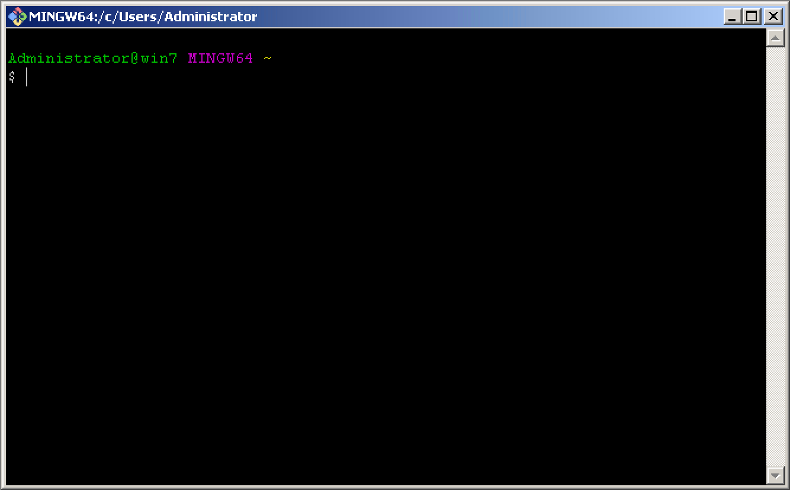

Navigation :: [Previous Page](LTRPRG-1100-02b3-Python-Ex2.md) :: [Table of Contents](LTRPRG-1100-00-Intro.md#table-of-contents) :: [Next Page](LTRPRG-1100-02b5-Python-Ex4.md)

---

### Exercise 3: Deploying Useful Python Packages

#### Objectives

The objectives for this exercise are to:

* Understand which Python packages are already installed
* Install useful Python packages for the Network Programmability Ninja

#### Step 1: Understanding which Python Packages are Installed

Once a virtual environment is created, a few specific packages are automatically installed. However, sometimes when 
going back into a project after not working on it for a while, it is useful to view which packages are already 
installed.

1.  Open the Git Bash terminal by double clicking the Git Bash icon on the desktop:
    
    
    
    

2.  Make sure that your terminal still shows the prepended project name `(pythonenv)`. If it does not, then change to
your lab working directory and activate the Python virtual environment you created earlier in this lab:
    
    ```
    $ cd ~/lab
    $ source pythonenv/Scripts/activate
    (pythonenv) $
    ```

3. The pip tool is a software management system to install and maintain packages in Python.  Before working with pip
in this virtual environment, ensure that pip is updated to the version tested when this lab was developed with the 
`python` command: 
    
    ```
    (pythonenv) $ python -m pip install --upgrade pip==19.1
    Collecting pip
      Downloading https://files.pythonhosted.org/packages/f9/fb/863012b13912709c13cf
    5cfdbfb304fa6c727659d6290438e1a88df9d848/pip-19.1-py2.py3-none-any.whl (1.4MB)
        100%                                  1.4MB 6.6MB/s
    Installing collected packages: pip
      Found existing installation: pip 19.0.3
        Uninstalling pip-19.0.3:
          Successfully uninstalled pip-19.0.3
    Successfully installed pip-19.1
    (pythonenv) $
    ```
    
    If the pip tool is already up-to-date with the version specified, the command output above might look something 
    like the following:
    
     ```
    (pythonenv) $ python -m pip install --upgrade pip==19.1
    Requirement already up-to-date: pip==19.1 in c:\users\administrator\lab\python
    env\lib\site-packages (19.1)
    (pythonenv) $
    ```

4. Now that pip has been updated in this virtual environment, it can be used to manage packages and modules in 
Python with the `pip` command.
    
    Display a list of installed Python packages with the `pip list` command:
    
    ```
    (pythonenv) $ pip list
    Package    Version
    ---------- -------
    pip        19.1
    setuptools 40.8.0
    (pythonenv) $
    ```

    As you can seen here, this virtual environment is still "vanilla" with no additional Python packages installed.  
    Let's install some useful network programmability Python packages. 

#### Step 2: Installing Useful Python Packages

There are plenty of useful packages when working with network programmability, for example, to name a few essentials:

* requests: This installs a library useful for making HTTP operations, which is necessary for working with REST APIs.
* ncclient: The ncclient library provides a client library for working with NETCONF, which we will discuss later in 
this lab.
* paramiko: Paramiko provides an implementation of SSHv2 in Python, enabling a Python script to interact with a 
network device over the SSH protocol.
* netmiko: Netmiko is a library that simplifies Paramiko for use with network devices such as those running Cisco 
IOS XE.
* ipaddress: This library allows Python to handle IP addresses with functions to effectively work with IP addresses and 
subnets.

1. You can use the `pip` tool to install packages into your Python virtual environment, for example
`pip install netmiko` to install the latest version of the netmiko Python package. The pip tool takes care of 
package dependencies as well, meaning that if other packages are necessary for netmiko to work, they will be installed
as well.  Go ahead and install the netmiko Python package with the `pip install netmiko` command (output truncated 
for brevity):
    
    ```
    (pythonenv) $ pip install netmiko
    Successfully installed asn1crypto-0.24.0 bcrypt-3.1.6 cffi-1.12.3 cryptography-2
    .6.1 netmiko-2.3.3 paramiko-2.4.2 pyasn1-0.4.5 pycparser-2.19 pynacl-1.3.0 pyser
    ial-3.4 pyyaml-5.1 scp-0.13.2 six-1.12.0 textfsm-0.4.1
    (pythonenv) $
    ```

2. In addition to using pip to install new packages, it can also be used to upgrade existing packages with the
`pip install -U` command.  For example, if you run the command `pip install -U setuptools`, the setuptools package
currently installed will be upgraded to the latest version available.  However, you may have reason to install or 
upgrade to a specific version of the Python package.  For example, if you run the command
`pip install -U setuptools==39.2.0`, setuptools will be upgraded, but to version 39.2.0, regardless of whether or 
not that is the latest version available.  For this lab, upgrade setuptools to version 39.2.0, specifically:
        
    ```
    (pythonenv) $ pip install -U setuptools==41.0.1
    Collecting setuptools==41.0.1
      Using cached https://files.pythonhosted.org/packages/ec/51/f45cea425fd5cb0b0380
      f5b0f048ebc1da5b417e48d304838c02d6288a1e/setuptools-41.0.1-py2.py3-none-any.whl
    Installing collected packages: setuptools
      Found existing installation: setuptools 40.8.0
        Uninstalling setuptools-40.8.0:
          Successfully uninstalled setuptools-40.8.0
    Successfully installed setuptools-41.0.1
    (pythonenv) $
    ```

3. Many times, projects list the specific package and version requirements so that repeatable installations are 
consistent. This will typically show up as a file named `requirements.txt` and can often be found at the root of a 
project's file structure. One of these files exists in the Git repository for this lab, which will allow for a quick 
installation of all required packages.  Use the `pip install -r` command with the file `requirements.txt` to install 
the remaining packages required for this lab (output truncated for brevity):
    
    ```
    (pythonenv) $ pip install -r ~/lab/LTRPRG-1100/requirements.txt
    Successfully installed certifi-2019.3.9 chardet-3.0.4 idna-2.8 lxml-4.3.3 nccli
    ent-0.6.4 requests-2.21.0 urllib3-1.25

    ```
    
    Now all of the correct Python packages and versions should be installed. Confirm with the `pip list` command:
    
    ```
    (pythonenv) $ pip list
    Package      Version
    ------------ ---------
    asn1crypto   0.24.0
    bcrypt       3.1.6
    certifi      2019.3.9
    cffi         1.12.3
    chardet      3.0.4
    cryptography 2.6.1
    idna         2.8
    lxml         4.3.3
    ncclient     0.6.4
    netmiko      2.3.3
    paramiko     2.4.2
    pip          19.1
    pyasn1       0.4.5
    pycparser    2.19
    PyNaCl       1.3.0
    pyserial     3.4
    PyYAML       5.1
    requests     2.21.0
    scp          0.13.2
    setuptools   41.0.1
    six          1.12.0
    textfsm      0.4.1
    urllib3      1.25
    (pythonenv) $
    ```
    
    Now that the virtual environment is active and has the prerequisite Python packages installed, it is a great time
    to start trying out Python.

---

Navigation :: [Previous Page](LTRPRG-1100-02b3-Python-Ex2.md) :: [Table of Contents](LTRPRG-1100-00-Intro.md#table-of-contents) :: [Next Page](LTRPRG-1100-02b5-Python-Ex4.md)
