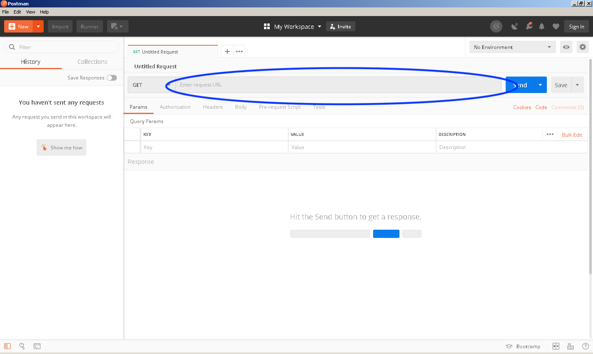
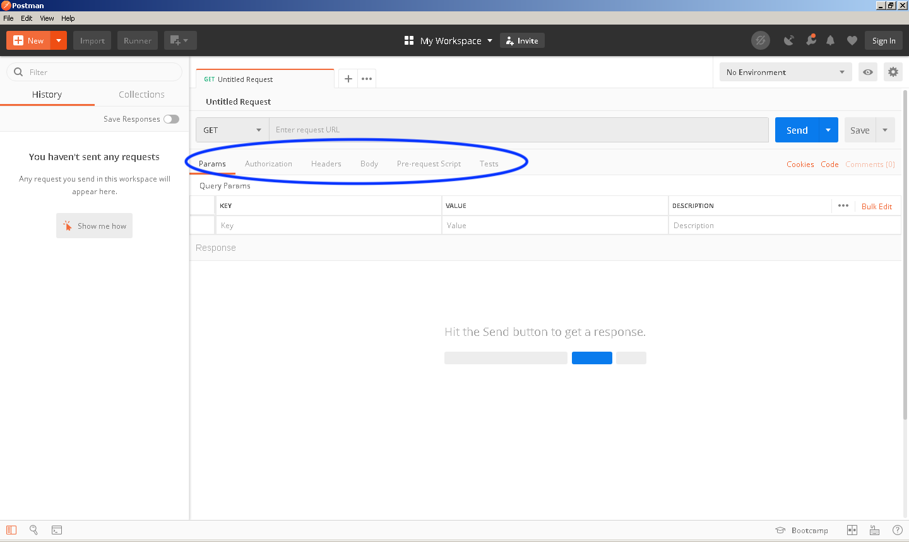
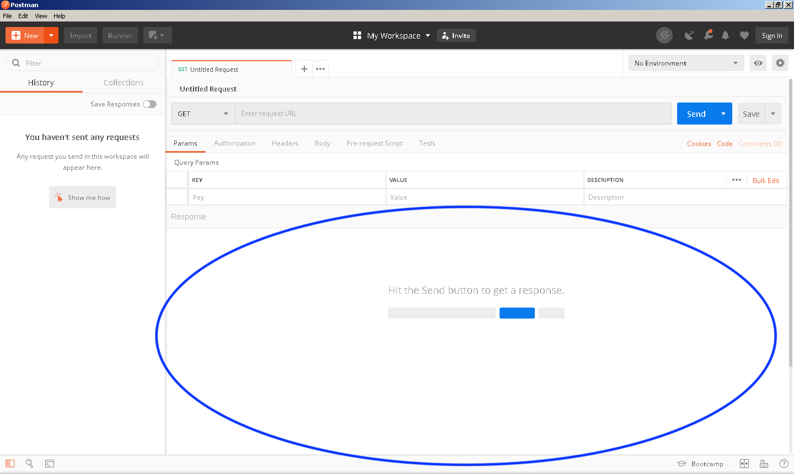
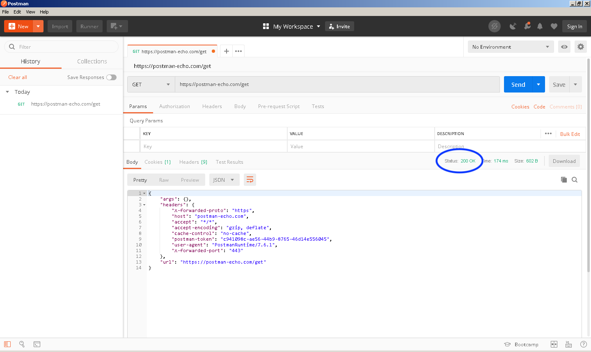
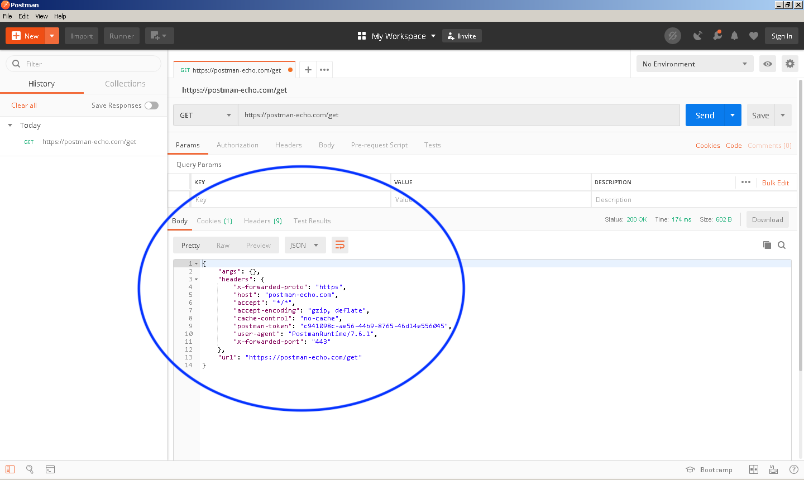
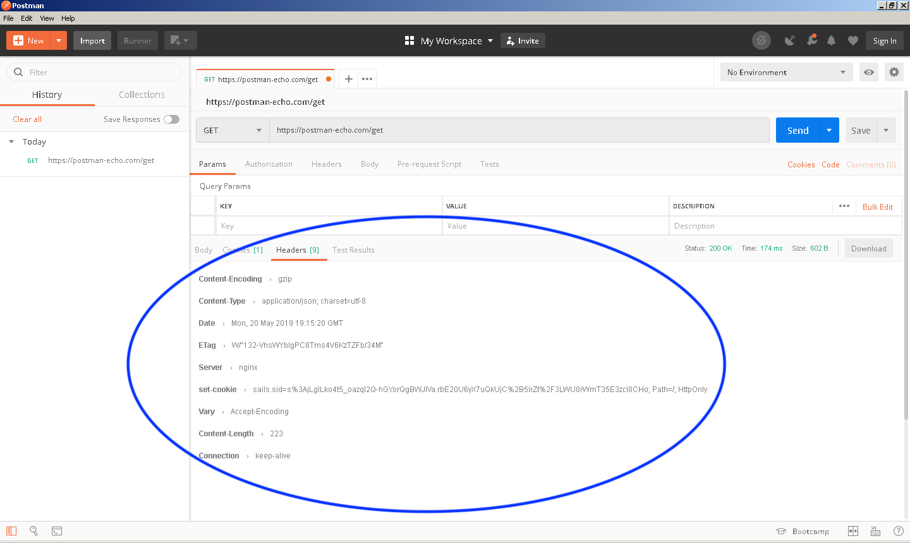
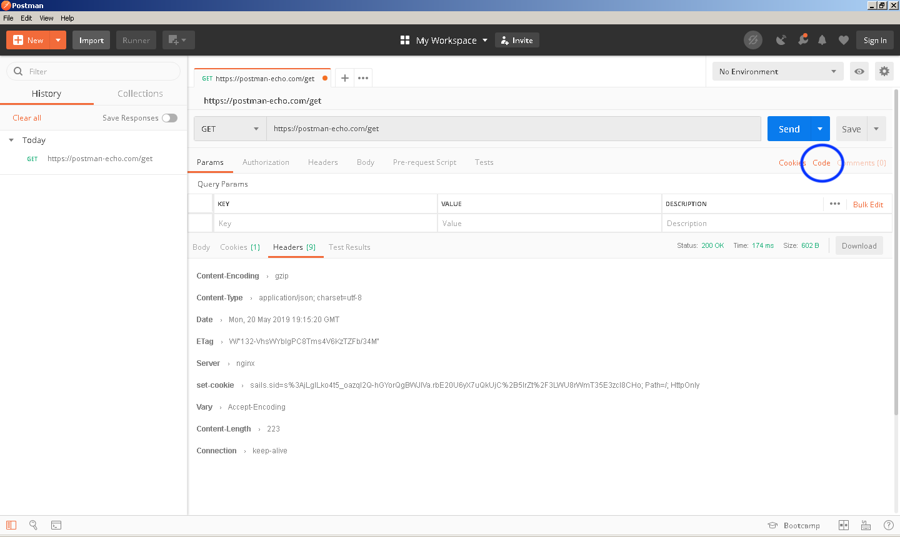
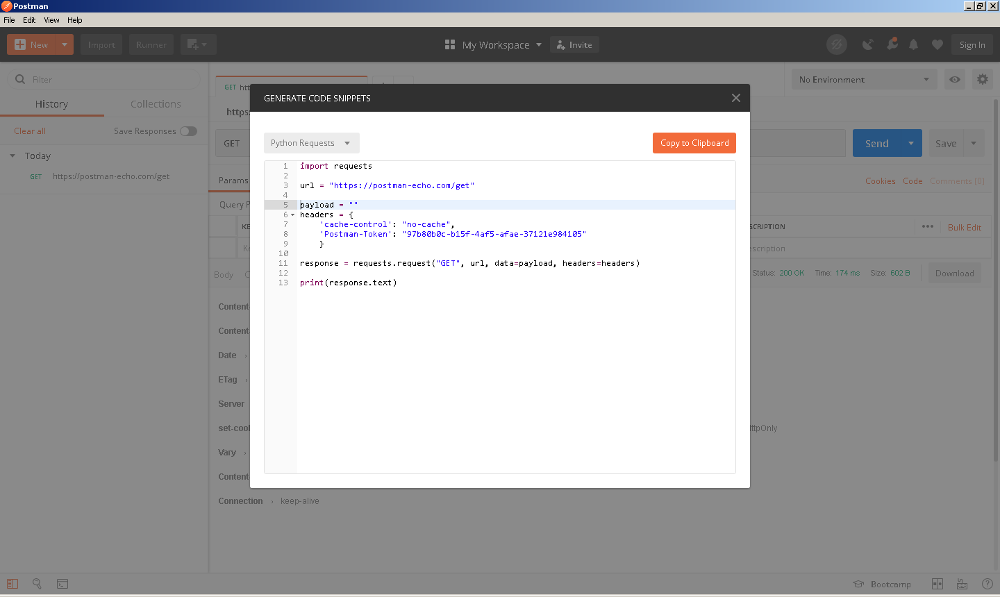

Navigation :: [Previous Page](LTRPRG-1100-02d1-Postman.md) :: [Table of Contents](LTRPRG-1100-00-Intro.md#table-of-contents) :: [Next Page](LTRPRG-1100-03-Hone.md)

---

### Exercise 1: Getting Started with Postman

#### Objectives

The objectives for this exercise are to:

* Become familiar with the layout of Postman
* Understand how to make an API call
* Analyze the results of an API call
* Learn how to use Postman to create Python code to make an API call

#### Step 1: Becoming Familiar with the Postman Layout

Postman is organized in three main sections: the header bar, the side bar, and the build area. The header bar is 
located at the top and provides access to common administrative tasks: creating new requests, importing data, 
changing settings, and so forth. The side bar is on the left side and it contains a history of requests made, as well
as a section titled, "Collections," which we will look at in a later exercise. The build area is the majority of the
screen real estate in the Postman application, and it is where you can build and send API requests.

1. Open Postman by double clicking the Postman icon on the desktop:
    
    
    
    


2. Locate the method dropdown at the top of the build area. This allows you to select the type of API request to 
make, such as an HTTP GET, PUT, POST, and so on. For our introductory lesson, please select `GET` as the method.
    
    

3. Next to the method dropdown, notice the field to input a request URL. This is the web location for the API with 
which you want to interact. Immediately to the right of this URL is a button to add parameters to the URL. These are 
akin to appending the URL with key/value pairs via `?myvariable=1&another=2` syntax often noted at the end of web URLs.
    
    

4. Just below the request URL field, there are a series of tabs where query parameters, the authorization, and 
request headers are defined.  You can define headers with the request, which is common with web requests in general.  
For instance, this is the method by which your mobile phone's web browser can indicate that it is a mobile device, 
and hence you get the mobile version of a web page automatically. With APIs it is important as well; often times 
authentication keys, data formats, and more can be defined in headers.
    
    

5. The bottom half of the build area is where the response from the API requests is displayed. This will show the 
response code, the time to receive a response, and details of the response, including any body and headers.
    
    

#### Step 2: Making an API call

1. In order to make an API call, we first have to select the HTTP method. We are using the HTTP application 
layer protocol for API communication, but access to most APIs will be secured using SSL or TLS as indicated by 
`https` in the API URLs.
    
    Three of the most common HTTP methods used in API calls are `GET`, `POST`, and `PUT`:
    
    * A `GET` request is used when getting information from an API. A `GET` request specifies the information in 
    which it is interested via the URL, parameters, and headers.
    * A `POST` request is one that is sending information to the API. This is often in the form of creating a new 
    data entry of some sort through the API.
    * A `PUT` request is often used to update existing information through the API.
    
    In our example, we will be making a `GET` request, so please make sure this is the method selected.
    
    

2. Now that we know we will be making a request for information, we need a location to find the API we are querying. 
In this introduction to Postman, we will use [Postman Echo](https://postman-echo.com), a free service you can use to 
test Postman and learn the basics of an API.
    
    In the request URL field, enter `https://postman-echo.com/get`.  We do not require any parameters for this API 
    call.  Click the `Send` button and watch for the response. If successful, the status should return `200 OK` which 
    means that the request was accepted by the API.
    
    

#### Step 3: Analyzing the Results of an API Call

1. After verifying the important response code is `200 OK` we can start to dig into the other components of the 
response. Notice the body of the response that is shown below:
    
    
    
    The response is a set of data displayed in the JSON format of key/value pairs, for example:
    
    ```
    {
        "args": {},
        "headers": {
            "x-forwarded-proto": "https",
            "host": "postman-echo.com",
            "accept": "*/*",
            "accept-encoding": "gzip, deflate",
            "cache-control": "no-cache",
            "postman-token": "c941098c-ae56-44b9-8765-46d14e556045",
            "user-agent": "PostmanRuntime/7.6.1",
            "x-forwarded-port": "443"
        },
        "url": "https://postman-echo.com/get"
    }
    ```

2. Aside from the body of the response, there are also headers that give information about the response, which are 
displayed by clicking the `Headers` tab:
    
    
    
    For instance, the header `Content-Type` specifies `application/json` as its value. This data is important if 
    working with APIs programmatically, as JSON formatted data would be parsed differently than, say, XML formatted 
    data.

#### Step 4. Creating Python Code with Postman

In addition to being a useful tool for exploring and learning APIs, Postman can be a great way to help you write 
Python code to make API calls as well!

1. Click the `Code` link below the `Send` button in the Postman applican screen:
    
    
    
    This will open a window that generates code snippets for a plethora of programming languages and applications.

2.  From the dropdown box, select `Python` and click `Requests`:
    
    
    
    Right there is everything you need to write a Python app to achieve the same results in Postman we reviewed in 
    Steps 2 and 3 earlier in this lab.
    
3. Let's run this Python code from the Python interactive interpreter.
    
    Open the Git Bash terminal by double clicking the Git Bash icon on the desktop:
    
    
    
    
    
    Make sure that your terminal shows the prepended project name `(pythonenv)`. If it does not, then change to your 
    lab working directory and activate the Python virtual environment you created earlier in this lab:
    
    ```
    $ cd ~/lab
    $ source pythonenv/Scripts/activate
    (pythonenv) $
    ```
    
    Type the command `python` at the command prompt.
    
    Return to Postman and click the `Copy to Clipboard` button in the code snippet window.  Paste the Python code 
    snippet into the Python interactive interpreter running in the Git Bash window.  This should result in output 
    similar what we saw earlier in Postman, for example:
    
    ```
    {"args":{},"headers":{"x-forwarded-proto":"https","host":"postman-echo.com","acc
    ept":"*/*","accept-encoding":"gzip, deflate","cache-control":"no-cache","postman
    -token":"cddca93e-6bc0-4844-9ca8-dae09288adc6","user-agent":"python-requests/2.2
    1.0","x-forwarded-port":"443"},"url":"https://postman-echo.com/get"}
    ```
    
    Congratulations, you've made an example API call with Python!

These steps are a simple introduction to Postman and RESTful API calls.  Yet one more tool of the ninja to use in 
your network programmability journey.

---

Navigation :: [Previous Page](LTRPRG-1100-02d1-Postman.md) :: [Table of Contents](LTRPRG-1100-00-Intro.md#table-of-contents) :: [Next Page](LTRPRG-1100-03-Hone.md)
