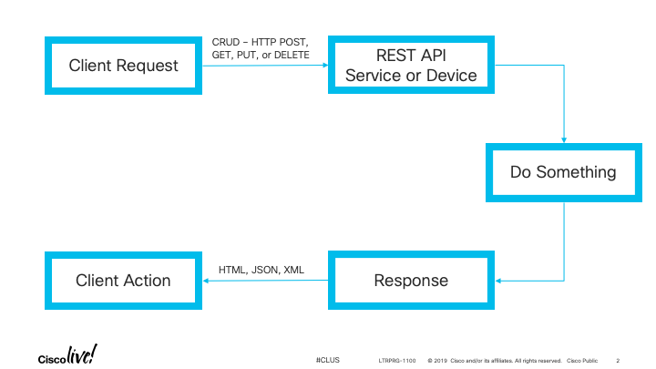

Navigation :: [Previous Page](LTRPRG-1100-03b1-REST.md) :: [Table of Contents](LTRPRG-1100-00-Intro.md#table-of-contents) :: [Next Page](LTRPRG-1100-03b3-REST-Ex2.md)

---

### Exercise 1: Understanding REST APIs

#### Objectives

The objectives of this exercise are to:

* Understand REST API communication
* Understand the anatomy of a REST API call

#### Step 1: Understanding REST API Communication

While there are standards that APIs typically follow, the particular calls, parameters, and expected results differ 
with every API. From a commonality standpoint, many APIs utilize the same architectural style called REST. REST, or 
Representational State Transfer, is based on core HTTP functions such as GET, POST, PUT, and DELETE.  Let's take a 
closer look at REST API communication.

A web browser retrieves web pages by requesting resources from a web server.  The web server responds with the 
resource formatted in HTML.  This HTML-formatted data is processed by the web browser and displayed for you in the 
web browser window.  The application protocol used is HyperText Transfer Protocol (HTTP), or HTTPS if secured with 
SSL or TLS.  Behind the scenes, HTTP(S) uses "CRUD" - Create, Read, Update, Delete - operations to achieve this 
request and transfer of information.  The CRUD operations the four basic functions from which a good API is designed:

* Create - A programmatic function to add something
* Read - A programmatic function to read something
* Update - A programmatic function to change something
* Delete - A programmatic function to remove something

In a RESTful API, CRUD corresponds to the HTTP methods POST, GET, PUT, and DELETE.

A web browser is just one client used to interface with REST APIs.  Postman, as we saw earlier in this lab is
another.  Two web services like Webex Teams and Cisco DNA Center can communicate using REST APIs. 

The general flow of a REST API is shown below:

#### Step 2: Understand the Anatomy of a REST API Call

We briefly introduced how to craft a REST API call earlier in the lab when we introduced Postman.  Let's dig a 
little deeper here.

1. You must choose the CRUD function as an HTTP method, for example:
    
    * POST - Create something new, e.g. create a new room or space in Webex Teams
    * GET - Retrieve something that exists, e.g. list the members of a Space in Webex Teams
    * PUT - Update something that exists, e.g. change the name of a Space in Webex Teams
    * DELETE - Remove something that exists, e.g. delete a space in Webex Teams

2. You must provide the URL for the REST API service to complete the appropriate action.  A URL is formed in the 
following example: `https://api.ciscospark.com/v1/rooms`.
    
    * `https` - Protocol, i.e. Secure HTTP
    * `api.ciscospark.com` - REST API service server or host
    * `/v1/rooms` - REST API path

3. You will likely have to authenticate the REST API call.  There are different HTTP authentication types, and which 
type used varies from API service or host.  Basic (username and password), token based, and OAuth are common HTTP 
authentication types.

4. HTTP headers are used to describe the HTTP connection, for example an HTTP header `application/json` tells the the
 client or server/host to expect JSON-formatted text in the HTTP body.
 
5. The HTTP body of an API request or response, typically formatted in JSON, is used to complete the request or 
respond to a request.

6. The HTTP response to an API call contains an HTTP status code.  Here are common HTTP status codes for reference:
    
    * Success Codes (2xx)
        * `200 OK` - The request was fulfilled
        * `202 Accepted` - The request was accepted for processing, but processing has not completed
        * `204 No Resoonse` - The request was received, but there was no information to send back
    * Error Codes (4xx/5xx)
        * `400 Bad Request` - The request was malformed or had bad syntax
        * `401 Unauthorized` - The request requires authentication
        * `403 Forbidden` - The request authentication succeeded, but access was denied
        * `404 Not Found` -  The request did not match anything, likely due to a wrong URL path
        * `500 Internal Server Error` - The server encountered an unexpected error condition

Now that we've introduced the anatomy of an REST API call, let's explore some examples.

---

Navigation :: [Previous Page](LTRPRG-1100-03b1-REST.md) :: [Table of Contents](LTRPRG-1100-00-Intro.md#table-of-contents) :: [Next Page](LTRPRG-1100-03b3-REST-Ex2.md)
