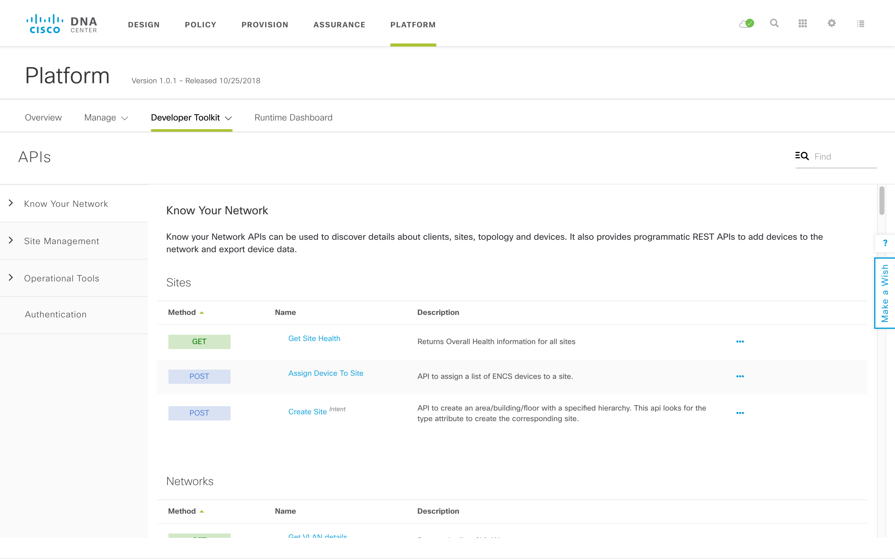
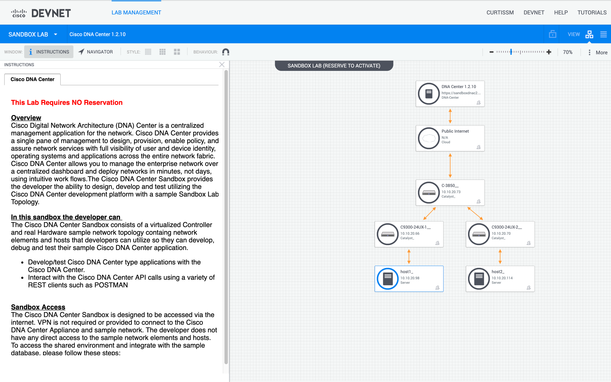
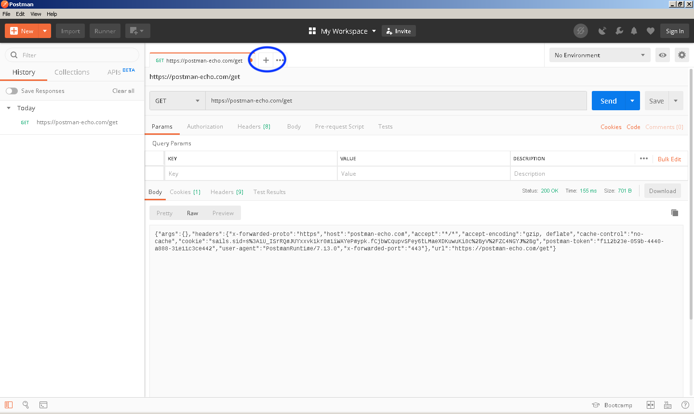
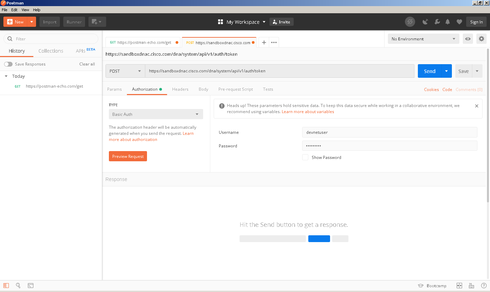
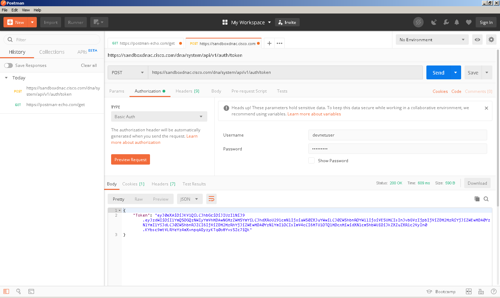
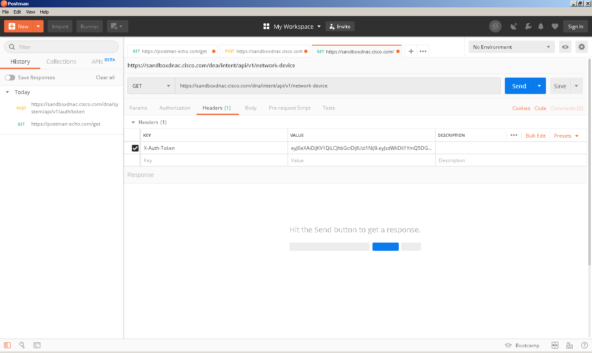
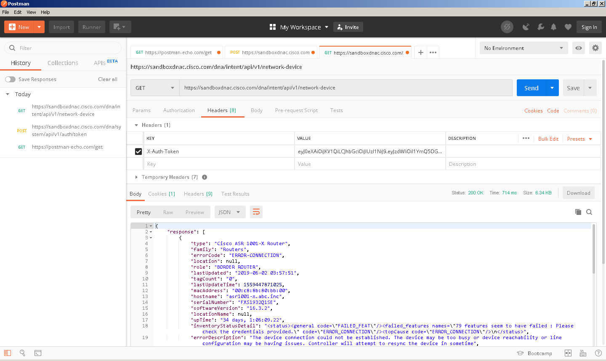
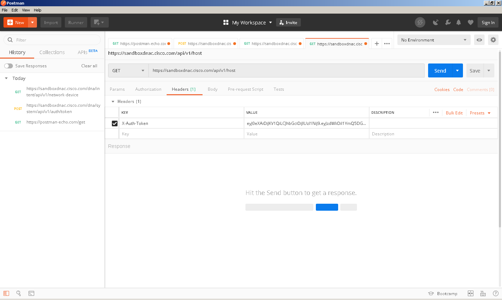
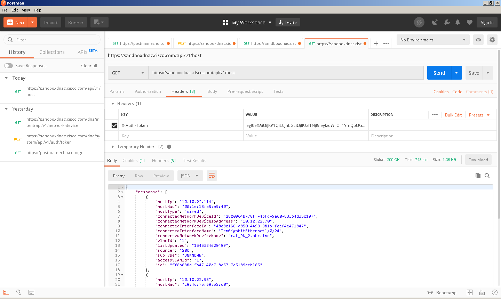

Navigation :: [Previous Page](LTRPRG-1100-03b2-REST-Ex1.md) :: [Table of Contents](LTRPRG-1100-00-Intro.md#table-of-contents) :: [Next Page](LTRPRG-1100-03c1-NETCONF.md)

---

### Exercise 2: Exploring Cisco DNA Center REST API Example Use Cases

#### Objectives

The objectives for this exercise are to:

* Learn how to configure Cisco DNA Center REST API services
* Explore REST API calls to Cisco DNA Center with Postman
* Learn how to make REST API calls to Cisco DNA Center using Python

[Cisco DNA Center](https://www.cisco.com/c/en/us/products/cloud-systems-management/dna-center/index.html) is the 
network management and command center for Cisco DNA, the intent-based network for the enterprise.  With Cisco DNA 
Center, you can provision and configure all of your network devices in minutes; use advanced analytics to proactively 
monitor, troubleshoot, and optimize your network; and integrate with third-party systems for improved operational 
processes.  Third party integration, of course, is possible through APIs.

Cisco DNA Center accepts REST API requests from authenticated users only.  To authenticate to Cisco DNA Center, you 
must submit user credentials.  A successful authentication returns an authorization token that you can use to 
make subsequent requests.  To request a token, use the HTTP `POST` method, and Cisco DNA Center will respond with an 
authorization token.  Subsequent requests should contain the authorization token in an HTTP `X-Auth-Token` header.

The [Cisco DNA Center Developer Guide](https://developer.cisco.com/docs/dna-center/) is available on the Cisco DevNet
website.  The Cisco DNA Center [Intent API](https://developer.cisco.com/site/dna-center-rest-api/?version=1.210) is 
also documented on the Cisco DevNet website.  Cisco DNA Center API documentation is also available in software by 
navigating to `Platform` > `Developer Toolkit` from the Cisco DNA Center home page:



For demonstration purposes for this lab, we are using the always-on
[Cisco DNA Center DevNet Sandbox Lab](https://devnetsandbox.cisco.com/RM/Diagram/Index/471eb739-323e-4805-b2a6-d0ec813dc8fc?diagramType=Topology):



This is a shared resource available for free to develop and test REST APIs on the Cisco DNA Center platform.  There 
is a sample topology with three network devices and two endpoint hosts.

Let's take a look at a how to configure Cisco DNA Center and a few examples of Cisco DNA Center REST API use cases.

#### Step 1: Configuring Cisco DNA Center REST API

To configure Cisco DNA Center to enable the REST API service, you must configure the appropriate platform bundle `Cisco 
DNA Center REST API`.  This bundle contains the REST API supported by Cisco DNA Center.  The full documentation is 
available in the [Cisco DNA Center Platform User Guide](https://www.cisco.com/c/en/us/td/docs/cloud-systems-management/network-automation-and-management/dna-center-platform/1-2-8/user_guide/b_dnac_platform_ug_1_2_8/b_dnac_platform_ug_1_2_8_chapter_010.html#id_93619).

This has already been completed for you in the DevNet Sandbox Lab, so no action is necessary for this lab.

#### Step 2: Exploring Cisco DNA Center REST APIs with Postman

Let's take a look at how to obtain and temporarily store a Cisco DNA Center REST API authorization token and make 
subsequent REST API calls.

1. Open Postman by double clicking the Postman icon on the desktop:
    
    
    
    

2. Click the `Plus` button in the tab bar to open a new request tab.
    
    

3. To generate an authorization token, configure the REST API request in Postman with the following:
    
    * HTTP method = `POST`
    * Request URL = `https://sandboxdnac.cisco.com/dna/system/api/v1/auth/token`
    * Authorization type = `Basic Auth`
    * Username = `devnetuser`
    * Password = `Cisco123!`
    
    For example:
    
    
    
    Click the `Send` button.  Confirm the Status is `200 OK` and a token is returned in the JSON-formatted request 
    response body text, for example:
    
    
    
    Copy the authorization token string, everything between the double quotes, but do not include the double quotes.
    
    Now that you have an authorization token, you can make additional REST API calls.

4. Click the `Plus` button in the tab bar to open a new request tab.

5. Let's get a list of the network devices managed by Cisco DNA Center.  Configure a new REST API request in Postman 
with the following:
    
    * Choose the HTTP method `GET`
    * Copy and paste the following into the Request URL: `https://sandboxdnac.cisco.com/dna/intent/api/v1/network-device`
    * Click the Header tab below the Request URL box and copy and paste the following:
        * Header Key = `X-Auth-Token`
        * Header Value - Paste your authorization token obtained in the previous step.  Do not include the doubles quotes.
    
    Do not include an Authorization type or username or password.
    
    For example:
    
    
    
    Click the `Send` button.  Confirm the Status is `200 OK` and JSON-formatted request response body text is 
    returned, for example:
    
    

6. Click the `Plus` button in the tab bar to open a new request tab.

7. Let's get a list of the host endpoints inventoried by Cisco DNA Center.  Configure a new REST API request in 
Postman with the following:
    
    * HTTP method = `GET`
    * Request URL = `https://sandboxdnac.cisco.com/api/v1/host`
    * Header Key = `X-Auth-Token`
    * Header Value - Paste your authorization token obtained in the previous step.  Do not include the doubles quotes.
    
    Do not include an Authorization type or username or password.
    
    For example:
    
    
    
    Click the `Send` button.  Confirm the Status is `200 OK` and JSON-formatted request response body text is 
    returned, for example:
    
    

We've made several REST API requests to Cisco DNA Center with Postman.  Let's do the same but with Python this time!

#### Step 2: Running Cisco DNA Center REST API Example Scripts

In the previous example we used Postman to make REST API calls.  While it is a good example of the 
communication flow, it is not a programmatic way of using APIs.  Alternatively, we will use the Python library 
[requests](https://github.com/kennethreitz/requests) to communicate via REST API with Cisco DNA Center programmatically.

1.  Open the Git Bash terminal by double clicking the Git Bash icon on the desktop:
    
    
    
    

2.  Make sure that your terminal still shows the prepended project name `(pythonenv)`. If it does not, then activate 
the Python virtual environment you created earlier in this lab with the `source ~/lab/pythonenv/Scripts/activate` 
command, for example:
    
    ```
    $ source ~/lab/pythonenv/Scripts/activate
    (pythonenv) $
    ```

3. From the command line terminal, ensure that requests is installed using the `pip install requests==2.22.0` command 
(output truncated for brevity):
    
    ```
    (pythonenv) $ pip install requests==2.22.0
    Requirement already satisfied: requests==2.22.0 in c:\users\administrator\lab\py
    thonenv\lib\site-packages (2.22.0)
    ```
4. Invoke the Python interpreter with the `python` command:
    
    ```
    (pythonenv) $ python
    Python 3.7.3 (v3.7.3:ef4ec6ed12, Mar 25 2019, 22:22:05) [MSC v.1916 64 bit (AMD6
    4)] on win32
    Type "help", "copyright", "credits" or "license" for more information.
    >>>
    ```

5. Import the `requests` Python library with the code snippet `import requests`:
    
    ```
    >>> import requests
    ```
    
    Establish a REST API request with the code snippet `print(requests.request("GET", "https://sandboxdnac.cisco.com/dna/intent/api/v1/network-device", verify=False))`:
    
    ```
    >>> print(requests.request("GET", "https://sandboxdnac.cisco.com/dna/intent/api/v1/network-device", verify=False))
    C:\Users\Administrator\lab\pythonenv\lib\site-packages\urllib3\connectionpool.py
    :851: InsecureRequestWarning: Unverified HTTPS request is being made. Adding cer
    tificate verification is strongly advised. See: https://urllib3.readthedocs.io/e
    n/latest/advanced-usage.html#ssl-warnings
      InsecureRequestWarning)
    <Response [401]>
    >>>
    ```
    
    Ignore the SSL certificate verification warning; this is a side effect of the DevNet Sandbox Lab using an
    invalid, or what are commonly called "snake oil", SSL certificate.
    
    Do take note of the final line `<Response [401]>`.  This is the HTTP status code.  Recall that an HTTP status code
    of 4xx is an error code.  HTTP status code `401` means that authorization failed.  How could that be?  Remember that
    Cisco DNA Center must authorize a user with HTTP Basic authorization and provide an authorization token.  In 
    this Python code snippet example, we didn't provide any such token in the HTTP headers.  In fact, the code 
    snippet contains no HTTP headers at all.
    
    The Python code to obtain and use the authorization token necessary for successful REST API requests to Cisco DNA
    Center are a little too complex to type manually into the Python interpreter.  We've included a few sample Python 
    scripts in the lab Git repository.

6. Exit the Python interpreter with the code snippet `quit()`:
    
    ```
    >>> quit()
    (pythonenv) $
    ```

7. Navigate to the `code` directory in this lab's Git repository with the `cd ~/lab/LTRPRG-1100/code` comnmand, for 
example:
    
    ```
    (pythonenv) $ cd ~/lab/LTRPRG-1100/code
    (pythonenv) $
    ```

8. Run the `dnac-get-devices.py` Python script with the `python dnac-get-devices.py` command, for example:
    
    ```
    (pythonenv) $ python dnac-get-devices.py
    {"Token":"eyJ0eXAiOiJKV1QiLCJhbGciOiJIUzI1NiJ9.eyJzdWIiOiI1YmQ5OGQzNWIyYmVhMDAwN
    GMzZWM5YmYiLCJhdXRoU291cmNlIjoiaW50ZXJuYWwiLCJ0ZW5hbnROYW1lIjoiVE5UMCIsInJvbGVzI
    jpbIjViZDM2MzRiYjJiZWEwMDA0YzNlYmI1YSJdLCJ0ZW5hbnRJZCI6IjViZDM2MzRhYjJiZWEwMDA0Y
    zNlYmI1OCIsImV4cCI6MTU1OTQ1NDU2MSwidXNlcm5hbWUiOiJkZXZuZXR1c2VyIn0.Mxuh5CCgZCf-L
    UGK14YTalq_YgY8Q3QFq6AaAlqGhYI"}
    {"response":[{"type":"Cisco ASR 1001-X Router","family":"Routers","errorCode":"E
    RROR-CONNECTION","location":null,"role":"BORDER ROUTER","lastUpdated":"2019-06-0
    2 04:47:59","tagCount":"0","lastUpdateTime":1559450879798,"macAddress":"00:c8:8b
    :80:bb:00","hostname":"asr1001-x.abc.inc","serialNumber":"FXS1932Q1SE","software
    Version":"16.3.2","locationName":null,"upTime":"34 days, 1:06:09.22","inventoryS
    tatusDetail":"<status><general code=\"FAILED_FEAT\"/><failed_features names=\"79
     features seem to have failed : Please check the credentials provided.\" code=\"
    ERROR_CONNECTION\"/><topCause code=\"ERROR_CONNECTION\"/>\n</status>","errorDesc
    ription":"The device connection could not be established. The device may be too
    busy or device reachability or line configuration may be having issues. Controll
    er will attempt to resync the device in sometime","bootDateTime":"2018-10-14 16:
    59:30","apManagerInterfaceIp":"","associatedWlcIp":"","collectionStatus":"Partia
    l Collection Failure","interfaceCount":"12","lineCardCount":"9","lineCardId":"19
    557762-4170-42c0-b4ae-c539ee996a05, 184ddd93-2fc2-4baa-aa66-67e4e2948399, c5987c
    a2-3f69-4341-8cf5-00431f3add0c, ab808a88-85a0-434f-895d-7b98cd0e25fb, 1e38a03d-c
    5dd-46dc-8038-74e83b3da5ca, ba411ee4-6e98-4bf4-afdd-1601fcc5b9e9, 454acd43-5b66-
    4912-a692-bb00a9725267, d5e53e21-6e3d-4e8f-881a-ea619b133511, f4fc3497-9624-44d1
    -b32e-4b074706727c","managementIpAddress":"10.10.22.253","memorySize":"381929803
    2","platformId":"ASR1001-X","reachabilityFailureReason":"","reachabilityStatus":
    "Reachable","series":"Cisco ASR 1000 Series Aggregation Services Routers","snmpC
    ontact":"","snmpLocation":"","tunnelUdpPort":null,"waasDeviceMode":null,"roleSou
    rce":"AUTO","softwareType":"IOS-XE","collectionInterval":"Global Default","insta
    nceTenantId":"5bd3634ab2bea0004c3ebb58","instanceUuid":"1904ca0d-01be-4d13-88e5-
    4f4f9980b512","id":"1904ca0d-01be-4d13-88e5-4f4f9980b512"},{"type":"Cisco Cataly
    st 9300 Switch","family":"Switches and Hubs","errorCode":"ERROR-CONNECTION","loc
    ation":null,"role":"ACCESS","lastUpdated":"2019-06-02 04:42:31","tagCount":"0","
    lastUpdateTime":1559450551084,"macAddress":"f8:7b:20:67:62:80","hostname":"cat_9
    k_1.abc.inc","serialNumber":"FCW2136L0AK","softwareVersion":"16.6.1","locationNa
    me":null,"upTime":"34 days, 1:11:16.07","inventoryStatusDetail":"<status><genera
    l code=\"ERROR_CONNECTION\"/></status>","errorDescription":"The device connectio
    n could not be established. The device may be too busy or device reachability or
     line configuration may be having issues. Controller will attempt to resync the
    device in sometime","bootDateTime":"2018-10-16 10:37:51","apManagerInterfaceIp":
    "","associatedWlcIp":"","collectionStatus":"Partial Collection Failure","interfa
    ceCount":"41","lineCardCount":"2","lineCardId":"df065d20-8d9b-4b66-a5ed-30aab545
    b85b, 766f14fe-8bb6-4ac7-a58c-f456f7e2ab34","managementIpAddress":"10.10.22.66",
    "memorySize":"889226872","platformId":"C9300-24UX","reachabilityFailureReason":"
    Collection Failure","reachabilityStatus":"Unreachable","series":"Cisco Catalyst
    9300 Series Switches","snmpContact":"","snmpLocation":"","tunnelUdpPort":null,"w
    aasDeviceMode":null,"roleSource":"AUTO","softwareType":"IOS-XE","collectionInter
    val":"Global Default","instanceTenantId":"5bd3634ab2bea0004c3ebb58","instanceUui
    d":"1a85db61-8bf2-4717-9060-9776f42e4581","id":"1a85db61-8bf2-4717-9060-9776f42e
    4581"},{"type":"Cisco Catalyst 9300 Switch","family":"Switches and Hubs","errorC
    ode":"ERROR-CONNECTION","location":null,"role":"DISTRIBUTION","lastUpdated":"201
    9-06-02 04:42:31","tagCount":"0","lastUpdateTime":1559450551084,"macAddress":"f8
    :7b:20:71:4d:80","hostname":"cat_9k_2.abc.inc","serialNumber":"FCW2140L039","sof
    twareVersion":"16.6.1","locationName":null,"upTime":"65 days, 8:59:59.17","inven
    toryStatusDetail":"<status><general code=\"ERROR_CONNECTION\"/></status>","error
    Description":"The device connection could not be established. The device may be
    too busy or device reachability or line configuration may be having issues. Cont
    roller will attempt to resync the device in sometime","bootDateTime":"2018-10-16
     10:37:05","apManagerInterfaceIp":"","associatedWlcIp":"","collectionStatus":"Pa
    rtial Collection Failure","interfaceCount":"41","lineCardCount":"2","lineCardId"
    :"fb1bc751-e9c3-4f76-8dd6-e1f8eb125f5d, 0c8e3427-8af1-4117-a1a1-d26f62fdba57","m
    anagementIpAddress":"10.10.22.70","memorySize":"889226872","platformId":"C9300-2
    4UX","reachabilityFailureReason":"Collection Failure","reachabilityStatus":"Unre
    achable","series":"Cisco Catalyst 9300 Series Switches","snmpContact":"","snmpLo
    cation":"","tunnelUdpPort":null,"waasDeviceMode":null,"roleSource":"MANUAL","sof
    twareType":"IOS-XE","collectionInterval":"Global Default","instanceTenantId":"5b
    d3634ab2bea0004c3ebb58","instanceUuid":"2800864b-78ff-4bfd-9a60-83364d35c197","i
    d":"2800864b-78ff-4bfd-9a60-83364d35c197"},{"type":"Cisco Catalyst38xx stack-abl
    e ethernet switch","family":"Switches and Hubs","errorCode":null,"location":null
    ,"role":"ACCESS","lastUpdated":"2019-06-02 04:42:01","tagCount":"0","lastUpdateT
    ime":1559450521163,"macAddress":"cc:d8:c1:15:d2:80","hostname":"Test06.test1.com
    ","serialNumber":"FOC1833X0AR","softwareVersion":"16.6.2s","locationName":null,"
    upTime":"24 days, 17:52:12.28","inventoryStatusDetail":"<status><general code=\"
    SUCCESS\"/></status>","errorDescription":null,"bootDateTime":"2018-10-16 10:40:1
    2","apManagerInterfaceIp":"","associatedWlcIp":"","collectionStatus":"Managed","
    interfaceCount":"61","lineCardCount":"2","lineCardId":"529ae584-3c97-492d-bad0-a
    79e25be334b, a7b77de2-a3dd-400d-a826-6c1ae387a555","managementIpAddress":"10.10.
    22.73","memorySize":"873744896","platformId":"WS-C3850-48U-E","reachabilityFailu
    reReason":"","reachabilityStatus":"Reachable","series":"Cisco Catalyst 3850 Seri
    es Ethernet Stackable Switch","snmpContact":"","snmpLocation":"","tunnelUdpPort"
    :null,"waasDeviceMode":null,"roleSource":"AUTO","softwareType":"IOS-XE","collect
    ionInterval":"Global Default","instanceTenantId":"5bd3634ab2bea0004c3ebb58","ins
    tanceUuid":"79d3a90b-1b95-4cd8-a9bd-6d5952814432","id":"79d3a90b-1b95-4cd8-a9bd-
    6d5952814432"}],"version":"1.0"}
    <Response [200]>
    ```
    
    That looks better!  Notice the authorization token at the beginning of the response, the JSON-formatted response 
    body text containing a list and details of network devices, and the final HTTP response status code `200 OK`.
    
    Parsing and formatting JSON for human readability is outside the scope of this lab, but you should get a sense of
    the detailed data that is available to you programmatically through Cisco DNA Center.
 
9. Run the `dnac-get-hosts.py` Python script with the `python dnac-get-hosts.py` command, for example (output truncated 
for brevity):
    
    ``` 
    (pythonenv) $ python dnac-get-hosts.py
    ```
    
    Note the similar results but with a list of network host endpoints.

Congratulations, you've successfully established a REST API session with Cisco DNA Center in the DevNet Sandbox lab 
environment.  Let's move on to a different kind of API: model-driven programmability with NETCONF and YANG.

---

Navigation :: [Previous Page](LTRPRG-1100-03b2-REST-Ex1.md) :: [Table of Contents](LTRPRG-1100-00-Intro.md#table-of-contents) :: [Next Page](LTRPRG-1100-03c1-NETCONF.md)
