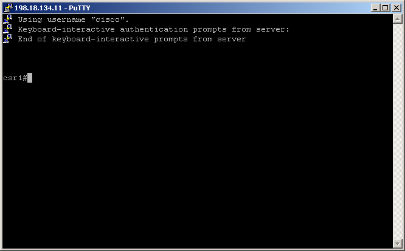

Navigation :: [Previous Page](LTRPRG-1100-03c3-NETCONF-Ex2.md) :: [Table of Contents](LTRPRG-1100-00-Intro.md#table-of-contents) :: [Next Page](LTRPRG-1100-03c5-NETCONF-Ex4.md)

---

### Exercise 3: Exploring IOS XE YANG Data Models with NETCONF

#### Objectives

The objectives for this exercise are to:

* Learn how to configure NETCONF in IOS XE 
* Learn how to verify the NETCONF configuration in IOS XE
* Learn how to make NETCONF connections using Python

NETCONF support was added in IOS XE Denali 16.3.1.  Support for the Catalyst 9300 and 9500 series switches was added in
IOS XE Denali 16.5.1b.  Support for Catalyst 9400 series switches was added in IOS XE Denali 16.6.2.  Finally, 
support for Catalyst 9500 High Performance series switches was added in IOS XE 16.8.1a.

#### Step 1: Configuring NETCONF in IOS XE

To work with NETCONF on IOS XE, you must be a user with privilege level 15 and enable the NETCONF interface on your 
network device.  To do so, complete the following steps:

1. Establish an SSH connection to the IOS XE device `csr1` by double clicking the CSR1 PuTTY icon on the desktop:
    
    
    
    

2. From the IOS XE device CLI, ensure you are in privileged EXEC mode as indicated by the `csr1#` prompt.  If you 
are in user EXEC mode as indicated by the `csr1>` prompt, then enter privileged EXEC mode with the `enable` command, 
for example:
   
    ```
    csr1>enable
    csr1#
    ```

3. Enter global configuration mode, which will be indicated by the `csr1(config)#` prompt, for example:
   
    ```
    csr1#configure terminal
    Enter configuration commands, one per line.  End with CNTL/Z.
    csr1(config)#
    ```

4. Create an account with privilege level 15 access with the `username` command:
    
    ```
    csr1(config)#username netconf privilege 15 password C1sco12345
    ```

5. Enable NETCONF with the `netconf-yang` command:
    
    ```
    csr1(config)#netconf-yang
    ```
    
    End the global configuration mode session with the `end` command or typing `CTRL-Z`, for example:
    
    ```
    csr1(config)#end
    csr1#
    ```
    
    That's all there is to it!  Let's test and verify NETCONF on your IOS XE device.

#### Step 2: Verifying NETCONF in IOS XE

You can use the following commands to verify the NETCONF configuration in IOS XE:

1. To display information about the IOS XE device NETCONF datastores, use the `show netconf-yang datastores` command,
for example:
    
    ```
    csr1#show netconf-yang datastores
    Datastore Name             : running
    
    csr1#
    ```
    
    You can see the default, mandatory `<running>` datastore is present.

2. To display information about active NETCONF sessions, use the `show netconf-yang sessions` command, for example:
    
    ```
    csr1#show netconf-yang sessions
    There are no active sessions
    
    csr1#
    ```
    
    You can see there are currently no active sessions, but we will change that soon!

3. To display information about NETCONF statistic on your IOS XE device, use the `show netconf-yang statistics` 
command, for example:
    
    ```
    csr1#show netconf-yang statistics
    netconf-start-time  : 2018-05-21T02:27:35+00:00
    in-rpcs             : 0
    in-bad-rpcs         : 0
    out-rpc-errors      : 0
    out-notifications   : 0
    in-sessions         : 0
    dropped-sessions    : 0
    in-bad-hellos       : 0
    
    csr1#
    ```
    
    Again, not much to see until we start using NETCONF later in this lab.

4. To display the status of the software processes required to support model driven programmability, use the
`show platform software yang-management process` command, for example:
    
    ```
    csr1#show platform software yang-management process
    confd            : Running 
    nesd             : Running 
    syncfd           : Running 
    ncsshd           : Running 
    dmiauthd         : Running 
    nginx            : Running 
    ndbmand          : Running 
    pubd             : Running 
    
    csr1#
    ```
    
    Note that the `nginx` process is running if `ip http server` or `ip http secure-server` is configured in IOS XE.  
    This process is not required to be in the `Running` state for NETCONF to function correctly.

5. Let's make your first NETCONF connection to your IOS XE network device.
    
    We will establish a NETCONF connection manually using the `ssh` command from the command line terminal on your 
    lab workstation (output truncated for brevity):
    
    ```
    (pythonenv) $ ssh -p 830 netconf@198.18.134.11 -s netconf
    netconf@198.18.134.11's password: C1sco12345
    <?xml version="1.0" encoding="UTF-8"?>
    <hello xmlns="urn:ietf:params:xml:ns:netconf:base:1.0">
    <capabilities>
    <capability>urn:ietf:params:netconf:base:1.0</capability>
    <capability>urn:ietf:params:netconf:base:1.1</capability>
    <capability>urn:ietf:params:netconf:capability:writable-running:1.0</capability>
    <capability>urn:ietf:params:netconf:capability:xpath:1.0</capability>
    <capability>urn:ietf:params:netconf:capability:validate:1.0</capability>
    <capability>urn:ietf:params:netconf:capability:validate:1.1</capability>
    <capability>urn:ietf:params:netconf:capability:rollback-on-error:1.0</capability>
    <capability>urn:ietf:params:netconf:capability:notification:1.0</capability>
    <capability>urn:ietf:params:netconf:capability:interleave:1.0</capability>
    <capability>urn:ietf:params:netconf:capability:with-defaults:1.0?basic-mode=explicit&amp;also-supported=report-all-tagged</capability>
    <capability>urn:ietf:params:netconf:capability:yang-library:1.0?revision=2016-06-21&amp;module-set-id=88c694c75e847aba17e8ab19254ad090</capability>
    <capability>http://tail-f.com/ns/netconf/actions/1.0</capability>
    <capability>http://tail-f.com/ns/netconf/extensions</capability>
    <capability>http://cisco.com/ns/cisco-xe-ietf-ip-deviation?module=cisco-xe-ietf-ip-deviation&amp;revision=2016-08-10</capability>
    <capability>http://cisco.com/ns/cisco-xe-ietf-ipv4-unicast-routing-deviation?module=cisco-xe-ietf-ipv4-unicast-routing-deviation&amp;revision=2015-09-11</capability>
    </capabilities>
    <session-id>34</session-id></hello>]]>]]> 
    ```
    
    Leave this session in this terminal window open.
    
    Now return to the window with the original SSH session to your IOS XE device.  Use the
    `show netconf-yang sessions` to view the active NETCONF session you've just established, for example:
    
    ```
    csr1#show netconf-yang sessions
    R: Global-lock on running datastore
    C: Global-lock on candidate datastore
    S: Global-lock on startup datastore
    
    Number of sessions : 1
    
    session-id  transport    username             source-host           global-lock 
    -------------------------------------------------------------------------------
    34          netconf-ssh  netconf              198.18.133.252        None        
    
    csr1#
    ```
    
    Return to the NETCONF session window and type `CTL-C` to terminate the session.  Let's take a look at the screen 
    output from our first NETCONF session.
    
    When you established a secure NETCONF over SSH as a NETCONF manager (client), the IOS XE network device as the 
    agent (server) sent a list of its NETCONF capabilities in an XML encoded data format.
    
    Note the list of capabilities should look somewhat familiar: they are YANG data models!  In fact, this 
    demonstrates that Cisco IOS XE supports industry standard YANG data models from the IETF and OpenConfig and 
    vendor specific YANG data models from Tail-F (acquired by Cisco in 2014) and Cisco.
    
    Note the `<session-id>34</session-id>` corresponds with the session ID from the IOS XE CLI command
    `show netconf-yang sessions` output.

Using SSH to establish a NETCONF connection manually is not recommended and is only shown here for illustrative 
purposes.  Doing so would require that you copy-and-paste XML encoded RPC commands by hand to manage and configure 
your network device.  That defeats the purpose and intent of what we're teaching in this lab.  Now that we have 
successfully configured and tested NETCONF on IOS XE, let's see how to put Python to use to write applications for 
model drive programmability using NETCONF.

#### Step 3: Using Python to Make NETCONF Connections

In the previous example we used SSH to establish a NETCONF session.  While it is a good example of the communication 
flow, it is not the most user friendly method for using NETCONF.  Alternatively, we will use the Python library 
[ncclient](https://github.com/ncclient/ncclient) to communicate via NETCONF with an IOS XE network device 
programmatically.

1.  Open the Git Bash terminal by double clicking the Git Bash icon on the desktop:
    
    
    
    

2.  Make sure that your terminal still shows the prepended project name `(pythonenv)`. If it does not, then activate 
the Python virtual environment you created earlier in this lab with the `source ~/lab/pythonenv/Scripts/activate` 
command, for example:
    
    ```
    $ source ~/lab/pythonenv/Scripts/activate
    (pythonenv) $
    ```

3. From the command line terminal, ensure that ncclient is installed using the `pip install ncclient==0.6.4` command 
(output truncated for brevity):
    
    ```
    (pythonenv) $ pip install ncclient==0.6.4
    ```

4. Invoke the Python interpreter with the `python` command:
    
    ```
    (pythonenv) $ python
    Python 3.7.3 (v3.7.3:ef4ec6ed12, Mar 25 2019, 22:22:05) [MSC v.1916 64 bit (AMD6
    4)] on win32
    Type "help", "copyright", "credits" or "license" for more information.
    >>>
    ```

5. Import the `ncclient` Python library with the code snippet `from ncclient import manager`:
    
    ```
    >>> from ncclient import manager
    ```
    
    Import the `sys` Python library with the code snippet `import sys`:
    
    ```
    >>> import sys
    ```
    
    Establish a NETCONF connection and say "Hello" with the code snippet `m = manager.connect(host='198.18.134.11', 
    port=830, username='netconf', password='C1sco12345', hostkey_verify=False)`:
    
    ```
    >>> m = manager.connect(host='198.18.134.11', port=830, username='netconf', password='C1sco12345', hostkey_verify=False)
    ```
    
    Print the capabilities returned by the IOS XE network device with the code snippet
    `for capability in m.server_capabilities: print(capability.split('?')[0])` (the second line of code should be 
    preceded with a TAB, type the `Enter`/`Return` key on the third line of code; output truncated for brevity):
    
    ```
    >>> for capability in m.server_capabilities:
    ...     print(capability.split('?')[0])
    ... 
    urn:ietf:params:netconf:base:1.0
    urn:ietf:params:netconf:base:1.1
    urn:ietf:params:netconf:capability:writable-running:1.0
    urn:ietf:params:netconf:capability:xpath:1.0
    urn:ietf:params:netconf:capability:validate:1.0
    urn:ietf:params:netconf:capability:validate:1.1
    urn:ietf:params:netconf:capability:rollback-on-error:1.0
    urn:ietf:params:netconf:capability:notification:1.0
    urn:ietf:params:netconf:capability:interleave:1.0
    urn:ietf:params:netconf:capability:with-defaults:1.0
    urn:ietf:params:netconf:capability:yang-library:1.0
    http://tail-f.com/ns/netconf/actions/1.0
    http://tail-f.com/ns/netconf/extensions
    http://cisco.com/ns/cisco-xe-ietf-ip-deviation
    http://cisco.com/ns/cisco-xe-ietf-ipv4-unicast-routing-deviation
          
    >>>
    
    ```
    
    Close the NETCONF session and exit the Python interpreter with the code snippet `quit()`:
    
    ```
    >>> quit()
    (pythonenv) $
    ```
    
    Congratulations, you've successfully established a NETCONF session with your network device in the lab 
    environment.  NETCONF will be leveraged through the Python ncclient package throughout the rest of this lab.  
    Let's take a look at a number of example uses cases in the next section of the lab.

---

Navigation :: [Previous Page](LTRPRG-1100-03c3-NETCONF-Ex2.md) :: [Table of Contents](LTRPRG-1100-00-Intro.md#table-of-contents) :: [Next Page](LTRPRG-1100-03c5-NETCONF-Ex4.md)
