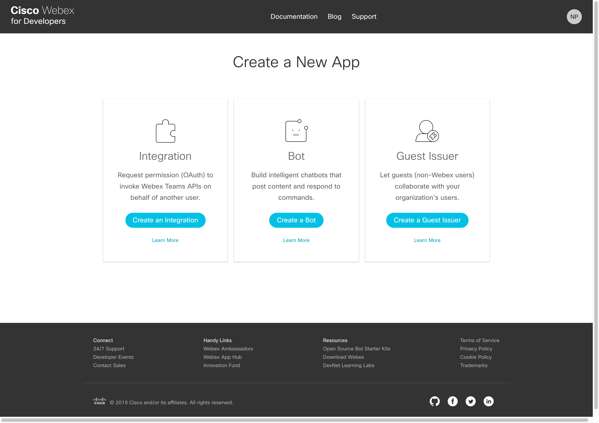
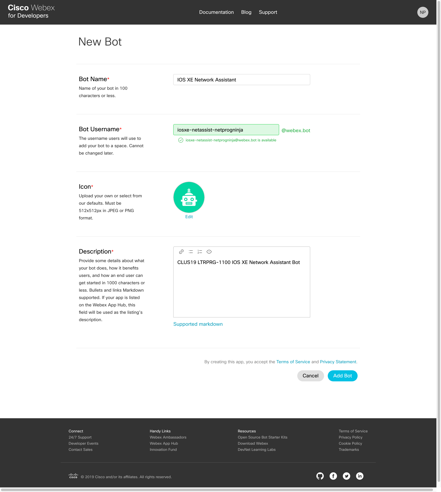
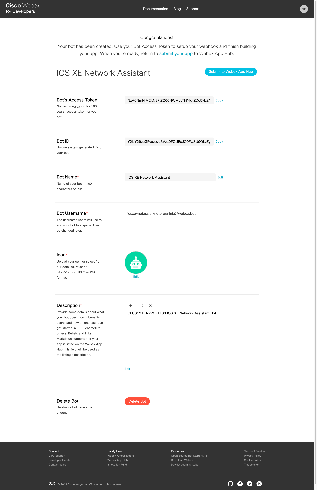
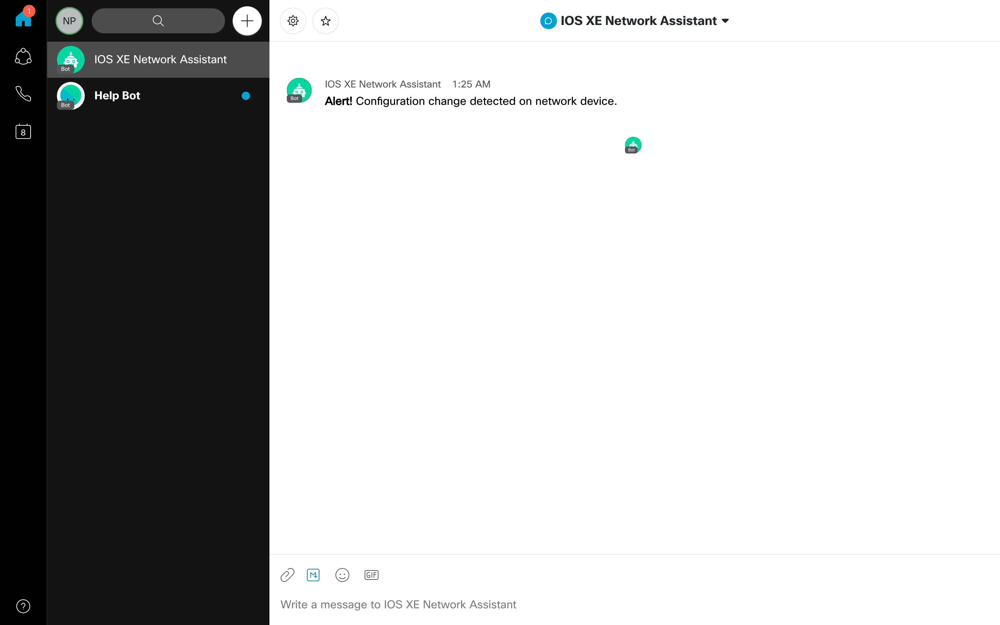
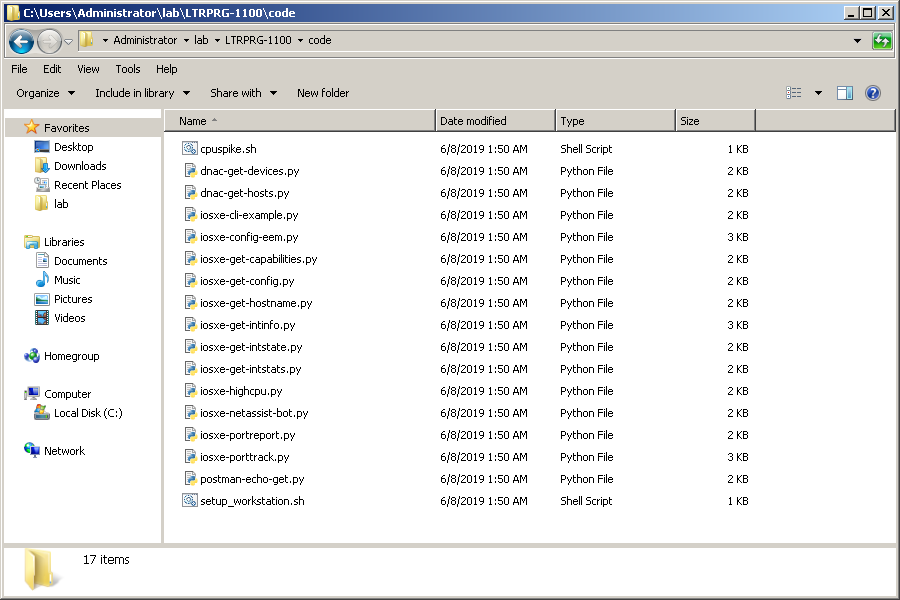
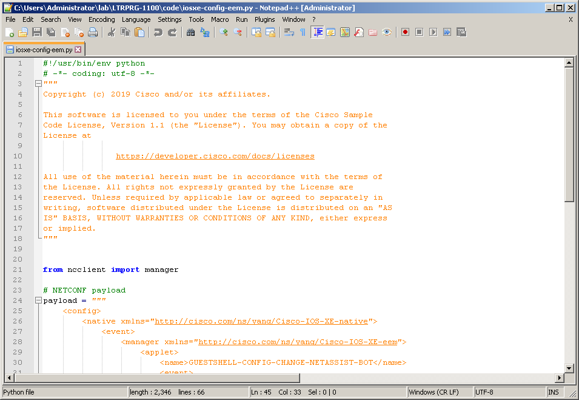
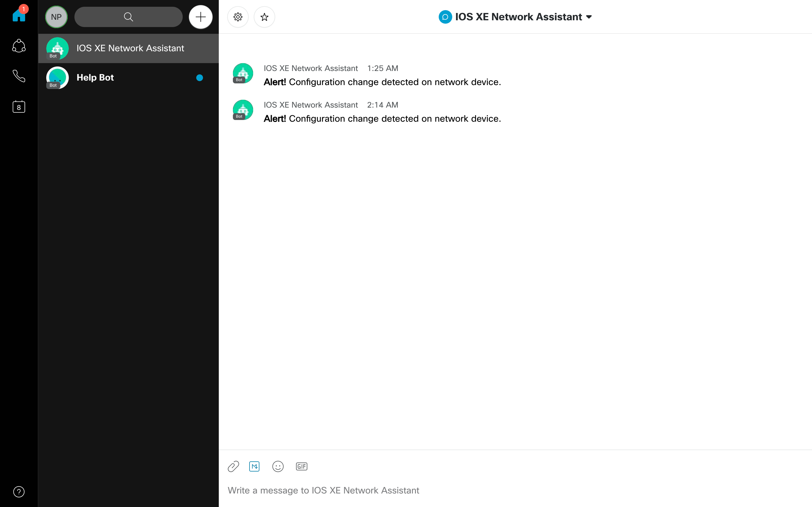

Navigation :: [Previous Page](LTRPRG-1100-04c1-NetAssist.md) :: [Table of Contents](LTRPRG-1100-00-Intro.md#table-of-contents) :: [Next Page](LTRPRG-1100-05-Conclusion.md)

---

### Example 1: ChatOps like a Network Programmability Ninja

#### Objectives

The objectives for this exercise are to:

* Learn how to create a Webex Teams Bot
* Create a Python script on-box in Guest Shell to be triggered under some condition
* Create an IOS XE EEM applet to trigger the Python script given come condition

#### Step 1: Creating a Webex Teams Bot

In order to give your network device a voice to communicate ChatOps style in Webex Teams, you need an account to use 
to send a message.  You neither want to create a Webex Teams account for every network device, nor use your account 
on every network device.  The solution is to create a Bot through which all of your network devices can communicate 
and collaborate.  Think of this Bot as your Network Assistant, a virtual member of your team.  In this lab, we will 
create a basic Notifier Bot, which typically only responds to events in an external service or system, and send a 
message in Webex Teams through that Bot.  It is left as an exercise to you to use this as a framework for creating a 
Controller or full-fledged Assistant ChatBot that can interact with you.

Creating a Webex Teams Bot is very easy.

1. In a web browser, navigate to [Cisco Webex for Developers](https://developer.webex.com/) at
`https://developer.webex.com`.  Login with your Webex Teams account credentials you created earlier in this lab.  If 
you did not create a Webex Teams account, then please ask a proctor for assistance and we can provide you with a 
temporary demo account.
    
    

2. Click on your profile photo at the top right corner of the webpage and click on `My Webex Teams Apps`.
    
    

3.  Click the `Create a New App` button.
    
    

4.  Click the `Create a Bot` button.  Fill out the form in its entirety.
    
    Name your Bot, for example `IOS XE Network Assistant`.
    
    Choose a Bot Username, for example `iosxe-netassist-<initials>`, replacing `<initials>` with your initials or a 
    random string.  This must be unique and cannot be shared, so we suggest you proceed the Bot Username with something 
    like your initials.
    
    Choose an Icon.  You can select one of the default icons or choose to upload an icon of your own creation.
    
    Enter a Description, for example `CLUS19 LTRPRG-1100 IOS XE Network Assistant Bot`.
    
    
    
    Click the `Add Bot` button.
    
    

6. Take extra care to note the `Bot's Access Token`.  Click `Copy` and then paste this into a text file for reference
later in this lab.  The access token is what will be used to authenticate the Webex Teams API calls from your 
Python script.  Once you leave this screen, you will not be able to retrieve this access token.  This token should be
treated like a password and kept private.

Congratulations, you have created a Webex Teams Bot to serve as your ChatOps IOS XE Network Assistant.  Continue with
this lab to create a Python script to be triggered with EEM. 

#### Step 2: Triggering On-Box Python Scripts with IOS XE Embedded Event Manager

In this step, you will configure Embedded Event Manager to run a Python script residing on-box in Guest Shell in 
response to a condition.

1. Establish an SSH connection to the IOS XE device `csr1` by double clicking the CSR1 PuTTY icon on the desktop:
    
    
    
    

2. From the IOS XE device CLI, ensure you are in privileged EXEC mode as indicated by the `csr1#` prompt.  If you are
in user EXEC mode as indicated by the `csr1>` prompt, then enter privileged EXEC mode with the `enable` command, for
example:
   
    ```
    csr1>enable
    csr1#
    ```

3. Enter a Guest Shell interactive session with the IOS XE command `guestshell run bash`, for example:
    
    ```
    csr1#guestshell run bash
    [guestshell@guestshell ~]$

4. There is an example Python script `iosxe-netassist.py` in this lab's Git repository.  Let's create a directory on 
the network device `bootflash:` and transfer the file to the network device file system.
    
    To create a new directory to hold scripts on-box if one does not already exist, use the `mkdir -p /bootflash/scripts` 
    command from the Guest Shell `[guestshell@guestshell ~]$` prompt, for example:
    
    ```
    [guestshell@guestshell ~]$ mkdir -p /bootflash/scripts
    [guestshell@guestshell ~]$
    ```
    
    Change to that directory with the `cd /bootflash/scripts` command, for example:
    
    ```
    [guestshell@guestshell ~]$ cd /bootflash/scripts
    [guestshell@guestshell scripts]$
    ```
    
    Transfer the example script with the `wget https://raw.githubusercontent.com/CiscoSE/LTRPRG-1100/master/code/iosxe-netassist-bot.py` command, for example:
        
    ```
    [guestshell@guestshell scripts]$ wget https://raw.githubusercontent.com/CiscoSE/
    LTRPRG-1100/master/code/iosxe-netassist-bot.py
    --2019-06-08 05:09:37--  https://raw.githubusercontent.com/CiscoSE/LTRPRG-1100/m
    aster/code/iosxe-netassist-bot.py
    Resolving raw.githubusercontent.com (raw.githubusercontent.com)... 151.101.0.133, 151.101.64.133
    , 151.101.128.133, ...
    Connecting to raw.githubusercontent.com (raw.githubusercontent.com)|151.101.0.13
    3|:443... connected.
    HTTP request sent, awaiting response... 200 OK
    Length: 1825 (1.8K) [text/plain]
    Saving to: 'iosxe-netassist-bot.py'
    
    100%[======================================>] 1,825       --.-K/s   in 0s
    
    2019-06-08 05:09:37 (133 MB/s) - 'iosxe-netassist-bot.py' saved [1825/1825]
    
    [guestshell@guestshell scripts]$
    ```

You need to complete a few tasks to update Python and install the necessary Python packages in Guest Shell needed for 
our Bot script.

5. The Webex Teams API uses the [Server Name Indication (SNI)](https://en.wikipedia.org/wiki/Server_Name_Indication)
extension to TLS.  An SSL client will fail to connect to the API if it does not support SNI with an error similar to:
    
    ```
    hostname 'api.ciscospark.com' doesn't match either of '*.wbx2.com', 'wbx2.com'
    ```
    
    IOS XE 16.8 Guest Shell ships with Python version 2.7.5, which contains an SSL client that will in fact fail to 
    connect due to lack of support for SNI.  SNI support was added to these versions of the following common 
    libraries and tools:
    
    * Java 1.7
    * PHP 5.3
    * Python 2.7.9, Python 3
    * Ruby (net/http) 2.0
    * cURL 7.18.1
    * wget 1.14
    
    Not to worry; it is trivial to upgrade Python in Guest Shell.  To do so, we recommend you upgrade using the 
    CentOS RPM package available for upgrade with the Yellowdog Updater, Modified (yum for short) RPM package manager.
    To upgrade Python, use the `sudo -E yum upgrade python2` command with elevated root user privileges, for example:
    
    ```
    [guestshell@guestshell scripts]$ sudo -E yum upgrade python2
    Loaded plugins: fastestmirror
    base                                                     | 3.6 kB     00:00
    extras                                                   | 3.4 kB     00:00
    updates                                                  | 3.4 kB     00:00
    (1/4): base/7/x86_64/group_gz                              | 166 kB   00:00
    (2/4): extras/7/x86_64/primary_db                          | 200 kB   00:00
    (3/4): updates/7/x86_64/primary_db                         | 5.0 MB   00:00
    (4/4): base/7/x86_64/primary_db                            | 6.0 MB   00:00
    Determining fastest mirrors
     * base: mirror.umd.edu
     * extras: mirror.es.its.nyu.edu
     * updates: distro.ibiblio.org
    Resolving Dependencies
    --> Running transaction check
    ---> Package python.x86_64 0:2.7.5-16.el7 will be updated
    ---> Package python.x86_64 0:2.7.5-77.el7_6 will be an update
    --> Processing Dependency: python-libs(x86-64) = 2.7.5-77.el7_6 for package: pyt
    hon-2.7.5-77.el7_6.x86_64
    --> Running transaction check
    ---> Package python-libs.x86_64 0:2.7.5-16.el7 will be updated
    ---> Package python-libs.x86_64 0:2.7.5-77.el7_6 will be an update
    --> Processing Dependency: libcrypto.so.10(OPENSSL_1.0.2)(64bit) for package: py
    thon-libs-2.7.5-77.el7_6.x86_64
    --> Running transaction check
    ---> Package openssl-libs.x86_64 1:1.0.1e-60.el7_3.1 will be updated
    --> Processing Dependency: openssl-libs(x86-64) = 1:1.0.1e-60.el7_3.1 for packag
    e: 1:openssl-1.0.1e-60.el7_3.1.x86_64
    ---> Package openssl-libs.x86_64 1:1.0.2k-16.el7_6.1 will be an update
    --> Running transaction check
    ---> Package openssl.x86_64 1:1.0.1e-60.el7_3.1 will be updated
    ---> Package openssl.x86_64 1:1.0.2k-16.el7_6.1 will be an update
    --> Finished Dependency Resolution
    
    Dependencies Resolved
    
    ================================================================================
     Package            Arch         Version                    Repository     Size
    ================================================================================
    Updating:
     python             x86_64       2.7.5-77.el7_6             updates        94 k
    Updating for dependencies:
     openssl            x86_64       1:1.0.2k-16.el7_6.1        updates       493 k
     openssl-libs       x86_64       1:1.0.2k-16.el7_6.1        updates       1.2 M
     python-libs        x86_64       2.7.5-77.el7_6             updates       5.6 M
    
    Transaction Summary
    ================================================================================
    Upgrade  1 Package (+3 Dependent packages)
    
    Total download size: 7.4 M
    Is this ok [y/d/N]:
    ```
    
    Notice that yum calculated the RPM dependencies for you and summarized the list of other RPMs that will also 
    need to be upgraded to upgrade Python.  When prompted with `Is this ok [y/d/N]:` answer 
    `y` and press the `Enter/Return` key:
    
    ```
    Downloading packages:
    Delta RPMs disabled because /usr/bin/applydeltarpm not installed.
    warning: /var/cache/yum/x86_64/7/updates/packages/openssl-1.0.2k-16.el7_6.1.x86_
    64.rpm: Header V3 RSA/SHA256 Signature, key ID f4a80eb5: NOKEY
    Public key for openssl-1.0.2k-16.el7_6.1.x86_64.rpm is not installed
    (1/4): openssl-1.0.2k-16.el7_6.1.x86_64.rpm                | 493 kB   00:00
    (2/4): python-2.7.5-77.el7_6.x86_64.rpm                    |  94 kB   00:00
    (3/4): openssl-libs-1.0.2k-16.el7_6.1.x86_64.rpm           | 1.2 MB   00:00
    (4/4): python-libs-2.7.5-77.el7_6.x86_64.rpm               | 5.6 MB   00:00
    --------------------------------------------------------------------------------
    Total                                               11 MB/s | 7.4 MB  00:00
    Retrieving key from file:///etc/pki/rpm-gpg/RPM-GPG-KEY-CentOS-7
    Importing GPG key 0xF4A80EB5:
     Userid     : "CentOS-7 Key (CentOS 7 Official Signing Key) <security@centos.org>"
     Fingerprint: 6341 ab27 53d7 8a78 a7c2 7bb1 24c6 a8a7 f4a8 0eb5
     Package    : centos-release-7-1.1503.el7.centos.2.8.x86_64 (@base/$releasever)
     From       : /etc/pki/rpm-gpg/RPM-GPG-KEY-CentOS-7
    Is this ok [y/N]:
    ```
    
    If prompted to import a new GPG key with the prompt `Is this OK [y/n]` answer `y` and press the `Enter`/`Return` 
    key:
    
    ```
    Running transaction check
    Running transaction test
    Transaction test succeeded
    Running transaction
      Updating   : 1:openssl-libs-1.0.2k-16.el7_6.1.x86_64                      1/8
      Updating   : python-libs-2.7.5-77.el7_6.x86_64                            2/8
      Updating   : python-2.7.5-77.el7_6.x86_64                                 3/8
      Updating   : 1:openssl-1.0.2k-16.el7_6.1.x86_64                           4/8
      Cleanup    : python-2.7.5-16.el7.x86_64                                   5/8
      Cleanup    : python-libs-2.7.5-16.el7.x86_64                              6/8
      Cleanup    : 1:openssl-1.0.1e-60.el7_3.1.x86_64                           7/8
    warning: file /usr/share/man/man1/tsget.1ssl.gz: remove failed: No such file or 
    directory
    warning: file /usr/share/doc/openssl-1.0.1e/ssleay.txt: remove failed: No such 
    file or directory
    warning: file /usr/share/doc/openssl-1.0.1e/openssl_button.html: remove failed:
    No such file or directory
    warning: file /usr/share/doc/openssl-1.0.1e/openssl_button.gif: remove failed:
    No such file or directory
    warning: file /usr/share/doc/openssl-1.0.1e/openssl.txt: remove failed: No such
     file or directory
    warning: file /usr/share/doc/openssl-1.0.1e/c-indentation.el: remove failed: No
     such file or directory
    warning: file /usr/share/doc/openssl-1.0.1e/README.FIPS: remove failed: No such
     file or directory
    warning: file /usr/share/doc/openssl-1.0.1e/README: remove failed: No such file
     or directory
    warning: file /usr/share/doc/openssl-1.0.1e/NEWS: remove failed: No such file o
    r directory
    warning: file /usr/share/doc/openssl-1.0.1e/LICENSE: remove failed: No such fil
    e or directory
    warning: file /usr/share/doc/openssl-1.0.1e/INSTALL: remove failed: No such fil
    e or directory
    warning: file /usr/share/doc/openssl-1.0.1e/FAQ: remove failed: No such file or
     directory
    warning: file /usr/share/doc/openssl-1.0.1e/CHANGES: remove failed: No such fil
    e or directory
    warning: file /usr/share/doc/openssl-1.0.1e: remove failed: No such file or dir
    ectory
      Cleanup    : 1:openssl-libs-1.0.1e-60.el7_3.1.x86_64                      8/8
    warning: file /usr/share/doc/openssl-libs-1.0.1e/LICENSE: remove failed: No suc
    h file or directory
    warning: file /usr/share/doc/openssl-libs-1.0.1e: remove failed: No such file o
    r directory
      Verifying  : 1:openssl-1.0.2k-16.el7_6.1.x86_64                           1/8
      Verifying  : 1:openssl-libs-1.0.2k-16.el7_6.1.x86_64                      2/8
      Verifying  : python-2.7.5-77.el7_6.x86_64                                 3/8
      Verifying  : python-libs-2.7.5-77.el7_6.x86_64                            4/8
      Verifying  : 1:openssl-1.0.1e-60.el7_3.1.x86_64                           5/8
      Verifying  : python-2.7.5-16.el7.x86_64                                   6/8
      Verifying  : python-libs-2.7.5-16.el7.x86_64                              7/8
      Verifying  : 1:openssl-libs-1.0.1e-60.el7_3.1.x86_64                      8/8
    
    Updated:
      python.x86_64 0:2.7.5-77.el7_6
    
    Dependency Updated:
      openssl.x86_64 1:1.0.2k-16.el7_6.1   openssl-libs.x86_64 1:1.0.2k-16.el7_6.1
      python-libs.x86_64 0:2.7.5-77.el7_6
    
    Complete!
    [guestshell@guestshell scripts]$
    ```
    
    It is safe to ignore the warnings at this time.  Ensure that the RPM package upgrades are successful with the 
    output `Complete!` before continuing with this lab.

6. Next, you need to install the prerequisite Python requests package needed to make the Webex Teams API calls.  You 
could install the Python package with pip like you on your lab workstation earlier in this lab, however with a system 
under package management like the CentOS Linux Guest Shell, we recommend you install the appropriate RPM instead, if 
available.  To install the `python-requests` RPM, use the `sudo -E yum install python-requests`, for example:
    
    ```
    [guestshell@guestshell scripts]$ sudo -E yum install python-requests
    Loaded plugins: fastestmirror
    Loading mirror speeds from cached hostfile
     * base: linux.cc.lehigh.edu
     * extras: mirrors.advancedhosters.com
     * updates: ftp.linux.ncsu.edu
    Resolving Dependencies
    --> Running transaction check
    ---> Package python-requests.noarch 0:2.6.0-1.el7_1 will be installed
    --> Processing Dependency: python-urllib3 >= 1.10.2-1 for package: python-request
    s-2.6.0-1.el7_1.noarch
    --> Processing Dependency: python-chardet >= 2.2.1-1 for package: python-requests
    -2.6.0-1.el7_1.noarch
    --> Running transaction check
    ---> Package python-chardet.noarch 0:2.2.1-1.el7_1 will be installed
    ---> Package python-urllib3.noarch 0:1.10.2-5.el7 will be installed
    --> Processing Dependency: python-six for package: python-urllib3-1.10.2-5.el7.no
    arch
    --> Processing Dependency: python-ipaddress for package: python-urllib3-1.10.2-5.
    el7.noarch
    --> Processing Dependency: python-backports-ssl_match_hostname for package: pytho
    n-urllib3-1.10.2-5.el7.noarch
    --> Running transaction check
    ---> Package python-backports-ssl_match_hostname.noarch 0:3.5.0.1-1.el7 will be 
    installed
    --> Processing Dependency: python-backports for package: python-backports-ssl_ma
    tch_hostname-3.5.0.1-1.el7.noarch
    ---> Package python-ipaddress.noarch 0:1.0.16-2.el7 will be installed
    ---> Package python-six.noarch 0:1.9.0-2.el7 will be installed
    --> Running transaction check
    ---> Package python-backports.x86_64 0:1.0-8.el7 will be installed
    --> Finished Dependency Resolution
    
    Dependencies Resolved
    
    ================================================================================
     Package                               Arch     Version            Repository
                                                                               Size
    ================================================================================
    Installing:
     python-requests                       noarch   2.6.0-1.el7_1      base    94 k
    Installing for dependencies:
     python-backports                      x86_64   1.0-8.el7          base   5.8 k
     python-backports-ssl_match_hostname   noarch   3.5.0.1-1.el7      base    13 k
     python-chardet                        noarch   2.2.1-1.el7_1      base   227 k
     python-ipaddress                      noarch   1.0.16-2.el7       base    34 k
     python-six                            noarch   1.9.0-2.el7        base    29 k
     python-urllib3                        noarch   1.10.2-5.el7       base   102 k
    
    Transaction Summary
    ================================================================================
    Install  1 Package (+6 Dependent packages)
    
    Total download size: 503 k
    Installed size: 2.1 M
    Is this ok [y/d/N]:
    ```
    
    Again, notice that yum calculated the RPM dependencies for you and summarized the list of other RPMs that will also 
    need to be upgraded to install the Python requests package.  When prompted with `Is this ok [y/d/N]:` answer 
    `y` and press the `Enter/Return` key:
    
    ```
    Is this ok [y/d/N]: y
    Downloading packages:
    (1/7): python-backports-ssl_match_hostname-3.5.0.1-1.el7.n |  13 kB   00:00
    (2/7): python-backports-1.0-8.el7.x86_64.rpm               | 5.8 kB   00:00
    (3/7): python-ipaddress-1.0.16-2.el7.noarch.rpm            |  34 kB   00:00
    (4/7): python-chardet-2.2.1-1.el7_1.noarch.rpm             | 227 kB   00:00
    (5/7): python-requests-2.6.0-1.el7_1.noarch.rpm            |  94 kB   00:00
    (6/7): python-six-1.9.0-2.el7.noarch.rpm                   |  29 kB   00:00
    (7/7): python-urllib3-1.10.2-5.el7.noarch.rpm              | 102 kB   00:00
    --------------------------------------------------------------------------------
    Total                                              641 kB/s | 503 kB  00:00
    Running transaction check
    Running transaction test
    Transaction test succeeded
    Running transaction
      Installing : python-ipaddress-1.0.16-2.el7.noarch                         1/7
      Installing : python-six-1.9.0-2.el7.noarch                                2/7
      Installing : python-chardet-2.2.1-1.el7_1.noarch                          3/7
      Installing : python-backports-1.0-8.el7.x86_64                            4/7
      Installing : python-backports-ssl_match_hostname-3.5.0.1-1.el7.noarch     5/7
      Installing : python-urllib3-1.10.2-5.el7.noarch                           6/7
      Installing : python-requests-2.6.0-1.el7_1.noarch                         7/7
      Verifying  : python-backports-ssl_match_hostname-3.5.0.1-1.el7.noarch     1/7
      Verifying  : python-requests-2.6.0-1.el7_1.noarch                         2/7
      Verifying  : python-backports-1.0-8.el7.x86_64                            3/7
      Verifying  : python-ipaddress-1.0.16-2.el7.noarch                         4/7
      Verifying  : python-chardet-2.2.1-1.el7_1.noarch                          5/7
      Verifying  : python-six-1.9.0-2.el7.noarch                                6/7
      Verifying  : python-urllib3-1.10.2-5.el7.noarch                           7/7
    
    Installed:
      python-requests.noarch 0:2.6.0-1.el7_1
    
    Dependency Installed:
      python-backports.x86_64 0:1.0-8.el7
      python-backports-ssl_match_hostname.noarch 0:3.5.0.1-1.el7
      python-chardet.noarch 0:2.2.1-1.el7_1
      python-ipaddress.noarch 0:1.0.16-2.el7
      python-six.noarch 0:1.9.0-2.el7
      python-urllib3.noarch 0:1.10.2-5.el7
    
    Complete!
    [guestshell@guestshell scripts]$
    ```
    
    Ensure that the RPM package upgrades are successful with the output `Complete!` before continuing with this lab.

    Now you can test your Python Bot script.

7. The `iosxe-netassist-bot.py` Python script requires two command line arguments.  Run the script without 
arguments for a summary with the command `python iosxe-netassist-bot.py`:
    
    ```
    [guestshell@guestshell scripts]$ python iosxe-netassist-bot.py
    usage: IOS XE Network Assistant Webex Teams Bot Script [-h] -t TOKEN -e EMAIL
    IOS XE Network Assistant Webex Teams Bot Script: error: argument -t/--token is r
    equired
    [guestshell@guestshell scripts]$
    ```
    
    Run the script with the correct command line arguments with the `python iosxe-netassist-bot.py -t <Bot Access Token> -e <user@example.com>`
    command, replacing `<Bot Access Token>` the your Bot's Access Token obtained earlier in this lab and 
    `<user@example.com>` with the email address you've logged into Webex Teams with, for example:
    
    ```
    [guestshell@guestshell scripts]$ python iosxe-netassist-bot.py -t NzA0NmNiM2ItN2FjZC00NWMyLThiYjgtZDc5NzE1Y2Q1MTQ2NzZmNTY1MmEtNjcx_PF84_consumer -e user@example.com
    [guestshell@guestshell scripts]$
    ```
    
    If there are no errors, then you should receive a 1:1 message from your Bot similar to the following:
    
    

8. Finally, you need to configure an EEM applet that looks for a condition and triggers your new Python Bot script 
on-box in Guest Shell.  The trigger we are going to use in this lab is any configuration change made on your network 
device.  Normally, you might install an EEM applet via the IOS XE CLI, for example with the following IOS XE 
configuration snippet:
    
    ```
    event manager applet GUESTSHELL-CONFIG-CHANGE-NETASSIST-BOT
      event syslog pattern "%SYS-5-CONFIG_I: Configured from"
      action 0.0 cli command "en"
      action 1.0 cli command "guestshell run python /bootflash/scripts/iosxe-netassist-bot.py -t OWIyODVhODEtMDM0MC00NmY5LWFmYjEtOTI1ODJiZWFiNzIyODdlY2FiOGItMTQ3 -e userexample.com"
    ```
    
    However, you are a Network Programmability Ninja now and will use model driven programmability to configure the 
    EEM applet on your network device.
    
    Open the Git Bash terminal by double clicking the Git Bash icon on the desktop:
    
    
    
    
    
    Make sure that your terminal still shows the prepended project name `(pythonenv)`. If it does not, then activate 
    the Python virtual environment you created earlier in this lab with the `source ~/lab/pythonenv/Scripts/activate`
    command, for example:
    
    ```
    $ source ~/lab/pythonenv/Scripts/activate
    (pythonenv) $
    ```
    
    Change to the `~/lab/LTRPRG-1100/code` directory inside the Git repository for this lab with the command
    `cd ~/lab/LTRPRG-1100/code`:
    
    ```
    (pythonenv) $ cd ~/lab/LTRPRG-1100/code
    (pythonenv) $
    ```
    
    The file `iosxe-config-eem.py` is the NETCONF client Python script using the ncclient Python package.  This 
    cotained the NETCONF XML payload for the task at hand.  You will need to edit `iosxe-config-eem.py` to replace 
    strings containing the Bot Access Token and your email address.
    
    Open the lab folder by double clicking the Windows Explore shortcut on the lab workstation desktop:
    
    
    
    Navigate to the `LTRPRG-1100` > `code` directory:
    
    
    
    Right click the file `iosxe-config-eem.py` and click `Edit with Notepad++`.
    
    
    
    In line 45, replace the string after `-t` with your IOX XE Network Assistant Bot Access Token.
    
    In line 45, replace the string after `-e` with the email address associated with your Webex Teams account.
    
    Save your changes by navigating to the `File` menu and clicking `Save`.  Close the Notepad++ application.
    
    Now return to the Git Bash terminal and run the `iosxe-config-eem.py` Python script with the
    `python iosxe-config-eem.py` command, for example:
    
    ```
    $ python iosxe-config-eem.py
    <?xml version="1.0" encoding="UTF-8"?>
    <rpc-reply xmlns="urn:ietf:params:xml:ns:netconf:base:1.0" message-id="urn:uuid:
    156f6e16-588a-43c8-b492-2b34670c07ce" xmlns:nc="urn:ietf:params:xml:ns:netconf:b
    ase:1.0"><ok/></rpc-reply>
    (pythonenv) $
    ```
    
    Check your handy work from the IOS XE device CLI with the `show running-config | section event` command, for 
    example:
    
    ```
    csr1#show running-config | section event
    event manager applet GUESTSHELL-CONFIG-CHANGE-NETASSIST-BOT
     event syslog pattern "%SYS-5-CONFIG_I: Configured from"
     action 0.0 cli command "en"
     action 1.0 cli command "guestshell run python /bootflash/scripts/iosxe-netassis
    t-bot.py -t OWIyODVhODEtMDM0MC00NmY5LWFmYjEtOTI1ODJiZWFiNzIyODdlY2FiOGItMTQ3 -e
    email@example.com"
    csr1#
    ```
    
    Now let's put the whole thing to test.  Make a configuration change from the IOS XE device CLI with the following
    IOS XE commands:
    
    ```
    configure terminal
    interface GigabitEthernet1
      description WAN interface
      exit
    end
    ```
    
    For example:
    
    ```
    csr1#configure terminal
    Enter configuration commands, one per line.  End with CNTL/Z.
    csr1(config)#interface GigabitEthernet1
    csr1(config-if)#  description WAN interface
    csr1(config-if)#  exit
    csr1(config)#end
    csr1#
    ```
    
    You should receive a Webex Teams message from your IOS XE Network Assistant Bot alerting you to the configuration
    change on the network device!
    
    
    
    Now each time you make a configuration change, you will receive a notification in Webex Teams!

This only just scratches the surface of what is possible with ChatOps leveraging the network programmability concepts
you've learned in this lab.  With great ease, you were able to leverage integrate an IOS XE network device using 
model driven programmability and APIs with a premiere cloud collaboration platform for communications.

---

Navigation :: [Previous Page](LTRPRG-1100-04c1-NetAssist.md) :: [Table of Contents](LTRPRG-1100-00-Intro.md#table-of-contents) :: [Next Page](LTRPRG-1100-05-Conclusion.md)
