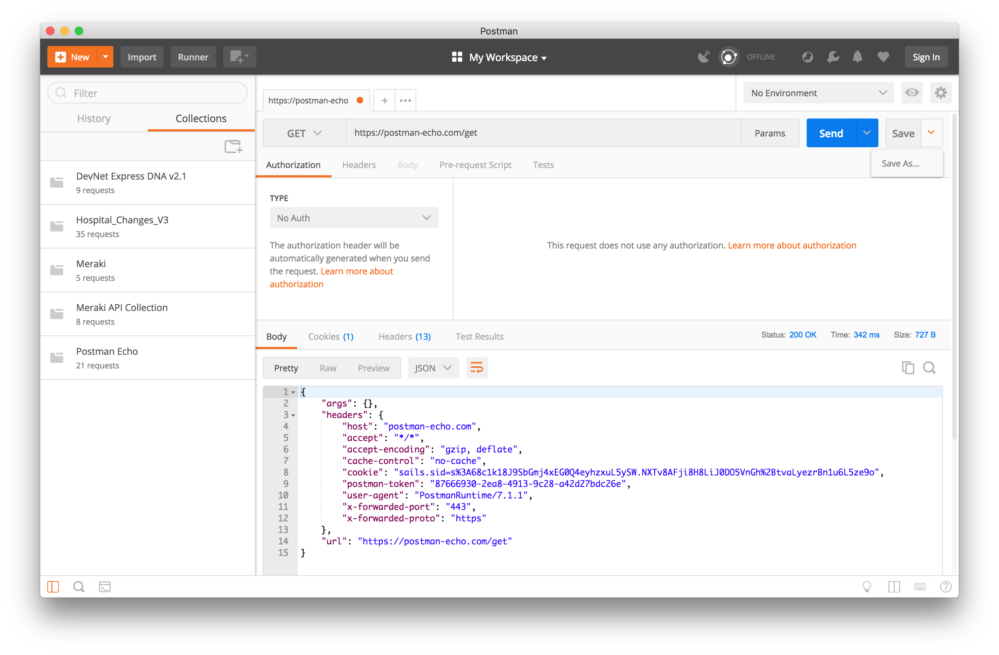
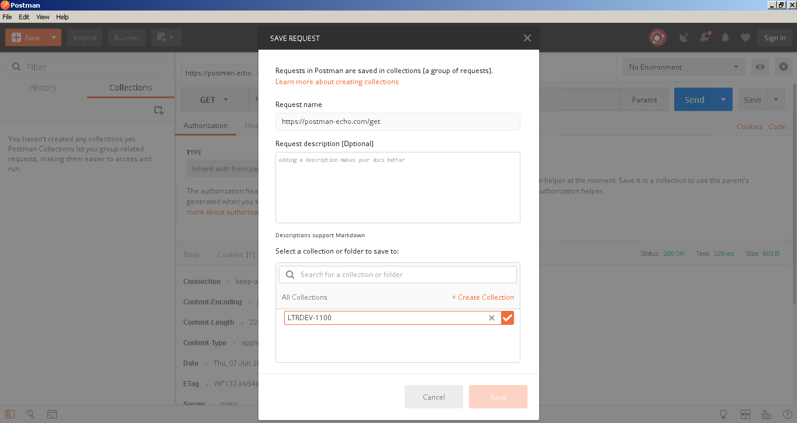
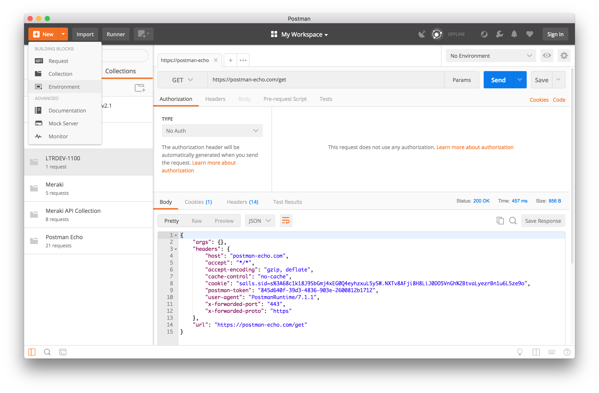
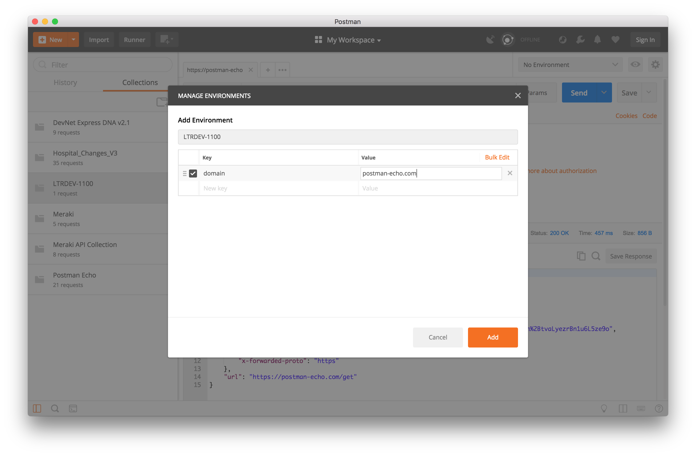
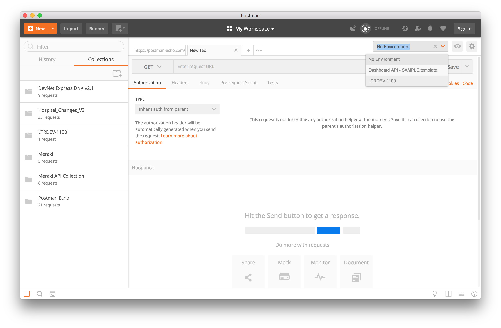
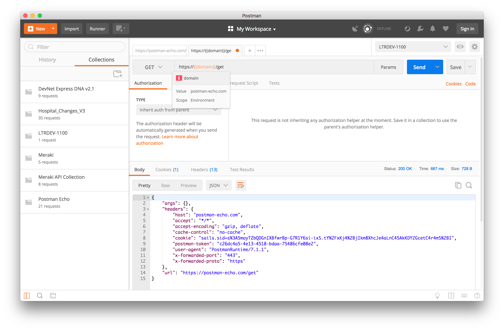
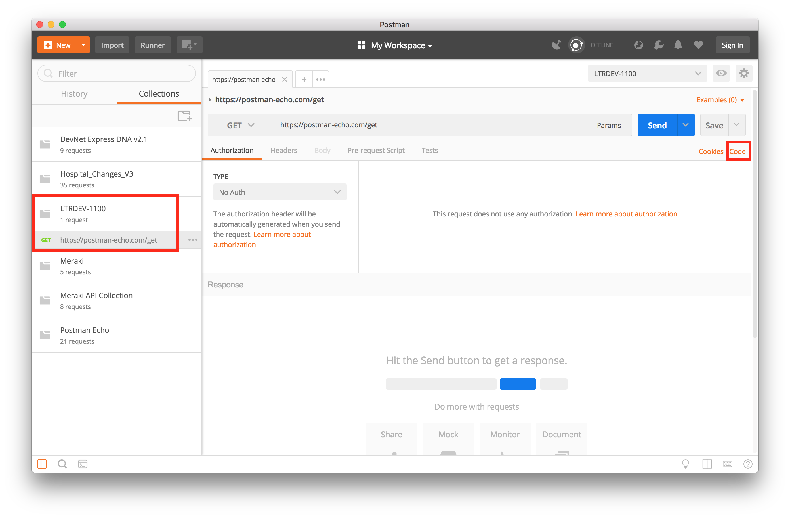
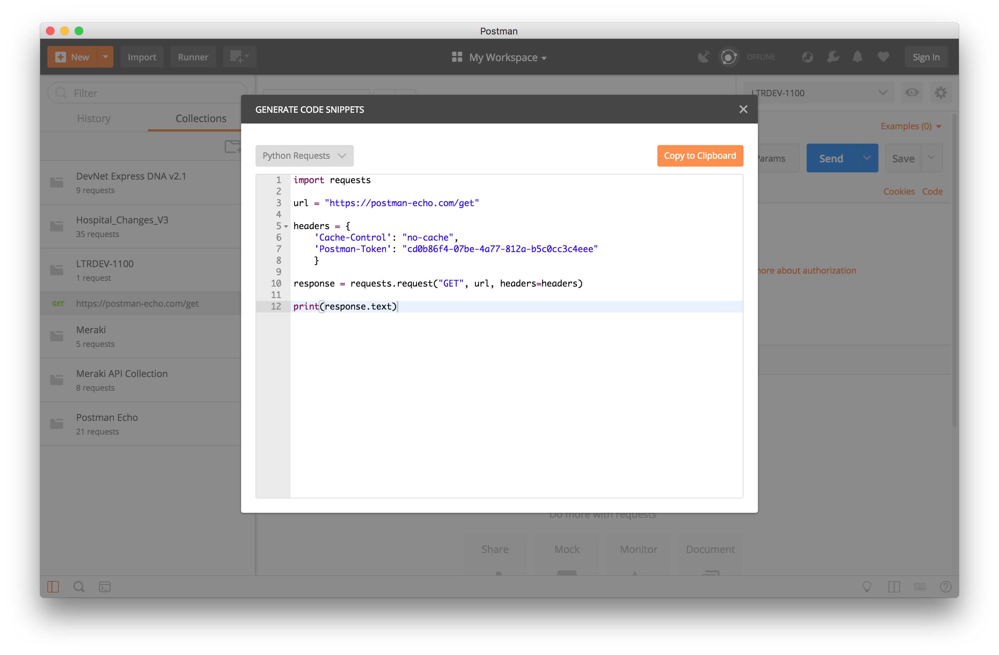

Navigation :: [Previous Page](LTRPRG-1100-05b1-Postman.md) :: [Table of Contents](LTRPRG-1100-00-Intro.md#table-of-contents) :: [Next Page](LTRPRG-1100-05c1-Vagrant.md)

---

### Exercise 1: Getting Advanced with Postman

#### Objectives

The objectives for this exercise are to:

* Learn how and why to create a Collection
* Save variables in an Environment
* Use Postman to generate a Python script

#### Step 1: Creating a Collection

In Postman, Collections allow you to save similar requests together for easy access. Imagine a situation where you 
are learning how to use a particular product or service API. More often than not, there may be more than one request necessary.

For instance, if you are working with the Cisco Meraki dashboard API, you may need to save several different API 
calls in order to replicate the work later, or reference them to use in a script. The Cisco Meraki dashboard API 
first call may be to list the organizations of which you are a member. Next, another GET request may be to list the 
networks available in an organization. After this, you may make another call to list the devices that belong to a particular network.

As you can see, utilizing multiple tabs in the build area becomes important, and furthermore, saving the requests to 
reference later is very helpful. Let's look at how to make a Collection in Postman to save related requests.

1. Ensure that you still have the `postman-echo.com` GET request tab open. If you previously closed it without saving
it, please revisit the last exercise to re-create it.

2. On the far right side of the build area, click the dropdown icon next to `Save` and then click `Save As...`
    
    
    
3. In the `Save Request` box that pops up, note that the lower portion of the screen allows you to search for, 
select, or create a new collection. Click `+Create Collection` and then type in `LTRPRG-1100` as the new collection 
name. Click the checkbox to fully create the collection, and then click on the newly created collection to select it.
Now, click `Save to LTRPRG-1100` to save this request.
    
    
    
    You can use this technique in the future to save API requests as you are working on them. When managing network 
    infrastructure that has fully featured API's, a collection could even be the ordered list of requests necessary 
    to complete a controlled change during a maintenance window. 

#### Step 2: Saving variables using Environments

When working with a particular API or set of API's pertaining to the same project, often times there are some 
variables that end up being re-used. For instance, you may be using the same authentication token on every request 
made. Or, perhaps all API calls are being made to the same domain name, even if the rest of the URI is different. The
domain name can be saved in a variable named 'domain' and then referenced with `{{domain}}` in the request builder.

This ability to define and use variables is helpful for a few reasons. First, it is more efficient to define it once 
and then use it many times. Second, since the variable is defined once in one place, it is less likely to suffer from
an inadvertent mistake in one place. And third, as we can save these variables into named groups called 
`Environments` we can set up multiple profiles for different users or API environments.

While variables can be created and saved in multiple scopes within Postman, we will focus on Environments. An 
environment is a set of key/value pairs (variables), and it can be quickly toggled for a particular request.  This 
would allow you to easily change between a test environment and a QA environment, for instance, with the appropriate 
tokens, URL's, etc for each.

1. First, create a new environment. To do this, click the dropdown for `+ New` in the upper left corner of Postman, 
and then select `Environment`.
    
    
    
2. In this new dialog box, we can name the environment `LTRPRG-1100` and define a variable. Using our basic API 
request example from before, create a variable named `domain` and define the value as `postman-echo.com`.  Click Add 
to save the environment.
    
    
    
3. Now that our environment is defined, let's enable it for use with a new request. near the upper right portion of 
the app, there is a dropdown selection box that shows the active environment. This will likely read `No Environment` 
at this point. Click the drop-down and select `LTRPRG-1100` as the environment to use.
    
    
    
4. Let's create an API request using the variable defined in this environment (tip: if you need a quick reference to 
a variable name or value, click the "eye" icon immediately to the right of the active environment drop-down menu). In
 a new request tab, ensure the method is set to `GET` and enter the URL: `https://{{domain}}/get` and then click `Send`.
    
    
    
5. Notice that the request completed with a status of `200 OK` to the API at postman-echo.com. Also notice that if 
you hover the mouse over the variable in the request URL, Postman will popup a box showing the variable is an 
environment variable as well as its value.

#### Step 3: Generating a Python script from Postman

While Postman is a very useful tool to when developing API requests, and can also be used in an ad-hoc way to 
prescriptively make API calls, often times it is helpful to run the API call in a script. This allows for much 
greater flexibility in the way requests are made, and also how results are processed.

Postman makes this process easy, as it can auto-generate code to use in a script.

1. In Postman, open the request from your LTRPRG-1100 collection. Then click on `Code` just underneath the `Send` and
`Save` buttons.
    
    
    
2. Ensure that the language in the upper left dropdown is set to `Python Requests`. In this window, it shows Python 
code necessary to execute this API call directly from a Python script. As a matter of fact, you can `Copy to 
Clipboard` and paste this into PyCharm to test it out.
    
    

---

Navigation :: [Previous Page](LTRPRG-1100-05b1-Postman.md) :: [Table of Contents](LTRPRG-1100-00-Intro.md#table-of-contents) :: [Next Page](LTRPRG-1100-05c1-Vagrant.md)
