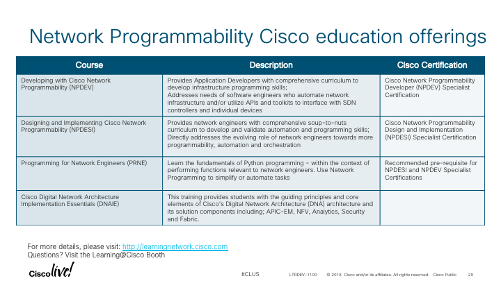

Navigation :: [Previous Page](LTRPRG-1100-05-Conclusion.md) :: [Table of Contents](LTRPRG-1100-00-Intro.md#table-of-contents)

---

# Appendix

## Additional Network Programmability Resources

### Additional API Resources

1. Explore the [Postman API Docs](https://create.meraki.io/postman) for a full reference of the available API
functions. For instance, click on `Devices` and then `List the devices in a network` to see the details of this 
particular GET call. Click to expand the example response in the right-side column. Which of these fields may be 
interesting if you were building an inventory script?

2. Many Cisco products have consolidated API information at the [Cisco DevNet](https://developer.cisco.com/) site. 
This web portal contains a plethora of reference documentation, tutorials, learning labs, sandbox environments, etc. 
This is a great place to start for learning more about the topics discussed in this lab.

### Additional Cisco IOS XE 16 Resources

1. Download the free eBook [Cisco IOS XE Programmability, Automating Device Lifecycle Management](https://www.cisco.com/c/dam/en/us/products/collateral/enterprise-networks/nb-06-ios-xe-prog-ebook-cte-en.pdf).  

2. Refer to the [Cisco IOS XE 16 Configuration Guides](https://www.cisco.com/c/en/us/support/ios-nx-os-software/ios-xe-16/products-installation-and-configuration-guides-list.html), including
[Programmability Configuration Guide](https://www.cisco.com/c/en/us/td/docs/ios-xml/ios/prog/configuration/1611/b_1611_programmability_cg.html) and
[Embedded Event Manager Configuration Guide](https://www.cisco.com/c/en/us/td/docs/ios-xml/ios/eem/configuration/xe-16-11/eem-xe-16-11-book.html).

### Cisco Learning Network

The [Cisco Learning Network](https://learningnetwork.cisco.com/welcome) has several resources for the
[Cisco Network Programmability Specialists certifications](https://learningnetwork.cisco.com/community/certifications/network-programmability):
[Network Programmability Developer](https://learningnetwork.cisco.com/community/certifications/network-programmability/network-application-developer)
and
[Network Programmability Design and Implementation Specialist](https://learningnetwork.cisco.com/community/certifications/network-programmability/design-and-implementation).

---

Navigation :: [Previous Page](LTRPRG-1100-05-Conclusion.md) :: [Table of Contents](LTRPRG-1100-00-Intro.md#table-of-contents)
